# Lab - Lesson 14 Lab 11b: Threat Hunting using Notebooks with Microsoft Sentinel (Optional)

### Estimated Timing: 20 Minutes

## Lab Scenario

You're a Security Operations Analyst at a company that implemented Microsoft Sentinel. You want to explore **notebooks** - an advanced hunting tool for Tier 2-3 analysts, incident investigators, and security data scientists. Notebooks let you do things the built-in Sentinel experience can't, such as custom Python analytics, machine-learning models, bespoke visualizations (custom timelines, process trees), and combining Sentinel data with outside data sources.

> **This lab is optional.** In the Lesson 14 agenda, hunting with notebooks is marked _optional_. It's included for students who want deeper, code-based hunting experience. Prior familiarity with Visual Studio Code, Jupyter, and Python is helpful but not required — you can complete the exploration steps without writing code.

### How this lab handles data

Notebooks query the Sentinel **data lake**, and getting _fresh_ data into the lake — and having new KQL/notebook jobs finish - involves ingestion and processing delays (often many minutes to hours). To avoid that wait, this lab uses **pre-populated data lake tables** and **provided sample notebooks**. Your focus is on _understanding and running_ notebooks against data that's already there, not on generating new data.

> **What this means for you:** When you open a sample notebook, the tables it references (like `SecurityEvent`) are already populated, so cells return results without a wait. Running code cells is _encouraged but optional_ — the core skills (setting up the environment, connecting, and reading notebook structure) don't require it.

## Lab objectives

In this lab, you will perform the following:

- Task 1: Sign in and open the Notebooks page
- Task 2: Set up Visual Studio Code
- Task 3: Connect Visual Studio Code to Microsoft Sentinel
- Task 4: Explore a data lake table schema
- Task 5: Explore and run a provided sample notebook

### Background: notebooks vs. workbooks vs. playbooks

Sentinel offers three tools that are easy to confuse. Here's the distinction:

| Tool          | Primary use                                                           | Typical user                                       |
| ------------- | --------------------------------------------------------------------- | -------------------------------------------------- |
| **Playbooks** | Automation of repeatable tasks (ingestion, enrichment, remediation)   | SOC engineers, analysts                            |
| **Workbooks** | Interactive dashboards and visualization                              | SOC engineers, analysts, managers                  |
| **Notebooks** | Code-based querying, enrichment, ML, big-data analytics, deep hunting | Threat hunters, Tier 2-3 analysts, data scientists |

A **notebook** is a document that mixes runnable code cells (usually Python) with formatted text (markdown) cells. It's the most powerful and flexible of the three - and the most technical - because you can pull in any Python library to analyze Sentinel data. Common libraries for this include **Kqlmagic** (run KQL from a notebook) and **MSTICPy** (Microsoft's Python security-investigation toolkit).

### Task 1: Sign in and open the Notebooks page

In this task you'll sign in to the Defender portal and open the Notebooks page inside Microsoft Sentinel.

1. You are logged in to the **WIN1** virtual machine.

1. In Microsoft Edge, go to the Defender portal at `https://security.microsoft.com`.

1. If prompted with **Sign in** window. Enter the following credentials:
   - **Email/Username:** <inject key="AzureAdUserEmail"></inject>

     

1. Next, provide your password:
   - **Password:** <inject key="AzureAdUserPassword"></inject>

     

1. If prompted to stay signed in, you can click **No**.

   

1. Close the **Meet your improved security center** pop-up using **X**.

   

1. In the navigation menu, select **Show navigation (1)** and then scroll down and expand the **Microsoft Sentinel (2)** section so you can see its options.

   

1. Expand **Threat management (1)** and then select **Notebooks (2)**.

   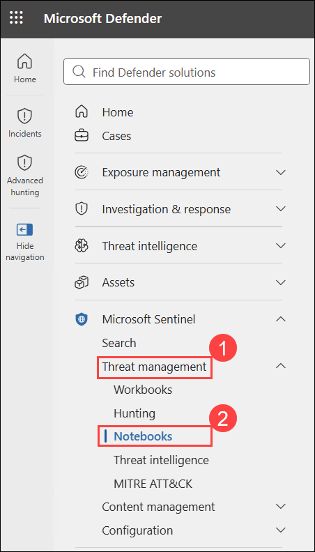

1. Review the **Notebooks** page - it lists the setup steps and links to resources you'll use.

   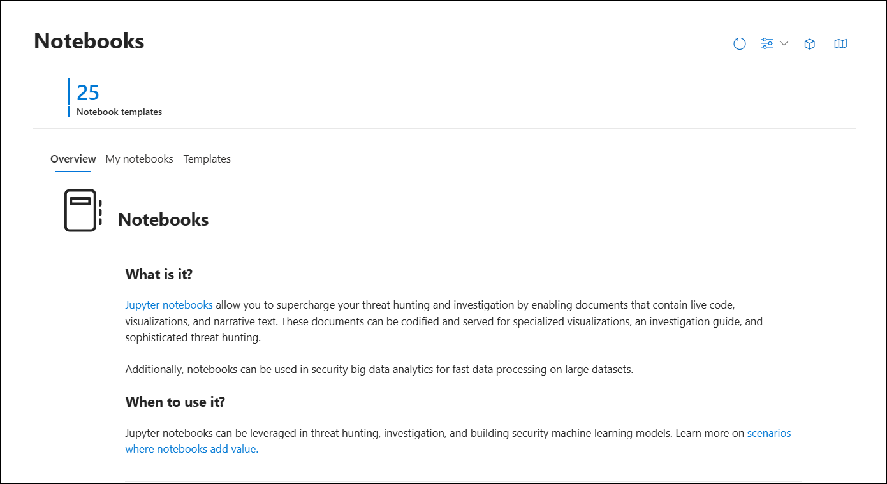

   **What to expect:** A setup checklist with links to the extensions and connection steps you'll complete in the next two tasks.

### Task 2: Set up Visual Studio Code

In this task you'll add the extensions that connect it to Python, Jupyter, and Sentinel. These installs are local and take effect immediately.

1. In the Windows search bar, type **Visual Studio Code (1)** and select it from the result **(2)**.

   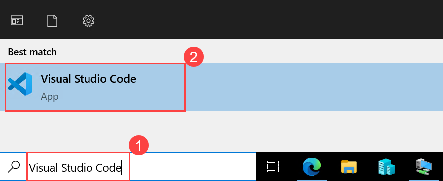

   > **Note:** Unless told otherwise, always install the **Microsoft**-published version of each extension.

1. If prompted with **Welcome to VS Code** pop-up window, select **X** from the right top corner to close it.

   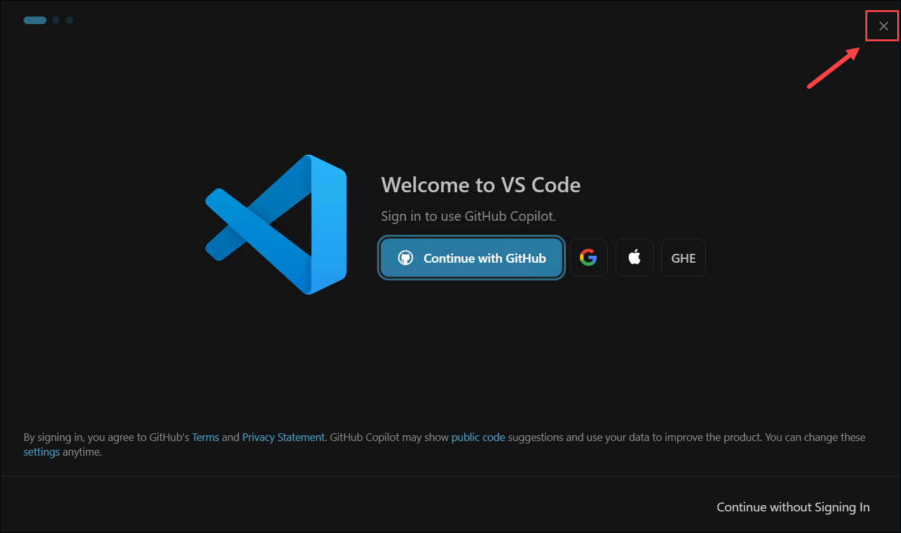

1. In the left menu bar, select the **Extensions** icon (the four-squares symbol).

   .png>)

1. These 4 extensions are already installed in VS Code for you:

   | Extension              | Purpose                                     |
   | ---------------------- | ------------------------------------------- |
   | **Python**             | Runs Python code and notebooks              |
   | **Jupyter**            | Adds Jupyter notebook support               |
   | **GitHub Copilot**     | AI assistance for writing queries/code      |
   | **Microsoft Sentinel** | Connects VS Code to your Sentinel data lake |

   **What to expect:** All four extensions show as installed in VS Code.

### Task 3: Connect Visual Studio Code to Microsoft Sentinel

In this task you'll add the Sentinel data-exploration connection so VS Code can see your workspace tables.

1. In VS Code, press **Ctrl+Shift+P** to open the command palette at the top.

   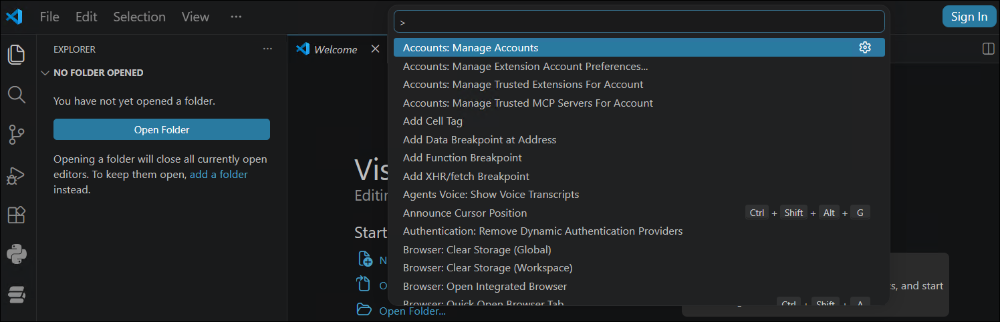

1. Search for **MCP: Add server (1)** and select it **MCP: Add server (2)** from the result.

   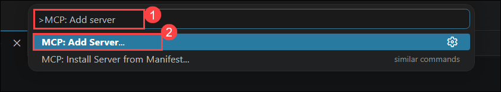

1. In **Choose the type of MCP server to add**, select **HTTP (HTTP or Server-Sent Events) (1)** and then enter the following URL **(2)**:

   ```text
   https://sentinel.microsoft.com/mcp/data-exploration
   ```

   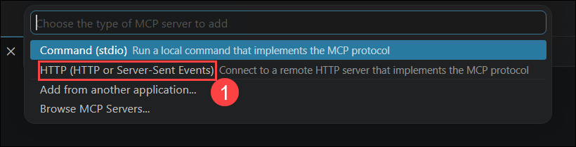

   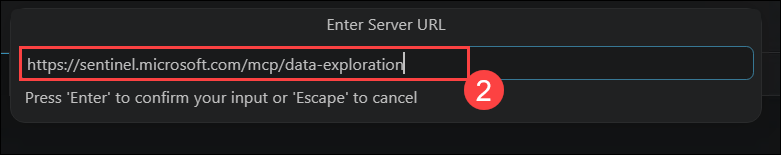

1. Press **Enter** to accept the default server ID.

   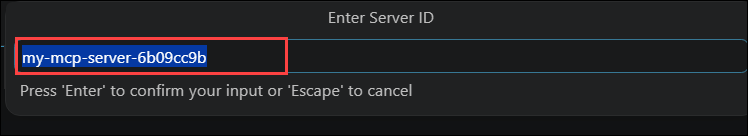

1. When prompted to authenticate the server, select **Allow**.

   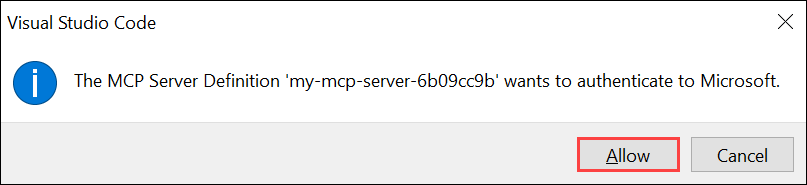

1. Login using the following credentials:
   - **Email/Username:** <inject key="AzureAdUserEmail"></inject>

   - **Password:** <inject key="AzureAdUserPassword"></inject>

1. On the **Sign in to all apps and websites on this device?** pop-up, select **Yes**.

   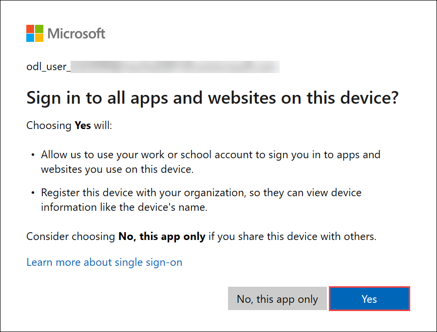

1. On the **Account added to this device** pop-up, select **Done**.

   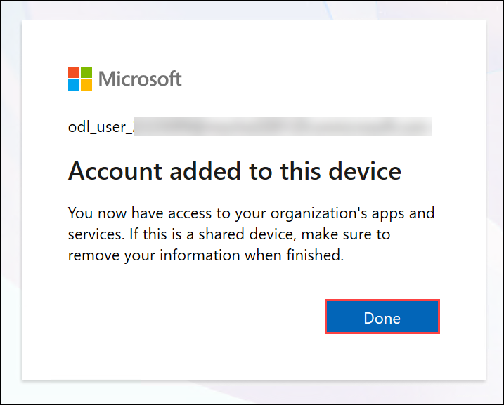

   > **Note:** If prompted to sign in for _AI Features_, you can select **Continue with GitHub** and use or create a GitHub account with your student credentials. This is only needed for GitHub Copilot — you may skip it and still complete the lab, just without Copilot's AI suggestions.

   **What to expect:** VS Code is connected to the Sentinel data-exploration server.

### Task 4: Explore a data lake table schema

In this task you'll browse the pre-populated tables. Before running a notebook, an analyst checks what data is available.

1. Select the **Microsoft Sentinel** icon (a stylized "S") in the left menu bar. Sign in with the following credentials if prompted.
   - **Email/Username:** <inject key="AzureAdUserEmail"></inject>

   - **Password:** <inject key="AzureAdUserPassword"></inject>

     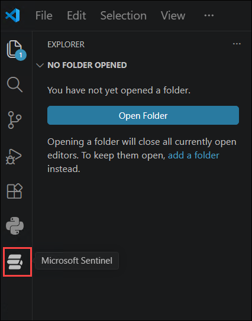

1. From the **Microsoft Sentinel** pane, click on **Sign In** under **LAKE TABLES**.

   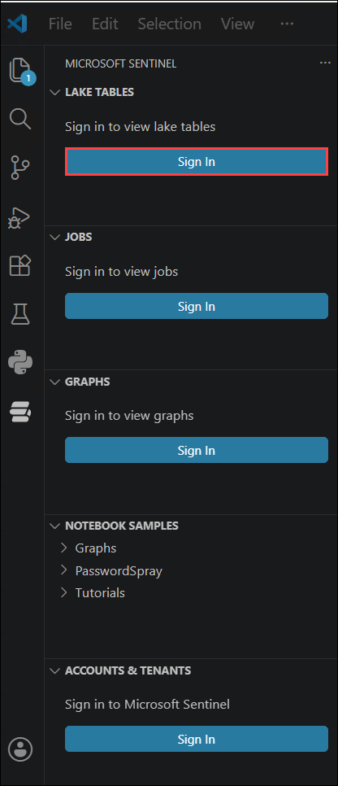

1. On the **'Microsoft Sentinel' extension wants to sign in using Microsoft** dialog, select **Allow**.

   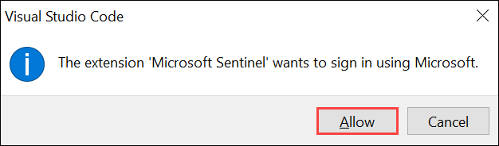

1. Select the account **<inject key="AzureAdUserEmail"></inject>** when prompted.

   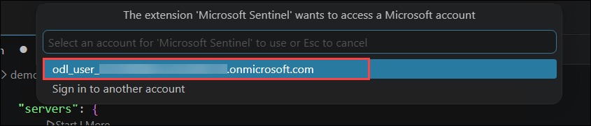

1. In the **LAKE TABLES** section, expand **SentinelWorkspace-01**, then expand the **Security & Audits** group.

   > **Note:** Data lake access isn't available in every environment. If you get "Your tenant is not eligible for the data lake", that's fine since this lab is optional, skip ahead to the next task and complete it by reading through the sample notebook instead of running it.

   .png>)

1. Select the **SecurityEvent** table to display its **schema** - the list of columns and their data types.

   **What you're seeing:** The schema tells you what fields you can query — for example, `TimeGenerated`, `Computer`, `EventID`, and `CommandLine`. This is exactly the table you hunted through with KQL in the previous lab; here you're viewing its structure from the notebook environment.

   **Why this matters:** Knowing the schema is the first step before writing any query or notebook cell - you can't hunt for a field that doesn't exist. Because the table is pre-populated, its schema and data are ready to explore immediately.

### Task 5: Explore and run a provided sample notebook

In this task you'll open one of Microsoft's provided tutorial notebooks and study how it's built. This teaches notebook structure and usage using data that's already there.

1. In the **NOTEBOOK SAMPLES** section, expand **Tutorials (1)** and select the **01_GettingStartedwithSentineldatalake (2)** tutorial notebook.

   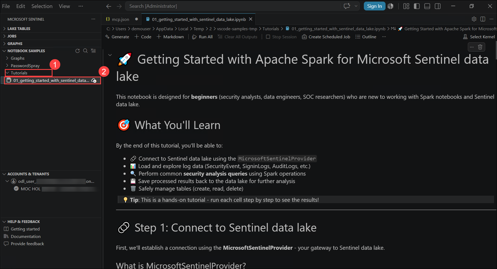

1. Once it opens, review how the notebook is organized. Notice the two kinds of cells:

   | Cell type          | Contains                    | Purpose                                           |
   | ------------------ | --------------------------- | ------------------------------------------------- |
   | **Markdown cells** | Formatted text              | Explains what each step does and why              |
   | **Code cells**     | Python (and KQL via magics) | The runnable logic that queries and analyzes data |

   **Why this structure is powerful:** A notebook is both the analysis _and_ its documentation. A hunter can hand a notebook to a colleague, who can read the markdown to understand the reasoning and re-run the code cells to reproduce the results - something a raw script can't do as clearly.

1. Read through the markdown cells in order to follow the tutorial's narrative - what it connects to, what it queries, and what it demonstrates.

1. **(Optional) Run the code cells.** If you'd like to see them execute:
   - You must first select a **Kernel** (the engine that runs the code). Choose the **Microsoft Sentinel** kernel with the recommended **small pool (12 vCores) python3** option.
   - Run cells top to bottom (each cell with the play button, or **Run All**). Because the data lake tables are pre-populated, queries return results without waiting on ingestion.

     > **Note:** Running cells is not required to complete this lab. Reading the notebook's structure and understanding how code and markdown combine is the core objective. Your instructor can help with kernel selection if time permits.

1. If you created or modified a notebook and want to keep it, select **Keep** (bottom right) to save it.

## Knowledge check

Test your understanding. Answers are below.

1. What makes a notebook different from a workbook or a playbook, and who typically uses notebooks?
2. What are the two main types of cells in a Jupyter notebook, and what does each hold?
3. Why is checking a table's schema an important first step before hunting with a notebook?
4. Name one Python library used to run KQL or perform security investigations from a notebook.
5. Why is a notebook often described as being both the analysis and its documentation?

<details>
<summary>Show answers</summary>

1. Notebooks are code-based tools for querying, enrichment, machine learning, and deep hunting, offering the most flexibility. They're used by threat hunters, Tier 2-3 analysts, incident investigators, and security data scientists. (Workbooks are for visualization/dashboards; playbooks are for automation.)
2. **Markdown cells** hold formatted explanatory text; **code cells** hold runnable code (Python, plus KQL via magics).
3. The schema shows which columns/fields exist, so you know what you can actually query — you can't hunt on a field that isn't there.
4. **Kqlmagic** (run KQL from a notebook) or **MSTICPy** (Microsoft Threat Intelligence Python Security Tools). Either is correct.
5. Because it interleaves runnable code with markdown text that explains the reasoning, so a colleague can both read _why_ each step was taken and re-run the code to reproduce the results.

</details>

## Review

In this lab, you have completed the following:

- Set up Visual Studio Code with the Python, Jupyter, GitHub Copilot, and Microsoft Sentinel extensions
- Connected Visual Studio Code to your Microsoft Sentinel data lake
- Explored the schema of the pre-populated `SecurityEvent` data lake table
- Opened and reviewed a provided sample notebook, and optionally ran its code cells

These are the same code-based hunting skills used by Tier 2-3 analysts and security data scientists to go beyond what the built-in Sentinel experience can do.

### You've successfully completed the hand's-on lab!
