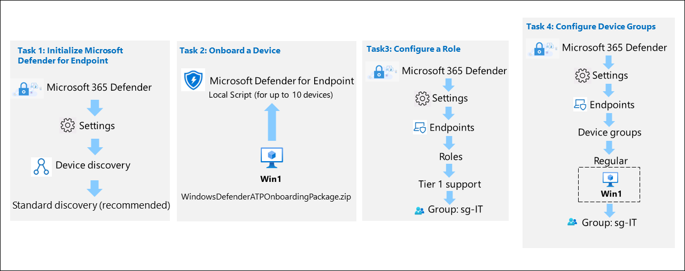

# Lab - Lesson 6 Lab 4: Harden and Investigate a Windows Endpoint with Built-in Security Tools

## Lab Scenario

You're a Security Operations Analyst working at a company that wants to harden its Windows workstations against common attacks and make sure analysts can investigate a device when something looks suspicious. In this lab you'll apply the same endpoint-security concepts a large organization uses — attack surface reduction, ransomware protection, host firewall configuration, and device investigation — but you'll do it using tools that are built into Windows.

> **Where this lab runs:** You'll perform every step on the **WIN1 virtual machine** provided in your CloudLabs environment — a disposable, cloud-hosted lab VM you reach through your browser. **Do not use your personal computer.** Nothing in this lab touches your own device, and the WIN1 VM is reset after the course, so the safe test activities below have no lasting effect on any real machine.

Because everything runs locally on that VM, there is **no cloud onboarding, no environment provisioning, and no waiting** for data to appear. Every command and setting in this lab takes effect immediately, so you can complete and verify the whole lab in one sitting.

> **Important:** The lab virtual machines are used across different modules. **Save your virtual machines** when you finish. If you exit without saving, you may have to redo some configuration.

## Lab objectives

In this lab, you will perform the following:

- Task 1: Obtain your credentials and open PowerShell as Administrator
- Task 2: Enable attack surface reduction (ASR) rules
- Task 3: Turn on controlled folder access (ransomware protection)
- Task 4: Configure the Windows Defender Firewall
- Task 5: Investigate the device with built-in tools
- Task 6: Verify, then clean up

By the end of this lab you will be able to:

- Describe attack surface reduction (ASR) and enable ASR rules with PowerShell.
- Turn on controlled folder access to protect against ransomware.
- Configure the Windows Defender Firewall to control network traffic.
- **Trigger safe test activity and confirm each protection is working by reading its log** — not just that the setting is on.
- Investigate a device using built-in Windows tools (running processes, startup/autorun entries, and the Event Viewer security log).

## Estimated Timing: 45 minutes

## Architecture Diagram



### Background: hardening and investigating an endpoint

Before you start, here's the idea behind each task.

An **endpoint** is any device — like this Windows workstation — that connects to your network. Attackers target endpoints because they're where users open email, plug in USB drives, and run programs. As a Security Operations Analyst, your job has two sides: **hardening** (reducing the ways an attacker can get in) and **investigating** (figuring out what happened when something goes wrong).

This lab practices four core skills:

- **Attack surface reduction (ASR)** shrinks the number of risky behaviors an attacker can use. For example, one ASR rule blocks Office applications from launching other programs — a trick malware in a malicious document often relies on.
- **Controlled folder access** is a ransomware defense. It only lets trusted apps change files in protected folders, so ransomware can't silently encrypt your documents.
- **The Windows Defender Firewall** controls which network connections are allowed in and out of the device — a first line of defense against network-based attacks.
- **Device investigation** is how you look inside a machine after an alert: what's running, what starts automatically, and what security events have been logged.

> **A note on the tools:** These features are part of **Microsoft Defender Antivirus and Windows**, which are built into every modern Windows install. They're the same underlying protections that a cloud platform like Microsoft Defender for Endpoint manages at scale — here you configure them directly on one machine so you can see exactly how they work.

> **Safety note:** Every command below is safe to run in your lab VM and is fully reversible. You'll use **Audit mode** for the riskier ASR rule so nothing is actually blocked, and the lab shows you how to undo each change at the end.

### Task 1: Obtain your credentials and open PowerShell as Administrator

All of the hardening steps require an elevated (administrator) PowerShell session, because security settings can only be changed by an administrator.

1. Sign in to the **WIN1** virtual machine as **Admin**, using the password provided in your CloudLabs environment.

   > **Tip:** Your credentials can be found on the **Environment Details** (or **Resources**) tab of your CloudLabs dashboard.

1. Select the **Start** button, type **PowerShell**, right-click **Windows PowerShell**, and choose **Run as administrator**.

1. If a **User Account Control** prompt appears, select **Yes**.

1. Confirm you're elevated by running the command below. It should return **True**.

   ```powershell
   (New-Object Security.Principal.WindowsPrincipal([Security.Principal.WindowsIdentity]::GetCurrent())).IsInRole([Security.Principal.WindowsBuiltInRole]::Administrator)
   ```

   > **Why this matters:** If this returns **False**, you opened a normal PowerShell window. Close it and reopen using **Run as administrator**, or the later commands will fail with an "Access denied" error.

**Checkpoint:** You have an administrator PowerShell window open, and the command above returned **True**.

### Task 2: Enable attack surface reduction (ASR) rules

In this task you'll view the current ASR configuration, enable one rule in **Block** mode, and enable a second rule in **Audit** mode so you can see the difference between enforcing and only logging.

1. First, see which ASR rules are currently configured. Run:

   ```powershell
   Get-MpPreference | Select-Object AttackSurfaceReductionRules_Ids, AttackSurfaceReductionRules_Actions
   ```

   > **What to expect:** On a fresh machine this usually returns nothing, which means no ASR rules are configured yet. That's normal.

1. Each ASR rule is identified by a **GUID** (a long unique ID) and set to an **action**. The actions are:

   | Action    | Meaning                                    | Numeric code |
   | --------- | ------------------------------------------ | ------------ |
   | Disabled  | Rule is off                                | 0            |
   | Enabled   | Rule blocks the behavior                   | 1            |
   | AuditMode | Rule only logs the behavior, doesn't block | 2            |
   | Warn      | Rule blocks but lets the user bypass       | 6            |

1. Enable the rule **Block Office applications from creating child processes** in **Block** mode. This stops a common malware technique where a malicious document tries to launch another program.

   ```powershell
   Add-MpPreference -AttackSurfaceReductionRules_Ids D4F940AB-401B-4EFC-AADC-AD5F3C50688A -AttackSurfaceReductionRules_Actions Enabled
   ```

   > **What this does:** From now on, Office apps on this machine can't spawn child processes. `Add-MpPreference` adds the rule without removing any rules you already had.

1. Now enable the rule **Block executable content from email client and webmail** in **Audit** mode. Audit mode _logs_ what the rule would have blocked, without actually blocking anything — this is how you safely test a rule before enforcing it.

   ```powershell
   Add-MpPreference -AttackSurfaceReductionRules_Ids BE9BA2D9-53EA-4CDC-84E5-9B1EEEE46550 -AttackSurfaceReductionRules_Actions AuditMode
   ```

   > **Think about it:** Why start a rule in Audit mode instead of Block? Because a new rule might interfere with legitimate work. Auditing first lets you confirm it's safe before you enforce it.

1. Verify both rules are now configured:

   ```powershell
   Get-MpPreference | Select-Object -ExpandProperty AttackSurfaceReductionRules_Ids
   Get-MpPreference | Select-Object -ExpandProperty AttackSurfaceReductionRules_Actions
   ```

   > **What to expect:** You should see the two GUIDs listed, with actions **1** (Block) and **2** (Audit) — one for each rule you added. The order of the two lists matches, so the first GUID goes with the first action.

#### See the rule in action

Configuring a rule is one thing — watching it fire is what makes it real. ASR events are recorded in a dedicated Windows log. You'll check that log, generate a small event, and confirm it appears.

1. First, look at how many ASR events are already recorded in the **Microsoft-Windows-Windows Defender/Operational** log:

   ```powershell
   Get-WinEvent -LogName "Microsoft-Windows-Windows Defender/Operational" -MaxEvents 200 |
     Where-Object { $_.Id -in 1121,1122 } |
     Measure-Object | Select-Object -ExpandProperty Count
   ```

   > **What this checks:** Event ID **1121** is an ASR rule _block_, and **1122** is an ASR rule _audit_ detection. This gives you a starting count so you can tell if a new event appears.

1. Now generate a harmless event by asking Defender to run its built-in signature/configuration check, which exercises the engine and writes operational events:

   ```powershell
   Update-MpSignature -ErrorAction SilentlyContinue
   Start-Sleep -Seconds 3
   ```

   > **Note:** This is completely safe — it just prompts the Defender engine to refresh, which is normal background activity. We use it here instead of a real malicious trigger because it needs no external files and can't disrupt the VM.

1. Read the most recent Windows Defender operational events to confirm the log is active and see what ASR/Defender records look like:

   ```powershell
   Get-WinEvent -LogName "Microsoft-Windows-Windows Defender/Operational" -MaxEvents 10 |
     Select-Object TimeCreated, Id, LevelDisplayName |
     Format-Table -AutoSize
   ```

   > **What to look for:** Recent entries with timestamps from the last few minutes confirm the Defender log is live on this machine. In a real detection, an ASR block would appear here as **Event ID 1121** naming the rule and the process it stopped — this is exactly where an analyst looks to confirm a rule caught something.

   > **Instructor note:** To demonstrate a genuine ASR _block_ event (1121) rather than engine activity, an instructor can, on a VM with Microsoft 365 Apps installed, open Word and use a macro that launches a child process — the "Block Office child process" rule you enabled will stop it and log 1121. This is optional and requires Office, so it's kept as a demo rather than a required student step.

**Checkpoint:** Two ASR rules are configured (actions 1 and 2), and you've confirmed the Windows Defender operational log is recording events on this machine.

### Task 3: Turn on controlled folder access (ransomware protection)

Controlled folder access protects important folders by only allowing trusted apps to change the files inside them. In this task you'll check its status, enable it in Audit mode, add a folder to protect, and confirm your changes.

1. Check the current status of controlled folder access:

   ```powershell
   Get-MpPreference | Select-Object EnableControlledFolderAccess
   ```

   > **What the values mean:** **0** = Disabled (off), **1** = Enabled (blocks untrusted apps), **2** = Audit (only logs). It's likely **0** on a fresh machine.

1. Turn on controlled folder access in **Audit** mode. As with ASR, audit mode is the safe way to see what _would_ be blocked without disrupting anything.

   ```powershell
   Set-MpPreference -EnableControlledFolderAccess AuditMode
   ```

   > **What this does:** Windows will now log any time an untrusted app tries to modify a protected folder, but it won't actually stop it yet. In production you'd switch this to **Enabled** after confirming trusted apps still work.

1. By default, controlled folder access already protects standard folders like Documents, Desktop, and Pictures. Add a custom folder to the protected list. First create a test folder, then protect it:

   ```powershell
   New-Item -Path "C:\LabProtected" -ItemType Directory -Force
   Add-MpPreference -ControlledFolderAccessProtectedFolders "C:\LabProtected"
   ```

   > **What this does:** `C:\LabProtected` is now guarded alongside the default folders. Only trusted applications will be able to change files in it once you move from Audit to Enabled mode.

1. Confirm your configuration:

   ```powershell
   Get-MpPreference | Select-Object EnableControlledFolderAccess
   (Get-MpPreference).ControlledFolderAccessProtectedFolders
   ```

   > **What to expect:** The first command returns **2** (Audit mode). The second lists your protected folders, including **C:\LabProtected**.

#### See it in action

Because you enabled controlled folder access in **Audit** mode, you can safely trigger a write to a protected folder and see it recorded — without anything actually being blocked.

1. Write a test file into a protected folder. In Audit mode this **succeeds**, but Defender logs that an untrusted process touched a protected location:

   ```powershell
   "Test write at $(Get-Date)" | Out-File "C:\LabProtected\cfa_test.txt"
   Get-Content "C:\LabProtected\cfa_test.txt"
   ```

   > **What this shows:** The write goes through (Audit mode doesn't block), and you can read the file back. If you later switched controlled folder access to **Enabled**, this same write from an untrusted app would be _blocked_ — that's the protection ransomware runs into.

1. Look for controlled folder access events in the Windows Defender operational log. Event ID **1124** is an audit-mode detection and **1123** is a block:

   ```powershell
   Get-WinEvent -LogName "Microsoft-Windows-Windows Defender/Operational" -MaxEvents 200 -ErrorAction SilentlyContinue |
     Where-Object { $_.Id -in 1123,1124 } |
     Select-Object TimeCreated, Id, LevelDisplayName |
     Format-Table -AutoSize
   ```

   > **What to look for:** If PowerShell is treated as an untrusted writer for that folder, you'll see a **1124** audit event. Depending on how the VM trusts PowerShell, the list may be empty — that's fine, and itself a useful lesson: audit logging depends on whether the writing process is already trusted. The key skill is knowing _which log and which Event IDs_ to check.

   > **Think about it:** Why is Audit mode so valuable before enforcing? Because it lets you discover exactly which apps would be blocked — and add the legitimate ones as exclusions — before the block ever affects a real user.

**Checkpoint:** Controlled folder access is in Audit mode (value 2), C:\LabProtected is protected, and you've checked the log for controlled-folder-access events (1123/1124).

### Task 4: Configure the Windows Defender Firewall

The host firewall controls which network connections are allowed. In this task you'll review the firewall's status across its three profiles and confirm it's protecting the device.

1. View the status of all three firewall profiles — **Domain**, **Private**, and **Public**:

   ```powershell
   Get-NetFirewallProfile | Select-Object Name, Enabled
   ```

   > **What the profiles mean:** Windows applies a different firewall profile depending on the network type. **Domain** is used on a corporate network, **Private** on a trusted home/office network, and **Public** on untrusted networks like coffee-shop Wi-Fi (the strictest). Each should show **Enabled: True**.

1. If any profile shows **Enabled: False**, turn the firewall on for all profiles:

   ```powershell
   Set-NetFirewallProfile -Profile Domain,Private,Public -Enabled True
   ```

   > **Why this matters:** A disabled firewall profile means the device accepts network connections without filtering on that network type — exactly what an attacker on the same network wants.

1. Look at what happens to unsolicited inbound connections by default:

   ```powershell
   Get-NetFirewallProfile | Select-Object Name, DefaultInboundAction, DefaultOutboundAction
   ```

   > **What to expect:** Inbound is typically **Block** (nothing gets in unless a rule allows it) and outbound is typically **Allow**. This "block inbound, allow outbound" default is a sensible baseline for a workstation.

1. As a practical example, view the built-in firewall rules that control **Remote Desktop**, a commonly attacked service:

   ```powershell
   Get-NetFirewallRule -DisplayGroup "Remote Desktop" | Select-Object DisplayName, Enabled, Direction, Action
   ```

   > **What this shows:** Whether inbound Remote Desktop connections are currently allowed. In a hardening exercise, an analyst reviews rules like these to make sure only intended services are reachable.

#### See it in action

Reviewing rules is useful, but you can also _prove_ a firewall rule works by creating one and testing it. You'll block a specific outbound destination, confirm it's blocked, then remove the rule.

1. Confirm you currently have outbound access to a safe test address by resolving and reaching it:

   ```powershell
   Test-NetConnection -ComputerName "www.microsoft.com" -Port 443 -InformationLevel Quiet
   ```

   > **What to expect:** This returns **True**, meaning the connection succeeds right now (assuming the VM has internet). If your VM has no internet access, skip to the log step below — the rule creation still demonstrates the concept.

1. Create an outbound firewall rule that **blocks** connections to that destination's port, then test again:

   ```powershell
   New-NetFirewallRule -DisplayName "LabBlockTest" -Direction Outbound -Action Block -RemotePort 443 -Protocol TCP -Enabled True | Out-Null
   Test-NetConnection -ComputerName "www.microsoft.com" -Port 443 -InformationLevel Quiet
   ```

   > **What to expect:** After the block rule, the same test now returns **False** — you just watched the firewall stop a connection it previously allowed. This is the firewall doing its core job, live.

   > **Caution:** This rule blocks _all_ outbound HTTPS (port 443) on the VM while it exists, which will interrupt web traffic. That's fine for the few seconds of this test — you remove it in the next step.

1. Remove the test rule to restore normal traffic:

   ```powershell
   Remove-NetFirewallRule -DisplayName "LabBlockTest"
   Test-NetConnection -ComputerName "www.microsoft.com" -Port 443 -InformationLevel Quiet
   ```

   > **What to expect:** The connection returns **True** again — removing the rule restored access. You've now seen a firewall rule take effect and be reversed.

**Checkpoint:** All three firewall profiles show **Enabled: True**, the default inbound action is **Block**, and you observed a custom block rule take effect and then be removed.

### Task 5: Investigate the device with built-in tools

When an alert fires, an analyst needs to look inside the machine. In this task you'll practice three fundamental investigation techniques: reviewing running processes, checking what starts automatically, and reading the security event log — all with tools already on the device.

#### Review running processes

1. List the running processes, showing the newest first:

   ```powershell
   Get-Process | Sort-Object StartTime -Descending | Select-Object -First 15 Name, Id, StartTime, Path
   ```

   > **What to look for:** During an investigation, analysts look for processes running from unusual locations (like a temp or downloads folder), processes with misspelled names imitating system files, or a process that started right before an alert. The **Path** column shows where each program is running from.

#### Check startup / autorun entries

2. Malware often adds itself to startup so it survives a reboot. List programs configured to run at startup:

   ```powershell
   Get-CimInstance Win32_StartupCommand | Select-Object Name, Command, Location, User
   ```

   > **What to look for:** Entries pointing to unfamiliar programs or scripts in user-writable locations are worth investigating. Legitimate software appears here too, so the skill is telling normal from suspicious.

#### Read the security event log

3. Review the most recent security events — for example, sign-in activity:

   ```powershell
   Get-WinEvent -LogName Security -MaxEvents 15 | Select-Object TimeCreated, Id, LevelDisplayName, Message
   ```

   > **What to look for:** Event ID **4624** is a successful sign-in and **4625** is a failed sign-in. A burst of 4625 events can indicate someone guessing a password. (You can also open the graphical **Event Viewer** from the Start menu and browse to **Windows Logs > Security** to see the same data.)

   > **Note:** If this command returns an error about no events, the security log may require the elevated session you already have — confirm you're in the administrator PowerShell window from Task 1.

**Checkpoint:** You've listed running processes with their paths, viewed startup entries, and read recent security-log events.

### Task 6: Verify, then clean up

Good practice is to confirm your hardening is in place, then return the lab machine to its original state so the next module starts clean.

1. Run this summary to review everything you configured:

   ```powershell
   Write-Host "=== ASR Rules ==="
   Get-MpPreference | Select-Object -ExpandProperty AttackSurfaceReductionRules_Ids
   Get-MpPreference | Select-Object -ExpandProperty AttackSurfaceReductionRules_Actions
   Write-Host "=== Controlled Folder Access (0=Off 1=On 2=Audit) ==="
   Get-MpPreference | Select-Object -ExpandProperty EnableControlledFolderAccess
   Write-Host "=== Firewall Profiles ==="
   Get-NetFirewallProfile | Select-Object Name, Enabled
   ```

**Verification checklist:**

- [ ] Two ASR rules are configured (actions 1 and 2).
- [ ] Controlled folder access returns 2 (Audit).
- [ ] All three firewall profiles are Enabled.
- [ ] You successfully listed processes, startup entries, and security events.

2. **Clean up** — undo the changes so the VM is back to its starting state:

   ```powershell
   # Remove the two ASR rules you added
   Remove-MpPreference -AttackSurfaceReductionRules_Ids D4F940AB-401B-4EFC-AADC-AD5F3C50688A
   Remove-MpPreference -AttackSurfaceReductionRules_Ids BE9BA2D9-53EA-4CDC-84E5-9B1EEEE46550

   # Turn controlled folder access back off and remove the test folder (and its test file)
   Set-MpPreference -EnableControlledFolderAccess Disabled
   Remove-MpPreference -ControlledFolderAccessProtectedFolders "C:\LabProtected"
   Remove-Item -Path "C:\LabProtected" -Recurse -Force

   # Safety: remove the firewall test rule if it was left behind
   Remove-NetFirewallRule -DisplayName "LabBlockTest" -ErrorAction SilentlyContinue
   ```

   > **Note:** Leave the firewall profiles **enabled** — those should stay on. Only the ASR rules, controlled folder access, the test folder, and the temporary firewall test rule are removed.

**Checkpoint:** Re-running the summary from step 1 shows no ASR rules and controlled folder access back at 0.

## Knowledge check

Test your understanding. Answers are below.

1. What is the purpose of attack surface reduction, and give one example of a behavior an ASR rule can block.
2. What's the difference between setting an ASR rule to **Enabled** versus **AuditMode**, and why might you start a new rule in Audit mode?
3. How does controlled folder access help defend against ransomware?
4. The Windows Defender Firewall has three profiles. Which one is the strictest, and when is it used?
5. During a device investigation, which security Event IDs indicate a successful sign-in and a failed sign-in?

<details>
<summary>Show answers</summary>

1. ASR reduces the number of risky behaviors attackers can exploit. Example: blocking Office applications from creating child processes (or blocking executable content from email/webmail).
2. **Enabled** actually blocks the behavior; **AuditMode** only logs what would have been blocked. You start in Audit mode to confirm the rule won't disrupt legitimate work before you enforce it.
3. It only allows trusted applications to modify files in protected folders, so ransomware (an untrusted process) can't encrypt those files.
4. The **Public** profile is the strictest; it's used on untrusted networks such as public Wi-Fi.
5. **4624** is a successful sign-in; **4625** is a failed sign-in.

</details>

## Review

In this lab, you have completed the following:

- Enabled attack surface reduction (ASR) rules and confirmed the Windows Defender operational log
- Turned on controlled folder access for ransomware protection, protecting a custom folder
- Confirmed the Windows Defender Firewall was active across all three profiles
- Investigated the device using built-in tools — reviewing running processes, startup entries, and the security event log
- Verified and cleaned up all changes

These are the same endpoint-security concepts used at enterprise scale, practiced directly on a single machine.

## Select **Next** to continue to Lesson 7 Lab 5
