# Lab - Lesson 7 Lab 5: Investigate Attack Evidence and Entities on a Windows Endpoint

### Estimated Timing: 2 Hours

## Lab Scenario

You're a Security Operations Analyst. A monitoring tool has flagged unusual activity on the **WIN-1** workstation, and it's your job to investigate. A real investigation is about _pivoting between entities_: you start with one clue a suspicious file and follow it to the process it launched, the network address it contacted, and the user account it ran under, building a picture of what happened.

In this lab you'll practice exactly that workflow. You'll safely trigger some suspicious-looking (but completely harmless) activity on the machine, then investigate each **entity** it produces using tools built into Windows. Because everything runs and is logged **locally**, there is **no cloud onboarding, no device to wait for, and no delay** while alerts propagate. Every step produces results immediately.

> **Where this lab runs:** You'll perform every step on the **WIN-1 virtual machine** provided in your CloudLabs environment a disposable, cloud-hosted lab VM you reach through your browser. **Do not use your personal computer.** The simulated activity in this lab is benign and self-contained, and the WIN-1 VM is reset after the course, so nothing here has any lasting effect on a real machine.

## Lab objectives

In this lab, you will perform the following:

- Task 1: Obtain your credentials and open PowerShell as Administrator
- Task 2: Trigger the simulated suspicious activity
- Task 3: Investigate the file entity
- Task 4: Investigate the process entity
- Task 5: Investigate the network entity (IP address and domain)
- Task 6: Investigate the user account entity
- Task 7: Build the incident summary, then clean up

### Background: evidence and entities in an investigation

Before you start, here's the mental model.

When something suspicious happens on a device, the investigation is organized around **entities** - the distinct "things" involved in the event. Lesson 7 describes the key entity types an analyst pivots through:

- **File** - the artifact on disk. Is it signed? Where does it live? What is its hash (a unique fingerprint used to check reputation)?
- **Process** - the running program. What launched it (its _parent_)? What did it launch (its _children_)? A tree of processes often tells the story of an attack.
- **IP address / domain** - where a process connected. Attackers use a **command-and-control (C2)** server to control compromised machines, so an unexpected outbound connection is a strong signal.
- **User account** - whose credentials were used. Compromised accounts and unexpected sign-ins are central to detecting **lateral movement**.

In a large organization these entities are investigated in a cloud portal that has already collected the data. In this lab you investigate the **same entity types on one machine** using built-in Windows tools, so you understand what the portal is actually showing you underneath.

> **A note on the tools:** Everything here uses Windows built-ins - PowerShell, the Event Viewer, and standard networking commands. Nothing needs to be installed, onboarded, or connected to the cloud.

> **Safety note - this is a _simulated_, benign scenario.** The "suspicious" script you run does nothing harmful: it creates a text file, starts Notepad, and attempts a single outbound connection to a safe, well-known test address. There is no real malware. Only run the steps provided here in your course lab VM. You'll clean everything up at the end.

### Task 1: Obtain your credentials and open PowerShell as Administrator

In this task you'll open PowerShell as Administrator and confirm you're running with elevated access, which investigation commands need in order to read system and security logs.

1. Select the **Start** button, type **PowerShell (1)**, then from the **Best match** section right-click on **Windows PowerShell (2)**, and choose **Run as administrator (3)**.

   

1. Confirm you're elevated (this should return **True**):

   ```powershell
   (New-Object Security.Principal.WindowsPrincipal([Security.Principal.WindowsIdentity]::GetCurrent())).IsInRole([Security.Principal.WindowsBuiltInRole]::Administrator)
   ```

   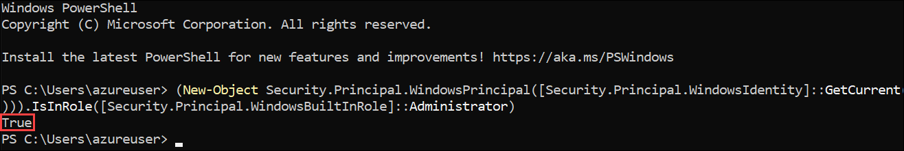

   **Why this matters:** If this returns **False**, you opened a normal PowerShell window. Close it and reopen using **Run as administrator**, or the later commands will fail with an "Access denied" error.

### Task 2: Trigger the simulated suspicious activity

In this task you'll create and run a small, harmless script that mimics the _shape_ of an attack - an unfamiliar script drops a file, launches a process, and reaches out to the network - so you have real, local evidence to investigate.

1. Create a working folder and the simulation script by pasting this whole block into PowerShell:

   ```powershell
   New-Item -Path "C:\LabSim" -ItemType Directory -Force | Out-Null
   @'
   # Benign simulated-activity script (safe for lab use)
   Write-Host "Simulating suspicious activity..."
   # 1. Drop a file (an attacker might drop a payload or a note)
   "Simulated artifact created at $(Get-Date)" | Out-File "C:\LabSim\dropped_artifact.txt"
   # 2. Launch a process (attackers often spawn a visible app as cover)
   Start-Process notepad.exe
   # 3. Make one outbound connection to a SAFE public test endpoint (simulating C2 beacon)
   try { Test-NetConnection -ComputerName "www.msftconnecttest.com" -Port 80 -InformationLevel Detailed } catch { Write-Host "Connection attempt logged." }
   Write-Host "Simulation complete."
   '@ | Out-File "C:\LabSim\SimActivity.ps1" -Encoding UTF8
   ```

   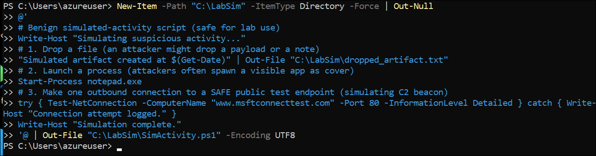

   **What this does:** It writes a script named `SimActivity.ps1` into `C:\LabSim`. The script is fully benign read it if you like with `Get-Content C:\LabSim\SimActivity.ps1`.

   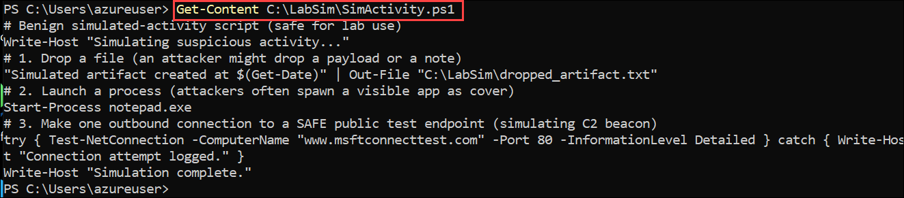

1. Run the simulation:

   ```powershell
   powershell.exe -ExecutionPolicy Bypass -File "C:\LabSim\SimActivity.ps1"
   ```

   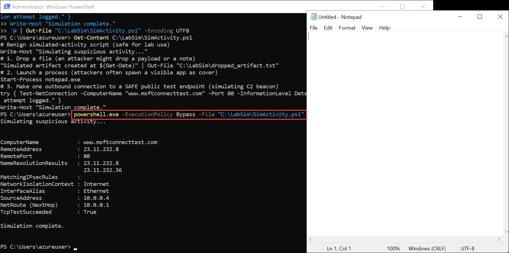

   **What to expect:** You'll see status text, **Notepad will open**, and you'll see the result of a connection test to a Microsoft connectivity-test address (a safe, public endpoint used here to stand in for a C2 server). Leave Notepad open for now.

   > **Note:** `www.msftconnecttest.com` is the address Windows itself uses to check for internet connectivity. It's completely safe and is used here only so there's a real outbound connection to investigate.

### Task 3: Investigate the file entity

In this task you'll investigate the file entity - checking its location, hash, and digital signature. Your first clue is the suspicious script file; an analyst asks: where is it, is it signed by a trusted publisher, and what is its hash?

1. Look at the file's basic properties like location, size, and timestamps:

   ```powershell
   Get-Item "C:\LabSim\SimActivity.ps1" | Select-Object FullName, Length, CreationTime, LastWriteTime
   ```

   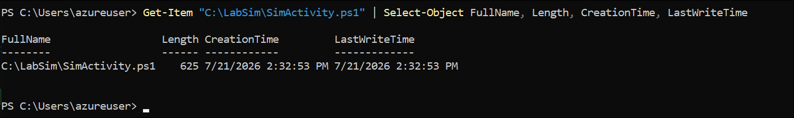

   **What to look for:** A script sitting in an unusual folder (not Program Files), created moments before an alert, is exactly the kind of thing worth a closer look.

1. Compute the file's **hash**, a unique fingerprint. Analysts paste hashes into threat-intelligence services to check if a file is known-malicious:

   ```powershell
   Get-FileHash "C:\LabSim\SimActivity.ps1" -Algorithm SHA256
   ```

   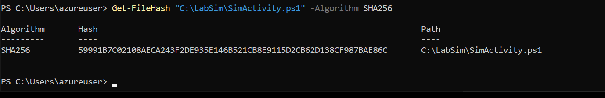

   **Why this matters:** The hash identifies this exact file no matter what it's named. In a real investigation you'd search this value against an IoC (indicator of compromise) list or a reputation service.

1. Check whether the file is **digitally signed** by a trusted publisher:

   ```powershell
   Get-AuthenticodeSignature "C:\LabSim\SimActivity.ps1" | Select-Object Status, SignerCertificate
   ```

   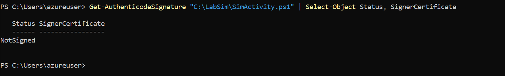

   **What to look for:** A status of **NotSigned** (which you'll see here) means no trusted publisher vouches for the file. Legitimate software is usually signed; unsigned scripts in odd locations deserve scrutiny.

### Task 4: Investigate the process entity

In this task you'll investigate the process entity and trace its parent/child relationship. The file launched a process (Notepad), and analysts trace **process relationships** - what started what - because the chain often reveals the attack.

1. Find the running Notepad process and note its Process ID (PID):

   ```powershell
   Get-Process notepad | Select-Object Name, Id, StartTime, Path
   ```

   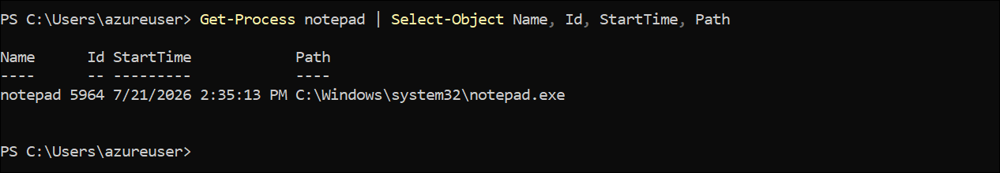

1. Look at the full picture of recently started processes with their command lines. The command line often reveals intent that the process name alone hides:

   ```powershell
   Get-CimInstance Win32_Process | Where-Object { $_.Name -match "notepad|powershell" } | Select-Object ProcessId, ParentProcessId, Name, CommandLine | Format-List
   ```

   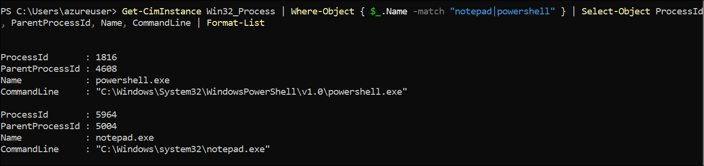

   **What to look for:** The **ParentProcessId** links a process to whatever launched it. Seeing that Notepad (or a PowerShell process) was spawned by another script - rather than by the user double-clicking - is the kind of parent/child relationship that signals automated, possibly malicious, activity.

1. Trace one process back to its parent to build the chain:

   ```powershell
   $p = Get-CimInstance Win32_Process -Filter "Name='notepad.exe'" | Select-Object -First 1
   $parent = Get-CimInstance Win32_Process -Filter "ProcessId=$($p.ParentProcessId)"
   "Child : $($p.Name) (PID $($p.ProcessId))"
   "Parent: $($parent.Name) (PID $($parent.ProcessId))"
   ```

   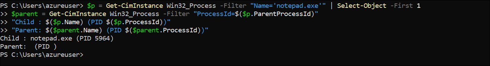

   **What this shows:** The parent/child pair - the local equivalent of the process tree shown on a device's investigation page.

### Task 5: Investigate the network entity (IP address and domain)

In this task you'll investigate the network entity - the IP address and domain the simulation contacted. The simulation reached out to an external address, and investigating **where** a device connected is central to spotting C2 traffic.

1. View current outbound network connections and the process behind each:

   ```powershell
   Get-NetTCPConnection -State Established | Select-Object LocalAddress, RemoteAddress, RemotePort, OwningProcess | Sort-Object RemoteAddress
   ```

   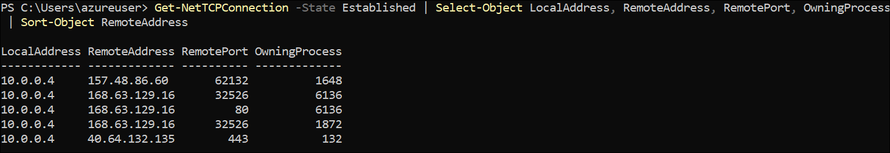

   **What to look for:** Unfamiliar **RemoteAddress** values - especially on odd ports - are worth investigating. The **OwningProcess** ties a connection back to a specific process (PID) from Task 4.

1. Resolve the domain the simulation contacted to an IP address (the reverse of what an analyst does when pivoting from an IP to a domain):

   ```powershell
   Resolve-DnsName "www.msftconnecttest.com" | Select-Object Name, Type, IPAddress
   ```

   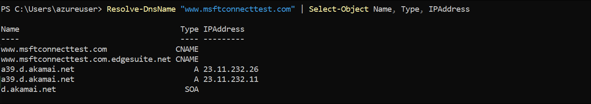

   **What this shows:** The link between a **domain** entity and an **IP address** entity. In the portal these are separate investigation pages; here you can see they describe the same destination.

1. Perform a reverse lookup - going from an IP back to a name, another common pivot:

   ```powershell
   $ip = (Resolve-DnsName "www.msftconnecttest.com" | Where-Object {$_.Type -eq "A"} | Select-Object -First 1).IPAddress
   "Resolved IP: $ip"
   try { Resolve-DnsName $ip -ErrorAction Stop | Select-Object NameHost } catch { "No reverse DNS record (common for many hosts)." }
   ```

   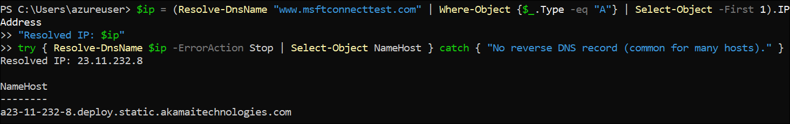

   **Why this matters:** Mapping between IPs and domains lets an analyst determine whether a connection went somewhere expected. An unexpected IP with no reverse DNS and no business reason is a red flag.

### Task 6: Investigate the user account entity

In this task you'll investigate the user account entity and review recent sign-in activity. Every action ran under a user account, and analysts investigate accounts to spot compromised credentials and unusual sign-ins.

1. Confirm which account the current session is running under:

   ```powershell
   whoami
   whoami /groups | Select-String "Administrators"
   ```

   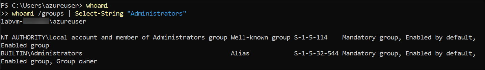

   **What this shows:** The identity behind the activity and whether it holds administrative privileges - important, because an attacker operating as an admin can do far more damage.

1. Review recent sign-in events from the Security log. Event ID **4624** is a successful sign-in:

   ```powershell
   Get-WinEvent -FilterHashtable @{LogName='Security'; Id=4624} -MaxEvents 10 | Select-Object TimeCreated, Id, @{N='Account';E={$_.Properties[5].Value}} | Format-Table -AutoSize
   ```

   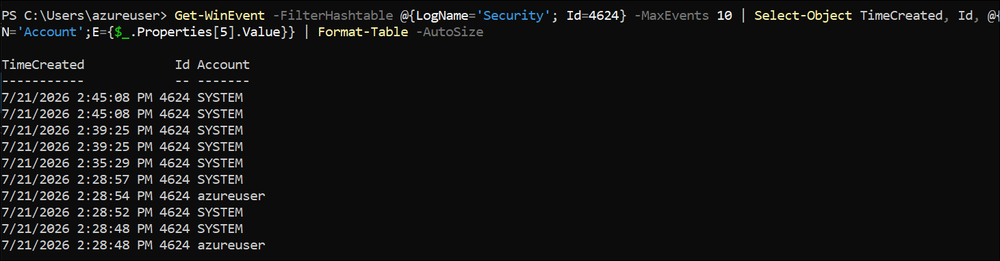

   **What to look for:** Sign-ins at unusual times, from unexpected accounts, or in rapid succession. A cluster of failed sign-ins (Event ID **4625**) before a success can indicate password guessing.

1. Check for recent **failed** sign-ins (4625), which may be empty in a clean lab - an empty result is itself a finding (no brute-force seen):

   ```powershell
   try {
       Get-WinEvent -FilterHashtable @{LogName='Security'; Id=4625} -MaxEvents 10 -ErrorAction Stop | Select-Object TimeCreated, Id | Format-Table -AutoSize
   } catch {
       "No failed sign-in (4625) events found - no brute-force activity in this window."
   }
   ```

   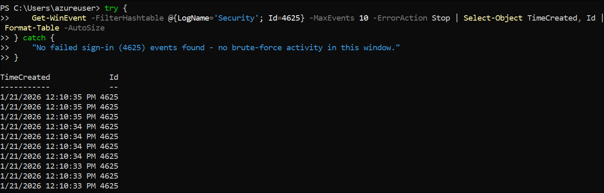

### Task 7: Build the incident summary, then clean up

In this task you'll build an incident summary that ties the entities together, then clean up the simulation artifacts. A real investigation ends with a concise summary that ties the entities together into a story; you'll assemble one, then return the machine to its starting state.

1. Assemble your findings into a single summary (this pulls the key facts together automatically):

   ```powershell
   $file = "C:\LabSim\SimActivity.ps1"
   Write-Host "===== INCIDENT SUMMARY ====="
   Write-Host "FILE:     $file"
   Write-Host "  Hash:   $((Get-FileHash $file -Algorithm SHA256).Hash)"
   Write-Host "  Signed: $((Get-AuthenticodeSignature $file).Status)"
   $np = Get-CimInstance Win32_Process -Filter "Name='notepad.exe'" | Select-Object -First 1
   Write-Host "PROCESS:  notepad.exe (PID $($np.ProcessId)), launched by parent PID $($np.ParentProcessId)"
   Write-Host "NETWORK:  contacted www.msftconnecttest.com ($((Resolve-DnsName 'www.msftconnecttest.com' | Where-Object Type -eq 'A' | Select-Object -First 1 -ExpandProperty IPAddress)))"
   Write-Host "USER:     $(whoami)"
   Write-Host "==========================="
   ```

   **Think about it:** Read the summary as a sentence: _"An unsigned script in C:\LabSim launched Notepad, which ran under the admin account and reached an external address."_ That entity-to-entity narrative is exactly what an incident graph conveys visually in a security portal.

   **Verification checklist:**
   - File: you have the hash and confirmed it's NotSigned.
   - Process: you identified Notepad's PID and its parent.
   - Network: you resolved the contacted domain to an IP.
   - User: you identified the acting account and reviewed sign-in events.
   - You produced a combined incident summary.

     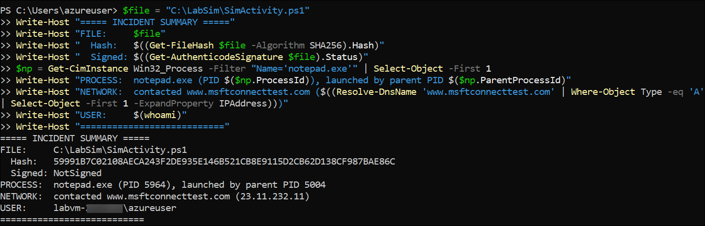

2. Close the Notepad window that the simulation opened.

3. **Clean up** - remove the simulation artifacts:

   ```powershell
   Get-Process notepad -ErrorAction SilentlyContinue | Stop-Process -Force
   Remove-Item -Path "C:\LabSim" -Recurse -Force
   ```

## Knowledge check

Test your understanding. Answers are below.

1. Name the five entity types an analyst pivots through during an investigation.
2. What is a file hash, and why is it useful when checking a file against threat intelligence?
3. Why does the parent/child relationship between processes matter in an investigation?
4. What is a command-and-control (C2) server, and why is an unexpected outbound connection suspicious?
5. During a user-account investigation, which Windows Security Event IDs represent a successful sign-in and a failed sign-in, and what might a burst of failed sign-ins indicate?

## Review

In this lab, you have completed the following:

- Triggered a safe, simulated suspicious event on the WIN1 workstation
- Investigated the file entity (hash and signature)
- Investigated the process entity (and its parent/child chain)
- Investigated the network connection entity (IP and domain)
- Investigated the user account entity (and its sign-in events)
- Assembled the evidence into an incident summary and cleaned up

These are the same evidence-and-entity investigation skills used in an enterprise security portal, practiced directly on a single machine with no onboarding and no waiting.

### You've successfully completed the hand's-on lab!
