# Exercise 2 - Enabling Data Connectors in Microsoft Sentinel in Microsoft Defender Portal

## Estimated Duration: 40 Minutes

## Overview

In this lab, you will enable and configure data connectors in Microsoft Sentinel to ingest logs and events from selected sources such as Microsoft Entra ID. You will explore available connectors, set up the integration, and verify that data is flowing into your Log Analytics workspace. This process establishes the data foundation required for analytics, threat hunting, and incident response in subsequent exercises.


## Lab Objectives
 In this lab, you will perform the following:

- Task 1: Connect the Microsoft Entra ID connector
- Task 2: Connect the Microsoft Defender for Cloud connector
- Task 3: Connect the Azure Activity connector

### Task 1: Connect the Microsoft Entra ID connector

 In this task, you will connect the Microsoft Entra ID connector to Microsoft Sentinel.

 1. Navigate to **Microsoft Defender Portal**

      ```
      https://security.microsoft.com/
      ```

 1. On the left side menu, select **Microsoft Sentinel (1)** > **Content management (2)** and select **Content hub (3)** under the Configuration.

     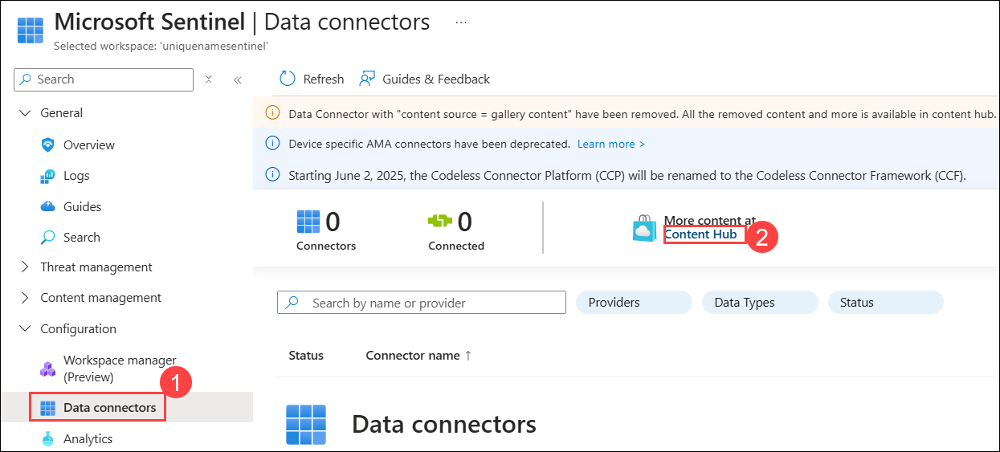
 
 1. On the Content hub page, search for **Microsoft Entra ID (1)**, then select **Microsoft Entra ID (2)** Data connector from the dropdown list and click on **Install (3)** to install it.

    

 1. From the left hand pane, click on **Configuration (1)** under **Microsoft Sentinel** select **Data connectors (2)** and expand **Microsoft Entra ID (3)** data connector and click on it, then select the **Open connector page (4)** on the connector information blade.

    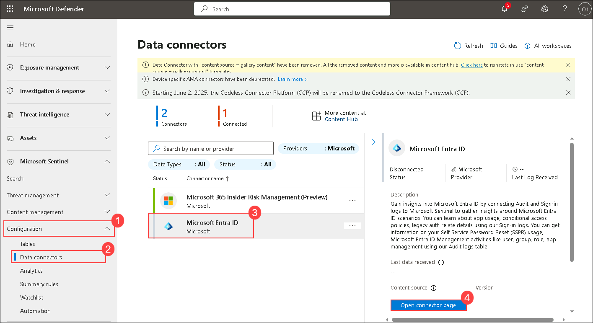

 1. Check the box for **Sign-in Logs (1)** and **Audit Logs (2)** options under the Configuration, then select **Apply Changes (3)**.

    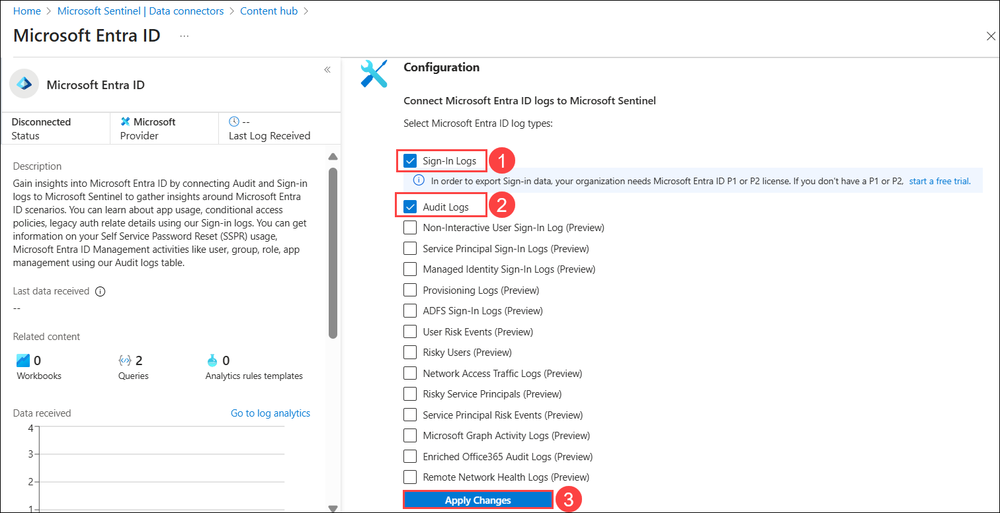

    >**Note:** It may take **15–20 minutes** for the **Microsoft Entra ID** data connector to show a **Connected** status after configuration. 

### Task 2: Connect the Microsoft Defender for Cloud connector

In this task, you will connect the Microsoft Defender for Cloud connector.

1. On the left side menu, select **Microsoft Sentinel (1)** > **Content management (2)** and select **Content hub (3)** under the Configuration.

    

1. On **Content hub** page, search for **Microsoft Defender for Cloud (1)** and **expand it (2)** from the list, then select **Tenant-based Microsoft Defender for Cloud (3)** Data connector and click on **Install Solution (4)** to install it.

   

    >**Note:** The Microsoft Defender for Cloud solution installs the Tenant-based Microsoft Defender for Cloud Data connector, Subscription-based Microsoft Defender for Cloud (Legacy) Data connector, and an Analytics rule.

1. On **Content hub** page, select the **Tenant-based Microsoft Defender for Cloud (1)** Data connector, and select the **Open connector page (2)** on the connector information blade.
   
   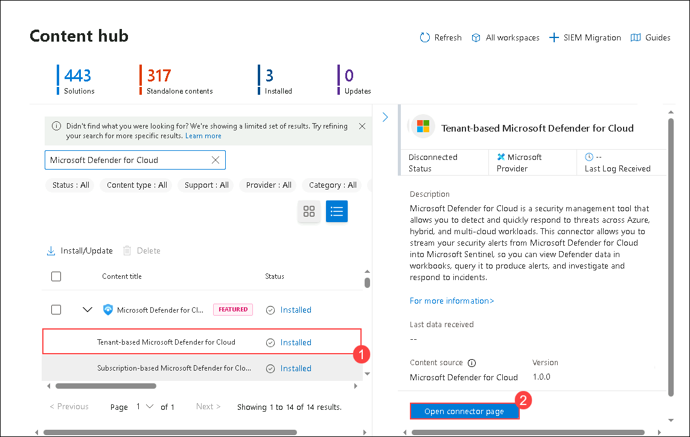 

1. You will now be navigated to the Azure portal, where you can see the information like **Last Log Recieved**, **Data recieved**

   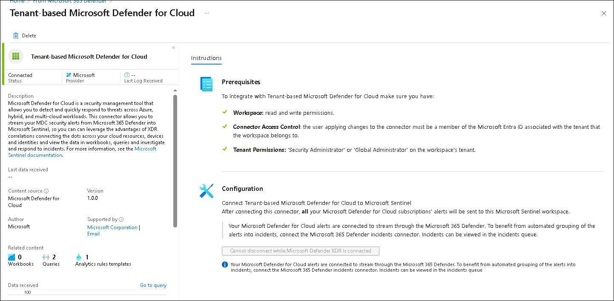 

### Task 3: Connect the Azure Activity connector

In this task, you will connect the Azure Activity connector.

1. On the left side menu, select **Microsoft Sentinel (1)** > **Content management (2)** and select **Content hub (3)** under the Configuration.

   

1. On **Content hub** page, search for **Azure Activity (1)** and select **Azure Activity (2)** Data connector from the list,  and click on **Install (3)** to install it.

   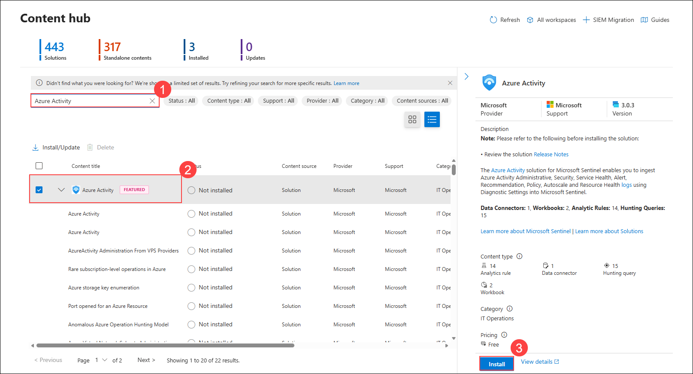

1. On **Content hub** page, select the **Azure Activity (1)** Data connector, and select the **Open connector page (2)** on the connector information blade.

   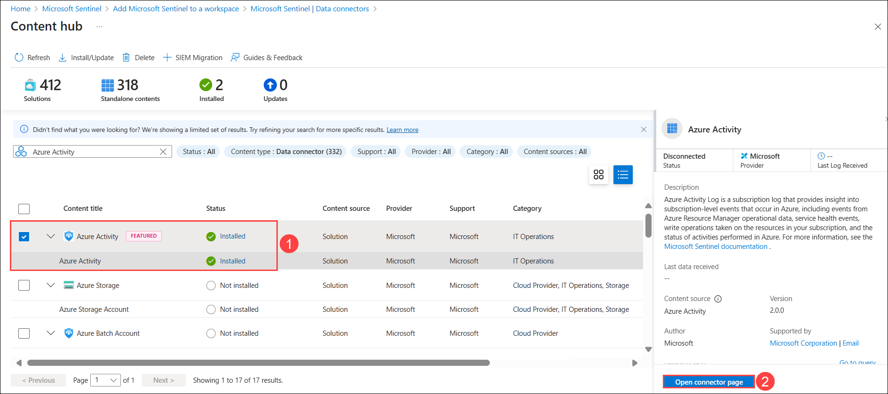

1. In the Configuration area, scroll down and under "2. Connect your subscriptions..." select **Launch Azure Policy Assignment wizard>**.

   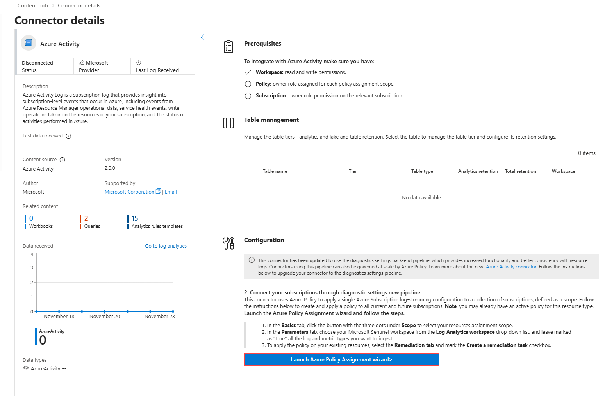

1. In the **Basics** tab, select the ellipsis button **(...) (1)** under **Scope** and select your **subscription (2)** from the drop-down list and click **Select (3)**.

   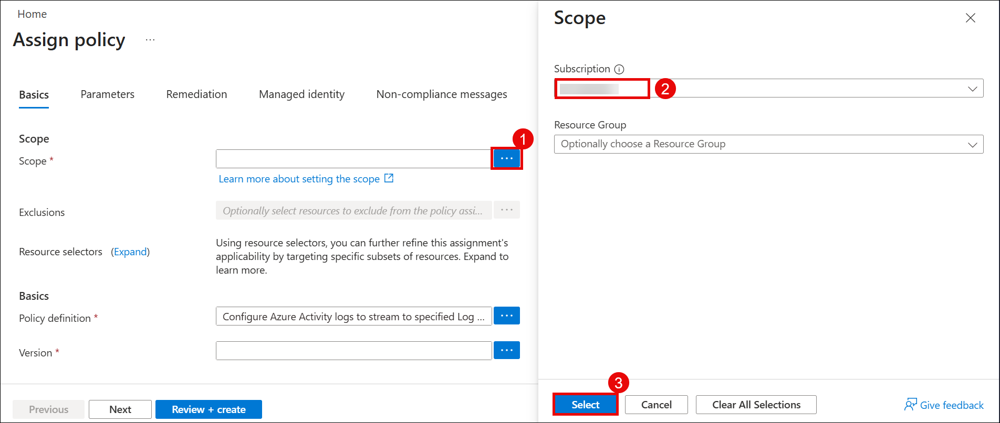

1. In the **Parameters** tab, click the ellipsis button **(...) (1)** next to **Primary Log Analytics workspace** and select your **workspace (2)** from the drop-down list and click **Select (3)**.

   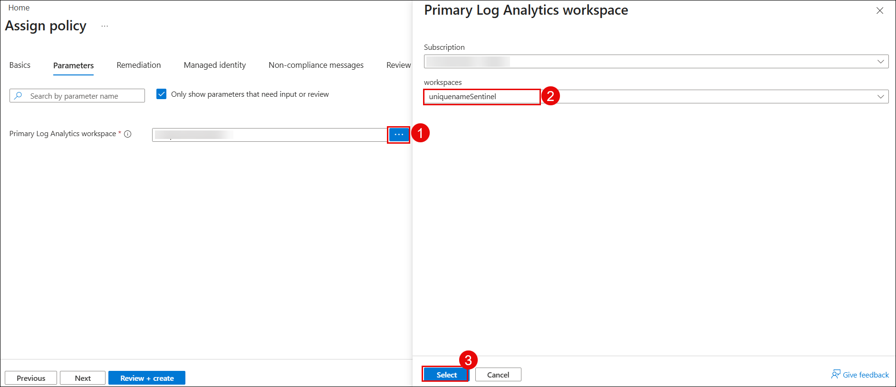

1. Select the **Remediation** tab and select the **Create a remediation task (1)** checkbox. This action will apply the policy to existing Azure resources.

1. Select the **Review + Create (2)** button to review the configuration.

   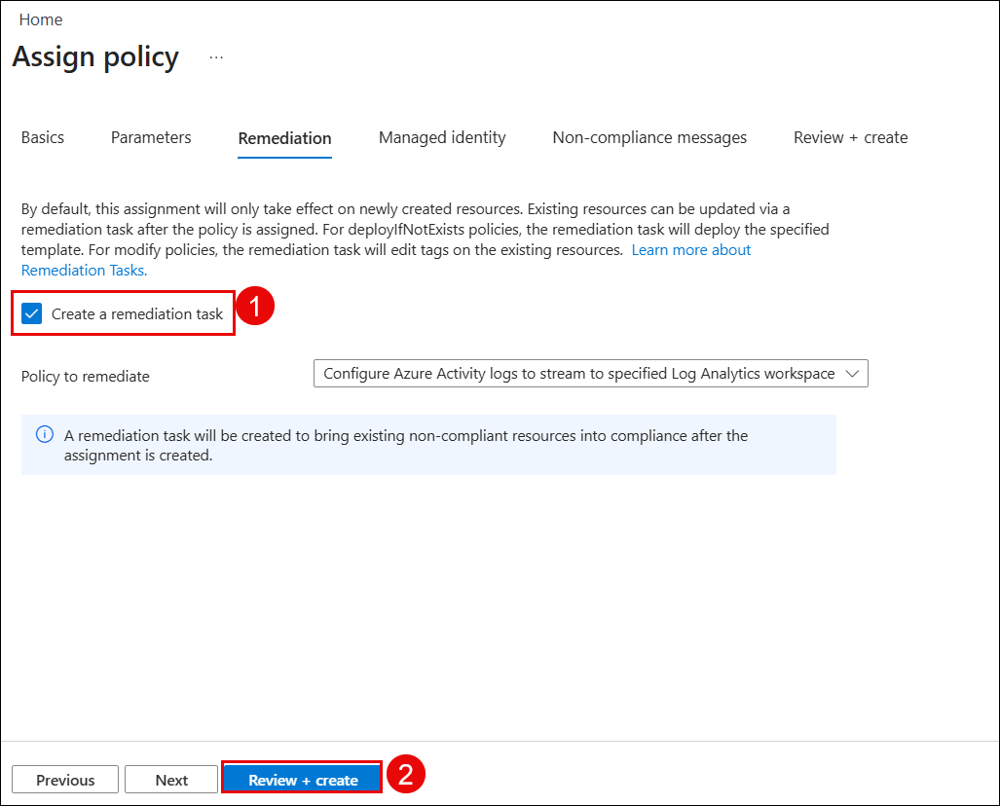

1. On **Review + create**, select **Create** to finish. 

   

    > **Note:** It may take **15–20 minutes** for the **Azure Activity** data connector to show a **Connected** status after configuration.


### Summary
In this lab, you have integrated log data from various data sources within the organization into Microsoft Sentinel using appropriate data connectors.

## You have successfully completed the exercise!

### Now, click on **Next >>** from the lower right corner to move on to the next page.

   

