# Exercise 3: Threat Intelligence connector and Content Hub

## Estimated Duration: 30 Minutes

## Overview

In this lab, you will configure the Threat Intelligence data connector in Microsoft Sentinel to ingest threat indicators from internal and external sources. You will also explore and use the Content Hub to discover, install, and manage solution packages that provide prebuilt analytics rules, hunting queries, and workbooks. This setup enhances your Sentinel environment with enriched threat data and ready-to-use security content to improve detection and investigation capabilities.


## Lab Objectives
 In this lab, you will perform the following:

- Task 1: Explore Content hub
- Task 2: Connect the Threat Intelligence connector
- Task 3: Create a Threat Indicator
- Task 4: Configure log retention


### Task 1: Explore Content hub

The Content hub delivers these content types as solutions and standalone items. Solutions are packages of Microsoft Sentinel content or Microsoft Sentinel API integrations that support an end-to-end product, domain, or industry vertical scenario in Microsoft Sentinel.

Customize out-of-the-box (OOTB) content for your needs, or create your own solution to share with others in the community. Each solution typically contains prebuilt analytics rules, workbooks, hunting queries, playbooks, and data connectors tailored for specific products, services, or threat scenarios.

When you access the Content Hub, you can:

  - Search and filter available solutions by category, provider, or capability.

  - Review solution details to understand what content and integrations are included.

  - Install solutions to quickly add ready-to-use security content to your Sentinel workspace.

  - Update or manage installed solutions to ensure they are using the latest version and features.

In the next task, you will perform the practical implementation of the **Content hub** by installing **Threat Intelligence** data connector.  


### Task 2: Connect the Threat Intelligence connector

In this task, you will connect the Threat Intelligence data connector in Microsoft Sentinel by installing it from the Content Hub to create threat indicators for analysis.

1. In the Azure portal search bar, type **Microsoft Sentinel (1)**, then select **Microsoft Sentinel (2)**.

   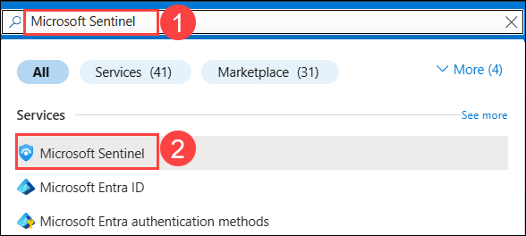

1. Select the **Microsoft Sentinel Workspace** you created earlier.

   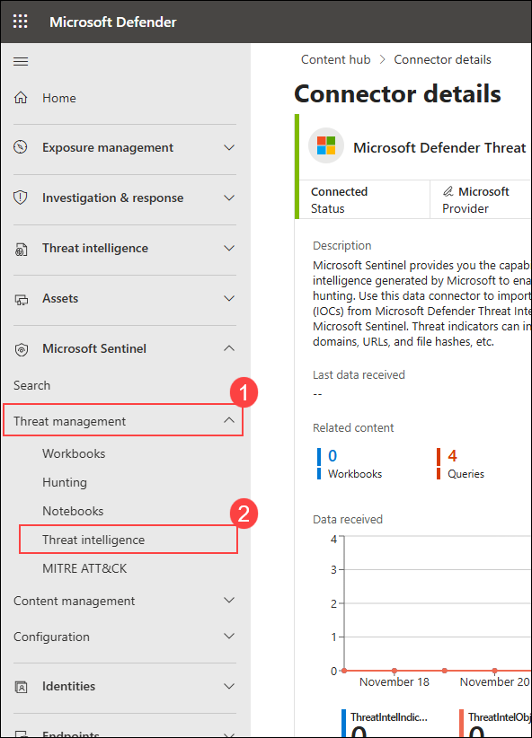

1. In Microsoft Sentinel, on the left menu, select the **Content hub (1)** option under Content management, and you will find a **Click here to go to the Defender portal (2)** link, click on it to navigate to the **Defender portal**.

   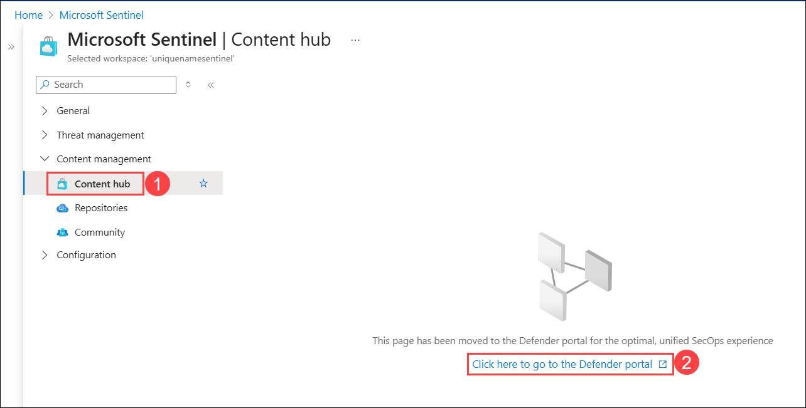

1. On Defender portal, Content hub page will open, in search bar type **Threat intelligence (1)**, select **Threat intelligence (2)** from the list, then click on **Install (3)**. 

   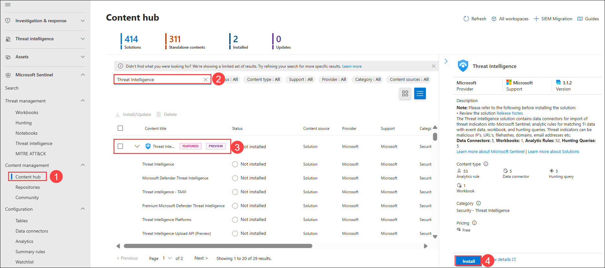

1. Expand **Threat intelligence (1)** data connector, select **Microsoft Defender Threat intelligence (2)** and click on it, then select the **Open connector page (3)** on the connector information blade.

   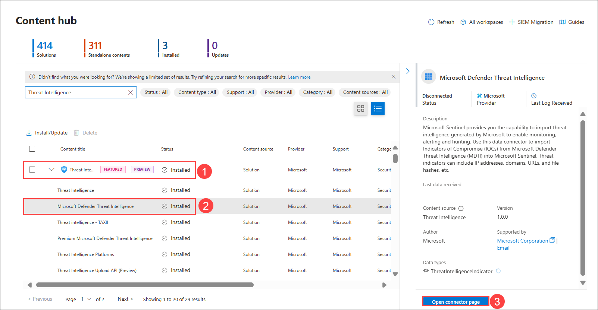

1. On **Microsoft Defender Threat intelligence** data connection page, click **Connect** to connect the data connector. 

   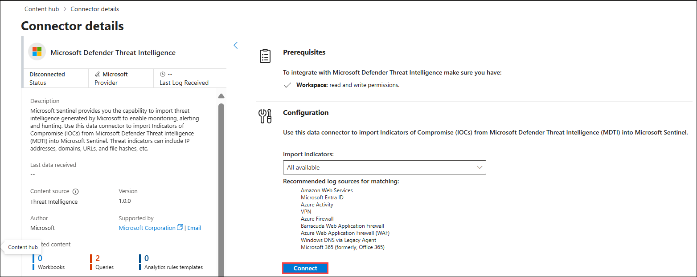

### Task 3: Create a Threat Indicator

In this task, you will create an indicator in Microsoft Sentinel.

1. Navigate to Defender Portal, expand **Threat intelligence (1)** from the left hand menu and select **Intel management (2)**. 

1. On **Intel management** page, click on **+ New (3)** under Indicator, then select **TI object (4)**.

   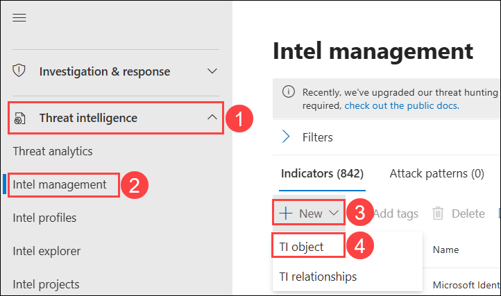

1. Review the different indicator types available in the ***Types*** dropdown. Select the **domain-name**. Enter your initials in the Domain box. You can use **onmicrosoft.com**.
1. On **New TI objects** pane, enter the following details:

    - **Object type:** Select **Indicator (1)** from the dropdown menu.

    - Click on **+ New observable (2)**, select **Domain name** from the drop down.

    - **Domain name value:** Enter **onmicrosoft.com (3)**.

    - **Name:** provide **Indicator-test (4)**.

    - **Indicator types:** Select **Malicious activity (5)** from the dropdown menu.

    - **Valid from:** Keep **today's date (6)**.

    - **Valid untill:** Keep date of **next day (7)**.

    - **Source:** Should be **Microsoft Sentinel (8)**.

    - Then click on **Add (9)**.

      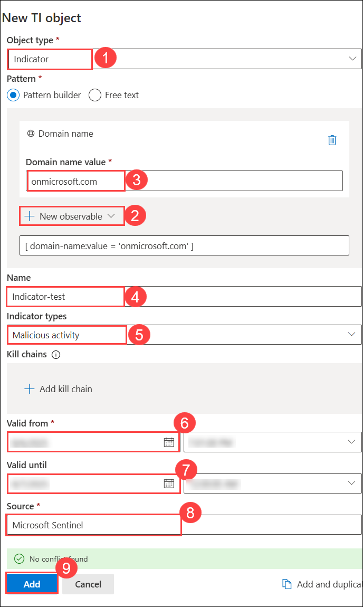

      **Note:** It could take a couple of minutes for the indicator to appear.

1. In the Azure portal search bar, type **Microsoft Sentinel (1)**, then select **Microsoft Sentinel (2)**.

   

1. Select the **Microsoft Sentinel Workspace** you created earlier.

   

1. Select the **Logs (1)** option under **General** on the left hand menu. 

   >**Note:** You may need to disable the "Always show queries" option and close the *Queries* window to run the statements.

1. Choose working mode as **KQL mode (2)**, enter the below given query **(3)**, then click **Run (4)** and in **Results (5)** section see the output of the query.  

    ```KQL
    ThreatIntelligenceIndicator
    ```
    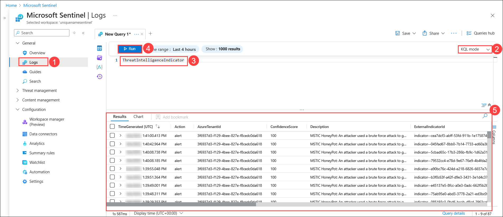
    
    >**Note:** You may need to wait for 20 minutes to get the expected output.

1. Keep the working mode as **KQL mode (1)**, enter the below given query **(2)** to see the DomainName column, then click **Run (3)** and in **Results (5)** section you should now, see the **DomainName column with onmicrosoft.com domain** as an output of the query. 

    ```KQL
    ThreatIntelligenceIndicator
    | project DomainName
    ```
   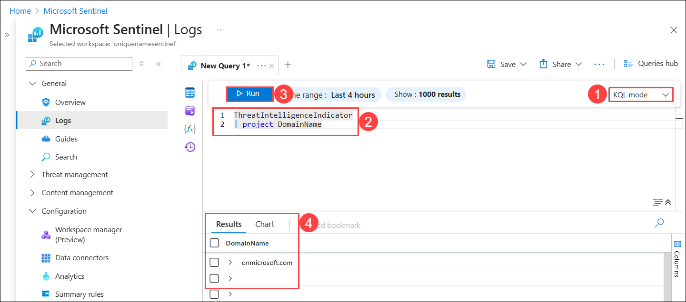

### Task 4: Configure log retention

In this task, you will change the retention period for the SecurityEvent table.

1. In Microsoft Sentinel, select the **Settings** option under the *Configuration* area.

1. Select **Workspace settings**.

1. In Log Analytics workspace, select the **Tables** option under the *Settings* area.

   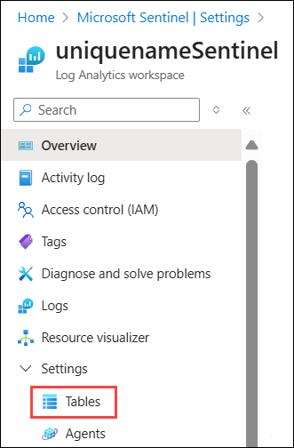

1. To search  type **SecurityEvent (1)** in the search bar and select the table **SecurityEvent (2)**, then click the **ellipsis (...) (3)** and select **Manage Table (4)** from the list.

   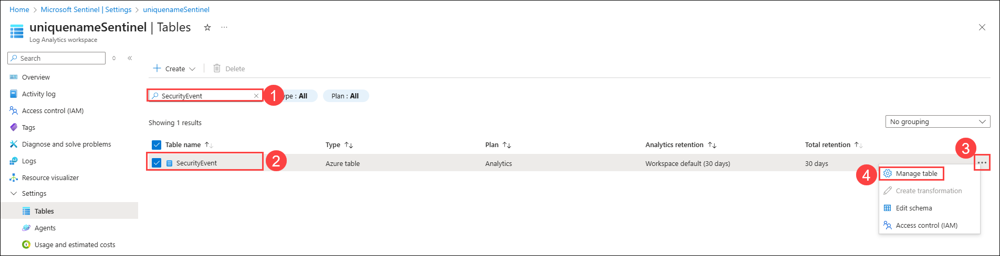

1. Select **180 days (1)** for **Total retention period**. Notice that **Long term retention** is only **150 days (2)**, since it uses 30 days from the (default) *Interactive retention*.

1. Select **Save (3)** to apply the changes. 

   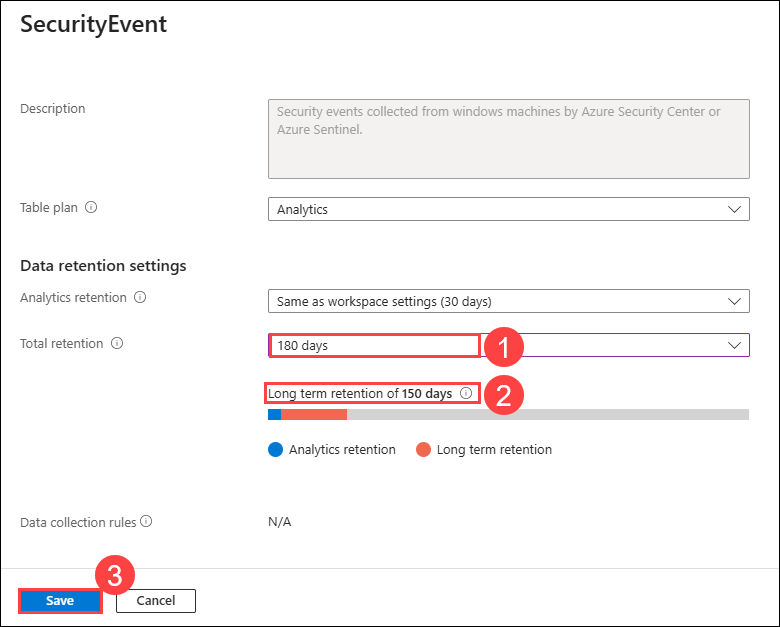

### Summary
his lab, you explored the Microsoft Sentinel Content Hub to discover and deploy relevant solutions, then connected the Threat Intelligence data connector to ingest threat data. You also created a Threat Indicator, enabling Sentinel to detect and correlate security events with known malicious indicators.

### Now, click on **Next >>** from the lower right corner to move on to the next page.

   


   
