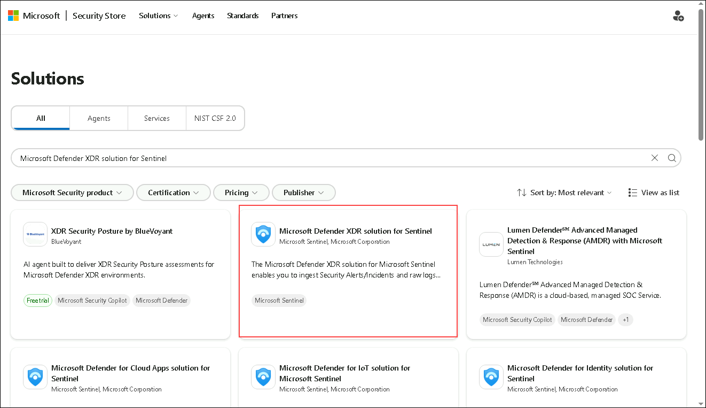
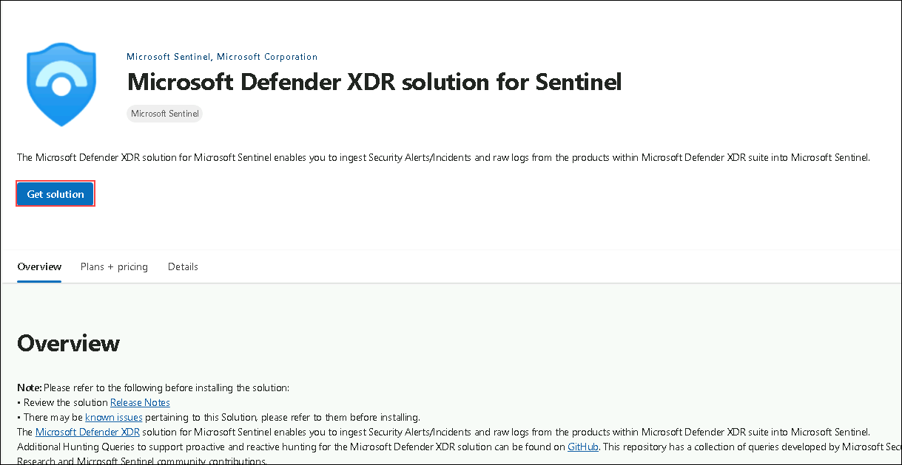
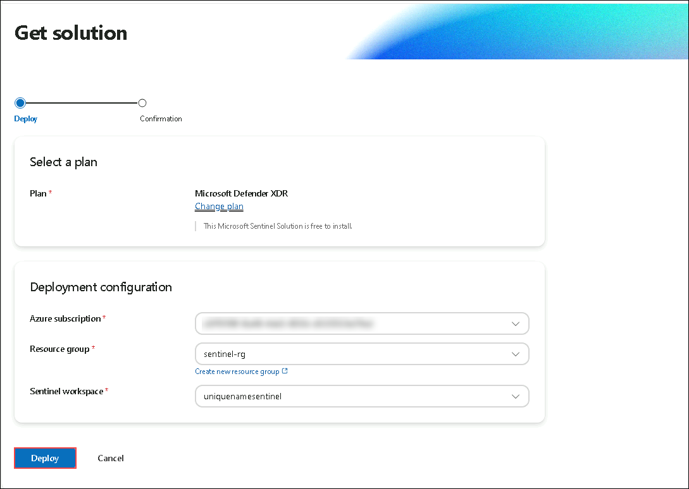
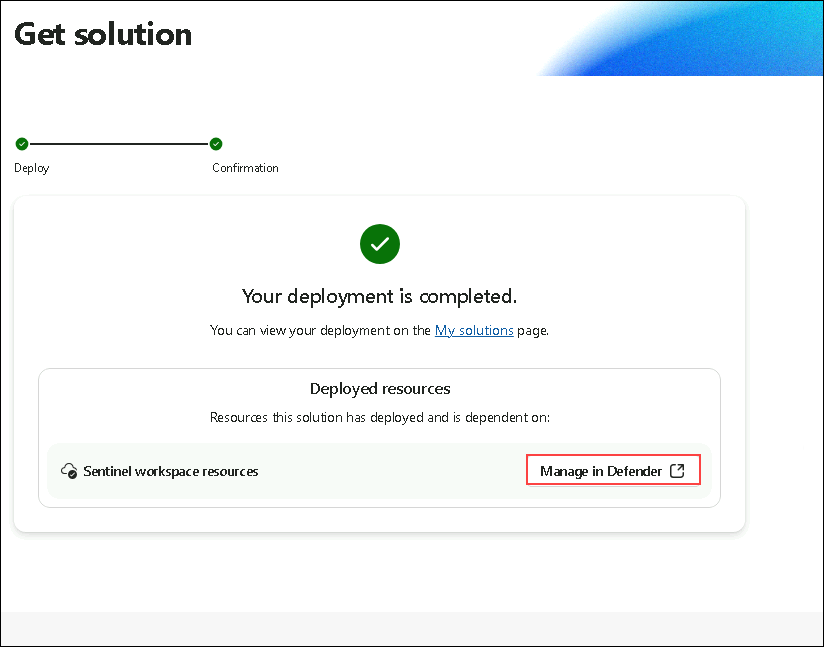
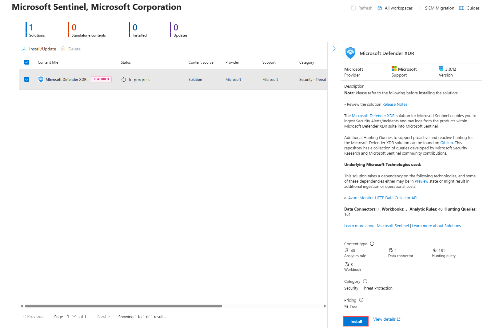
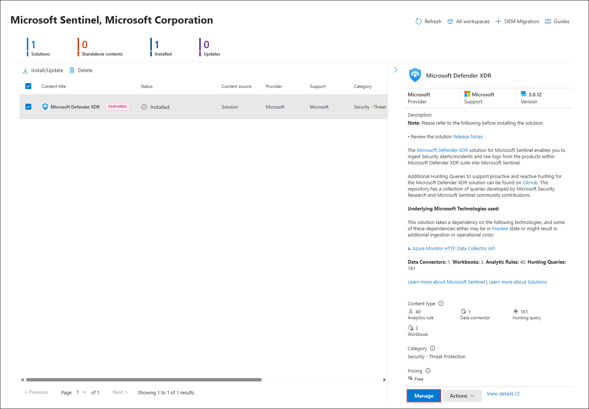
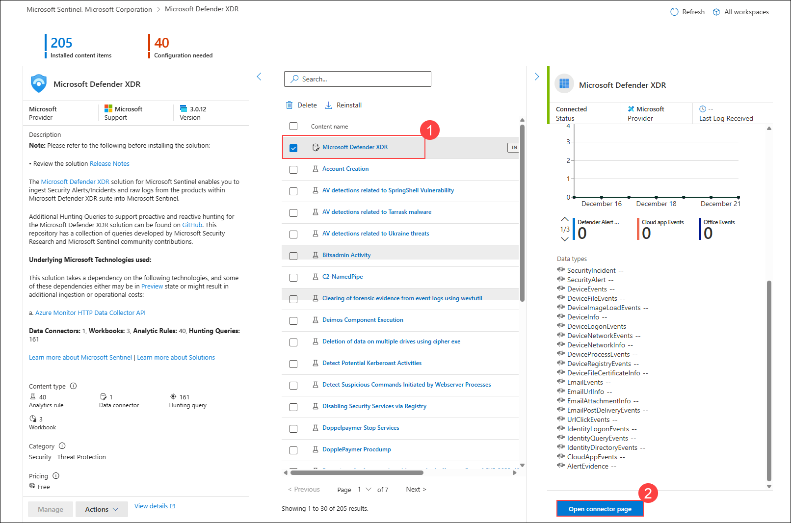
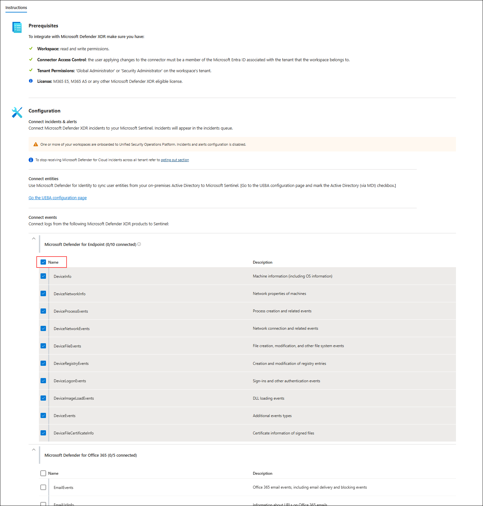
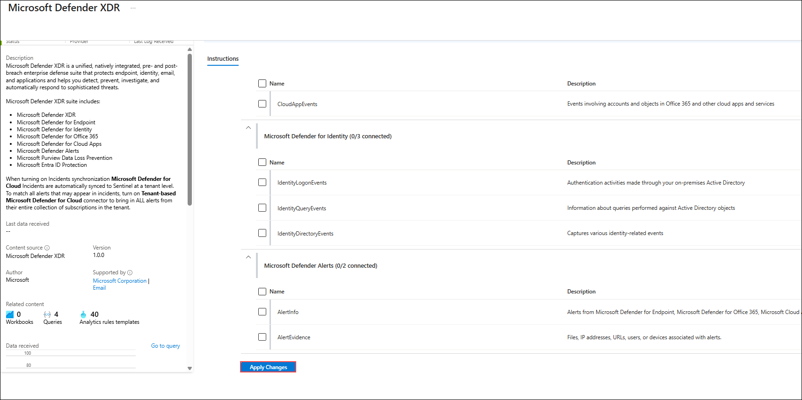

# Exercise 3: Getting a Connector via the Microsoft Security Store​

### Estimated Duration: 30 Minutes

## Overview

In this exercise, you will explore the Microsoft Security Store and learn how to deploy a pre-built security solution that integrates with Microsoft Sentinel. The goal is to understand how security content such as analytics rules, workbooks, hunting queries, and connectors can be deployed and managed directly from the Security Store. You will deploy the Microsoft Defender XDR solution for Sentinel, which streamlines integration between Defender XDR and Sentinel by automatically adding relevant data connectors, detections, and dashboards. This process demonstrates how organizations can accelerate threat detection and response by using ready-made security solutions instead of building everything manually.

### Objectives
In this exercise, you will complete the following tasks:
- Task 1: Deploy a Solution from Microsoft Security Store​

### Task 1: Deploy a Solution from Microsoft Security Store​

1. In the new tab of the browser window, navigate to Microsoft Defender portal.

    ```
    https://securitystore.microsoft.com/
    ```

1. You will be navigated to Microsoft Security Store, search for **Microsoft Defender XDR solution for Sentinel**

   

1. In the Solutions page, select the **Microsoft Defender XDR solution for Sentinel** tile

   

1. Click on **Get Solution** in the *Microsoft Defender XDR solution for Sentinel* page. 

   

1. On Get Solution page, the Deployment Configuration will automatically be configured, click on **Deploy**

   

1. Once the deployment is complete, click on **Manage in Defender** 

   

1. Select the **Microsoft Defender XDR solution**, scroll down on the right hand pane, select on **Install**.

   

1. Click on **Manage** once the installation is complete.

   

1. On the installed content items click on **Microsoft Defender XDR (1)**, notice the Content and the **Status** of the **Data Connectors**. Now, click on **Open Connector Page (2)**

   

1. Select under **Connect events** and check the box under **Microsoft Defender for Endpoint** on and click on **Apply Changes**.

   
   
   

1. Now you have installed the **Microsoft Defender XDR solution for Sentinel** 

## Summary

In this exercise, you have deployed Microsoft Defender XDR solution for Sentinel solution from Microsoft Security Store and configured it

## You have successfully completed the exercise!

### Now, click on **Next >>** from the lower right corner to move on to the next page.

   