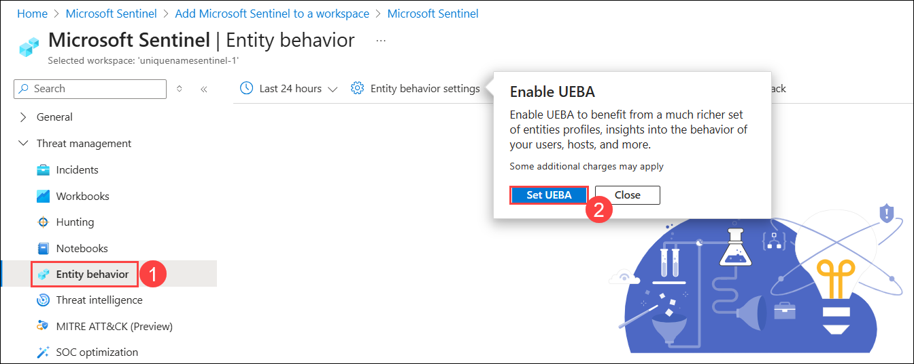
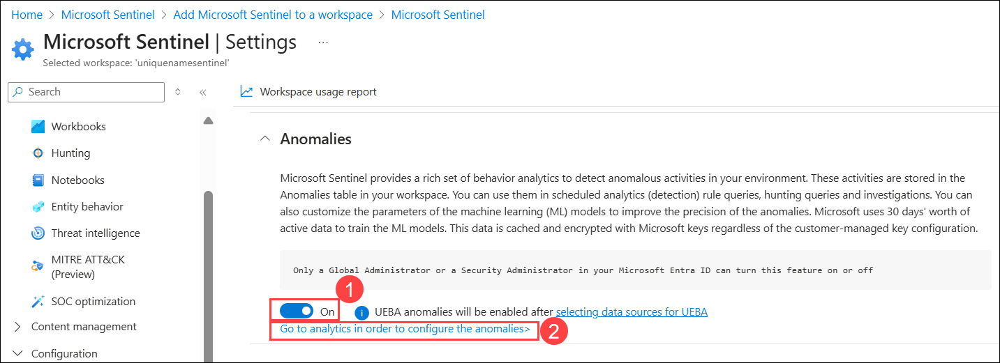

# Exercise 4 - UEBA with Microsoft Sentinel

## Estimated Duration: 20 Minutes

## Overview 

In this lab, you will configure Microsoft Sentinel to perform Entity Behavior Analytics to discover anomalies and provide entity analytics pages. By enabling UEBA, Sentinel will profile users, hosts, and service accounts, analyze behavioral patterns, and surface unusual activities for investigation. This enhances threat detection by identifying potential security issues that may not be detected by traditional alert rules.

## Lab Objectives
 In this lab, you will perform the following:

- Task 1: Explore Entity Behavior 
- Task 2: Confirm and review Anomalies Rules

### Task 1: Explore Entity Behavior 

In this task, you will explore Entity behavior analytics in Microsoft Sentinel.

1. In the Search bar of the Azure portal, type **Microsoft Sentinel (1)**, then select **Microsoft Sentinel (2)**.

   

1. Select the **Microsoft Sentinel Workspace** you created earlier.

   

1. On the **Microsoft Sentinel Workspace**, select **Entity behavior (1)** from the left hand pane. 

1. On the popup **Enable UEBA** from *Entity behavior settings*, select **Set UEBA (2)**.

    

1. On the *Settings* tab under *Entity behaviour analytics*, scroll down the **Anomalies** section and verify read through the paragraph, and verify that the *switch* is **On (1)**.

1. Select the **Go to analytics in oder to configure the anomalies (2)** link.

   

### Task 2: Confirm and review Anomalies rules

In this task, you will confirm Anomalies analytics rules are enabled.

1. You should be now at the **Analytics Rules** page. On **Anomalies (1)** tab, confirm **Status is Enabled (2)** for all the rules.

   

1. Select any **Rule (1)**, then click on the **ellipsis (...) (2)** and select **Edit (3)** from the menu.

   

1. Review the **General** tab information. Notice the *Status* is set to **Enabled (1)** *Mode* is **Production (2)** and then select **Next: Configuration> (3)**.

   

1. Review the *Configuration* tab information. Notice that you cannot change the **Anomaly score threshold (1)**, then select **X (2)** in the top right corner to exit the **Analytics rule wizard**.

    

1. Select any **Rule (1)**, then click on the **ellipsis (...) (2)** and select **Duplicate (3)** from the menu.

    

1. Now, review and select the new rule with the **FLGT (1)** tab at the beginning of the name, then click on the **ellipsis (...) (2)** and select **Edit (3)** from the menu.

   

1. Review the *General* tab information. Notice the *Status* is set to **Disabled (1)** *Mode* is **Flighting (2)** and then select **Next: Configuration> (3)**.

   

1. Review the *Configuration* tab information. Notice that you can now change the **Anomaly score threshold**, then set the value to **1 (1)** and select **Next: Submit Feedback> (2)**.

   

1. On Submit feedback page, leave all options as Default, then select **Next: Review and Create>**.

   

1. Once the validation pass,then click **Save** to update the rule.

   
    

    >**Note:** You can upgrade the Mode of the rule from **Flighting** to **Production** by changing the the *General* tab settings for therule and save the changes following the previous steps. The **Production** rule will become the **Flighting** rule afterwards.

     

## Summary

In this lab, you enabled UEBA in Microsoft Sentinel to profile entities, detect anomalies, and enhance threat detection beyond traditional alert rules.

## You have successfully completed the lab!

In this hands-on lab **Threat Protection and Incident response with Microsoft Sentinel- Day 1**, you successfully deployed Microsoft Sentinel, integrated key data sources, enriched insights with threat intelligence, and applied UEBA for anomaly detection. You are now equipped to build a robust security monitoring setup, detect potential threats, and respond effectively to incidents.

