# Lab 05: UEBA with Microsoft Sentinel

## Estimated Duration: 30 Minutes

## Overview 

In this lab, you will configure Microsoft Sentinel to perform Entity Behaviour Analytics to discover anomalies and provide entity analytics pages. By enabling UEBA, Sentinel will profile users, hosts, and service accounts, analyze Behavioural patterns, and surface unusual activities for investigation. This enhances threat detection by identifying potential security issues that may not be detected by traditional alert rules.

## Lab Objectives
 In this lab, you will perform the following:

- Task 1: Explore Entity Behaviour 
- Task 2: Confirm and review Anomalies Rules

### Task 1: Explore Entity Behaviour 

In this task, you will explore Entity behaviour analytics in Microsoft Sentinel.

1. In the Defender portal, navigate to **Settings (2)** under **System (1)** and click on **Microsoft Sentinel (3)**

    

1. From the left pane, in **SIEM workspaces (1)**, select Microsoft Sentinel workspace **uniquenamesentinel (2)**.

    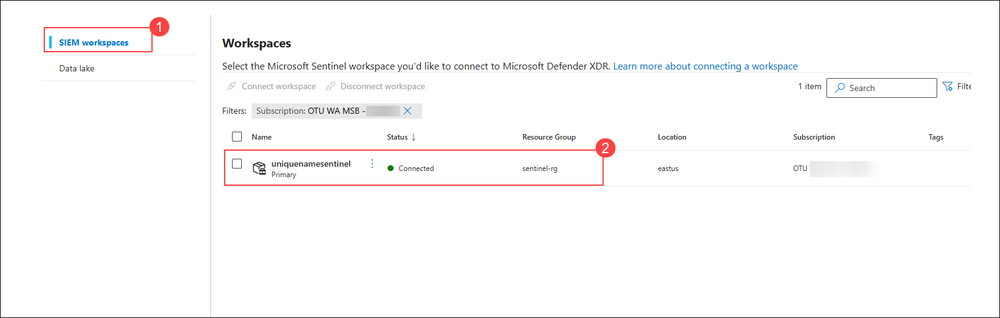

1. On the **Microsoft Sentinel Workspace** page, expand **Entity Behaviour analytics (1)** and from the drop down click on **Configure UEBA (2)**. 

    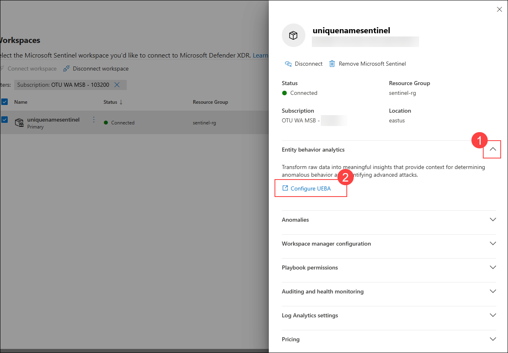

1. Enable the **Turn on UEBA feature (1)** toggle and then enable the **Microsoft Entra ID (2)** toggle. 

    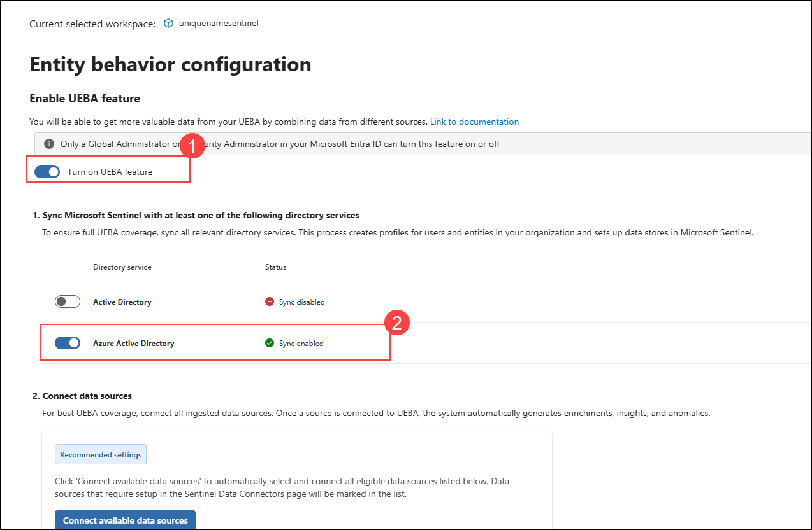

### Task 2: Confirm and review Anomalies rules

In this task, you will confirm that Anomalies analytics rules are enabled.

1. In the Microsoft Defender portal, select **Analytics (2)** under **Configuration (1)** from the left hand pane

    

1. You should now be at the **Analytics Rules** page. On **Anomalies (1)** tab, confirm **Status is Enabled (2)** for all the rules.

    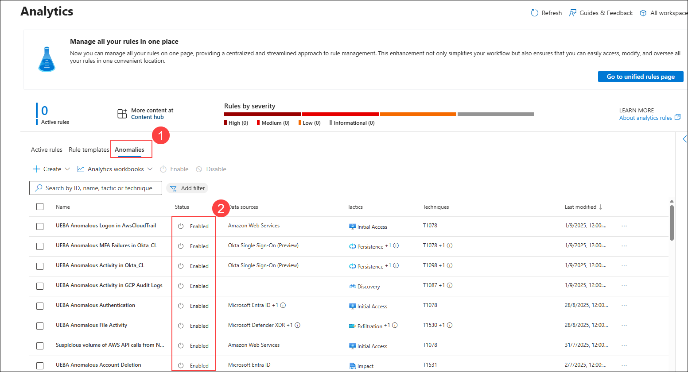

1. Select any **Rule (1)**, then click on the **ellipsis (...) (2)** and select **Edit (3)** from the menu.

    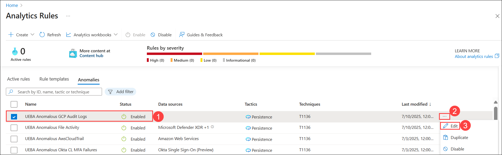

1. Review the **General** tab information. Notice the *Status* is set to **Enabled (1)** *Mode* is **Production (2)** and then select **Next: Configuration> (3)**.

    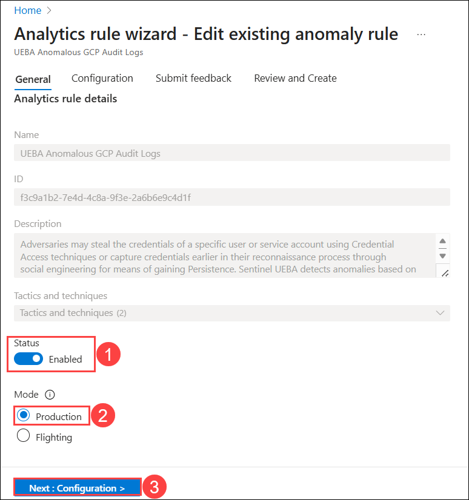

1. Review the *Configuration* tab information. Notice that you cannot change the **Anomaly score threshold (1)**, then select **Cancel (2)** in the top right corner to exit the **Analytics rule wizard**.

    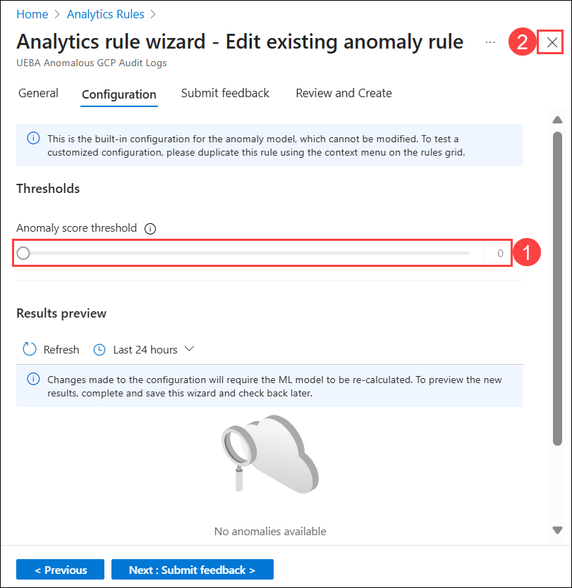

1. Select any **Rule (1)**, then click on the **ellipsis (...) (2)** and select **Duplicate (3)** from the menu.

    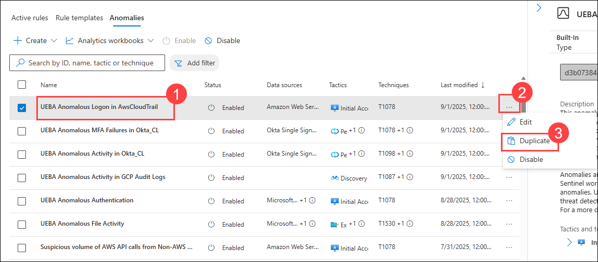

1. Now, review and select the new rule with the **FLGT (1)** tab at the beginning of the name, then click on the **ellipsis (...) (2)** and select **Edit (3)** from the menu.

    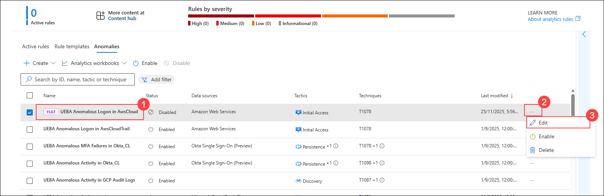

1. Review the *General* tab information. **Notice** the *Status* is set to **Disabled (1)** *Mode* is **Flighting (2)** and then select **Next: Configuration> (3)**.

    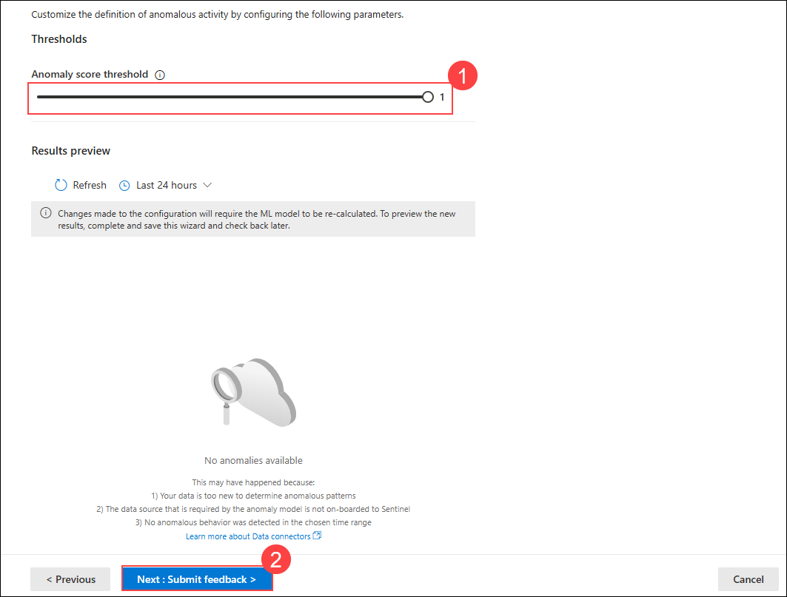

1. Review the *Configuration* tab information. Notice that you can now change the **Anomaly score threshold**, then set the value to **1 (1)** and select **Next: Submit Feedback> (2)**.

    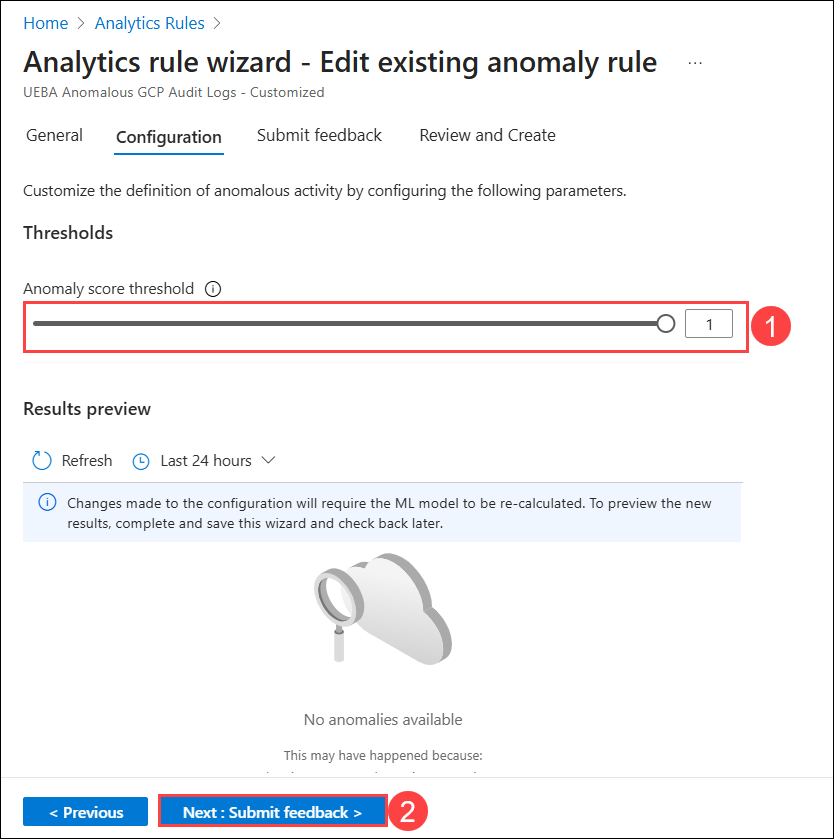

1. On the Submit feedback page, leave all options as Default, then select **Next: Review and Create>**.

    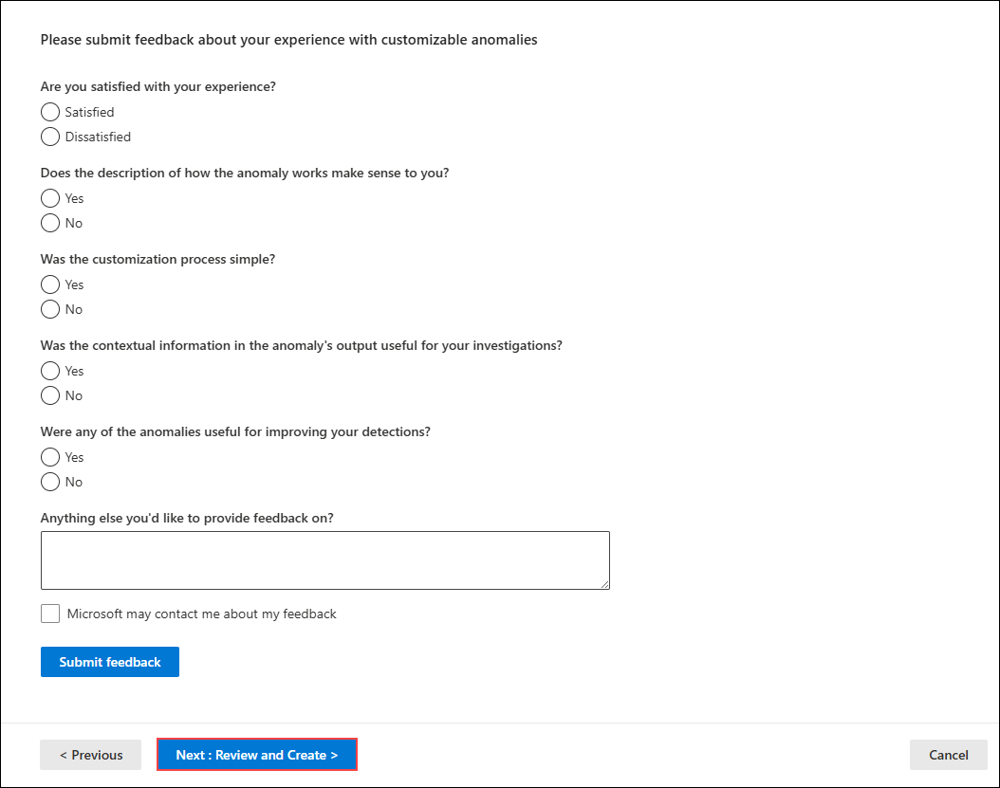

1. Once the validation passes, click **Save** to update the rule.

    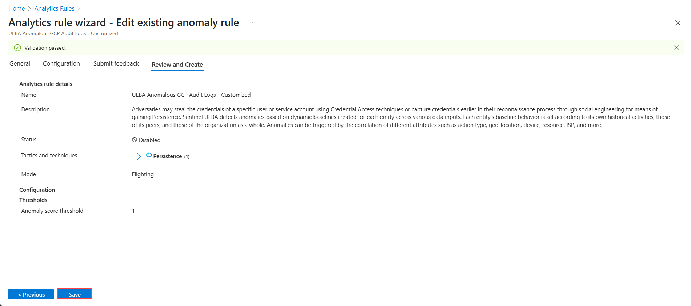
    
 1. You can again upgrade the Mode of the rule from **Flighting** to **Production** by changing the the *General* tab settings for the rule and save the changes following the previous steps. The **Production** rule will become the **Flighting** rule afterwards.

    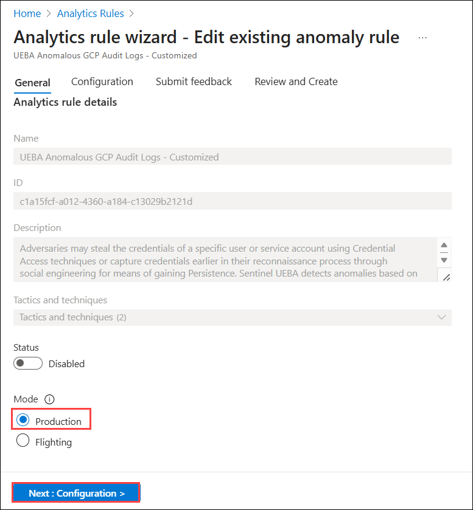

## Summary

In this lab, you enabled UEBA in Microsoft Sentinel to profile entities, detect anomalies, and enhance threat detection beyond traditional alert rules.

## You have successfully completed the lab!

### Now, click on **Next >>** from the lower right corner to move on to the next page.

   

