# Lab 07: Sentinel MCP Server - AI-Assisted Investigation Prompts

### Estimated Duration: 30 Minutes

## Overview

In this lab, you will explore how the Model Context Protocol (MCP) brings AI-assisted investigation to Microsoft Sentinel. You will connect GitHub Copilot in Visual Studio Code to the Microsoft Sentinel MCP server using the **triage** tool collection, which investigates incidents, alerts, and advanced hunting data **without requiring the Sentinel data lake**. Using this connection, you will perform natural-language security investigations into credential theft and lateral movement without writing complex KQL queries.

> **Note - No data lake required:** The Microsoft Sentinel MCP server offers several tool collections. The **data exploration** and **agent creation** collections require the Sentinel data lake, but the **triage** collection does not - it works when your Sentinel workspace is onboarded to the Defender portal (or you have Defender XDR / Defender for Endpoint), and it queries incidents, alerts, and the advanced hunting API directly. This lab uses the triage collection, so it runs entirely against data already in Advanced Hunting.

## Lab Objectives

In this lab, you will perform the following:
- Task 1: Verify Sentinel readiness and triage prerequisites
- Task 2: Connect GitHub Copilot to Sentinel via the MCP triage collection
- Task 3: Investigate real attacks using MCP and natural language

### Task 1: Verify Sentinel Readiness and Triage Prerequisites

**Objective:** Confirm that Microsoft Sentinel is connected to the Defender portal and that the attack telemetry exists in Advanced Hunting, so the MCP triage tools have data to reason over.

> **Why this matters:** The triage tool collection queries your incidents, alerts, and advanced hunting tables directly. It does **not** use the data lake - so the only things you need to confirm are that Sentinel is connected to the Defender portal and that the attack data is present in Advanced Hunting.

### Task 1.1: Verify Sentinel Workspace Connection

In this task, you will verify that your Microsoft Sentinel workspace is connected to the Defender portal.

1. Open a browser and navigate to the **Microsoft Defender portal**:

   ```
   https://security.microsoft.com
   ```

2. From the left navigation pane, expand **System (1)**, select **Settings (2)**, and then choose **Microsoft Sentinel (3)**.

    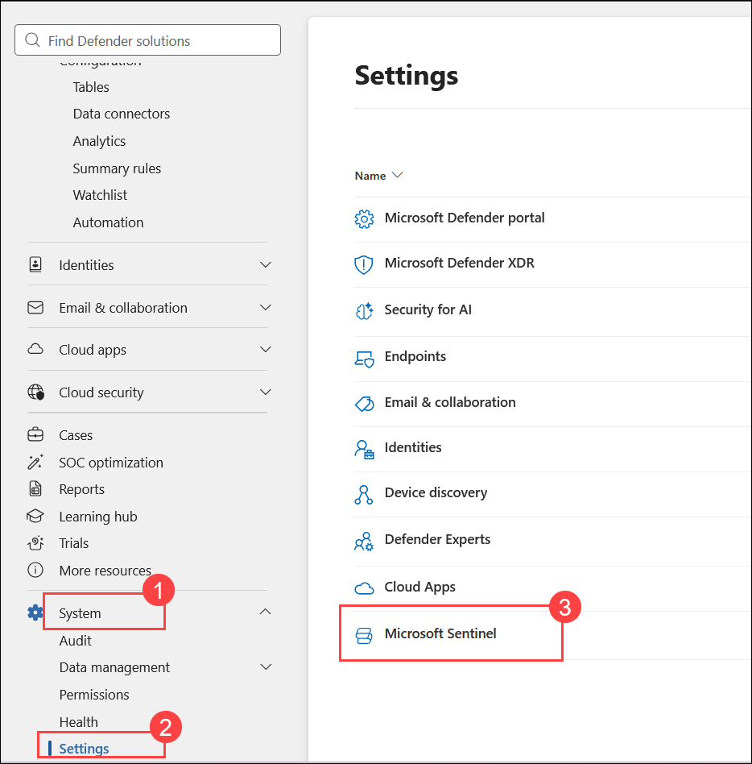

3. Select **SIEM workspaces** and confirm your Sentinel workspace is listed as **Connected**.

   > **Note:** The triage MCP collection requires your Sentinel workspace to be connected to the Defender portal (or Defender XDR / Defender for Endpoint), plus the **Security Reader** role. If you have Owner or Global Administrator, the role requirement is already satisfied.

### Task 1.2: Verify Attack Data Exists in Advanced Hunting

In this task, you will confirm that the pre-configured attack telemetry has been ingested and is available in Advanced Hunting before connecting AI tools.

1. From the left navigation, select **Advanced hunting**. In the query editor, replace the existing query with the below query and click on **Run query** to confirm process-execution telemetry exists:

   ```kql
   DeviceProcessEvents
   | where Timestamp > ago(7d)
   | where FileName in~ ("cmd.exe", "powershell.exe", "mimikatz.exe", "procdump.exe")
   | summarize EventCount = count() by DeviceName, FileName
   | order by EventCount desc
   ```

   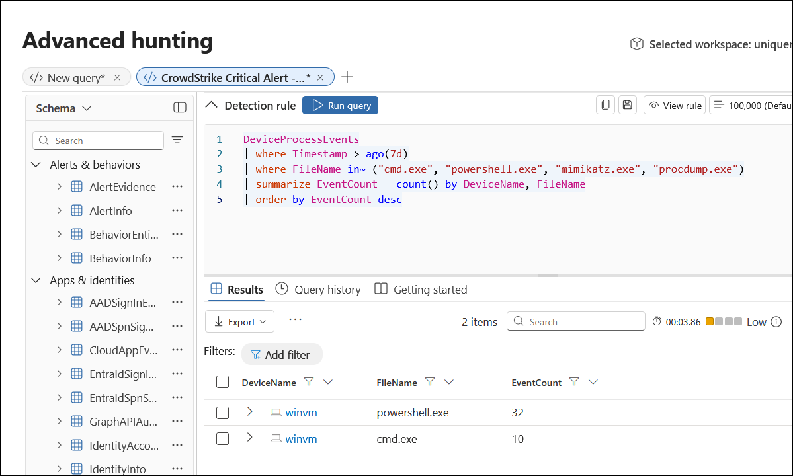

   > **Expected result:** Multiple rows showing `cmd.exe` and `powershell.exe` executions on your lab VMs, confirming attack telemetry is ingested.

3. Run a second validation query for credential-theft indicators:

   ```kql
   SecurityAlert
   | where TimeGenerated > ago(7d)
   | summarize AlertCount = count() by AlertName, ProductName
   | order by AlertCount desc
   ```

   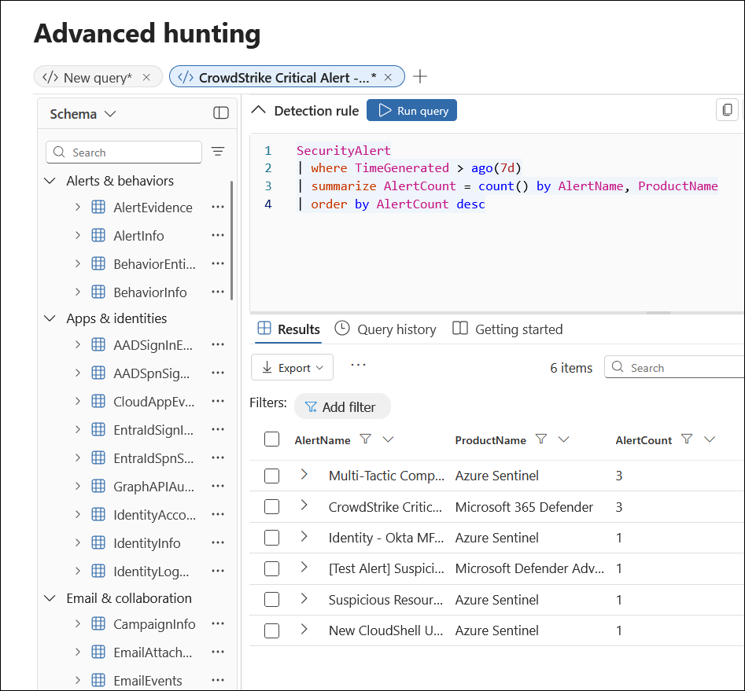

   > **Expected result:** Alerts from Microsoft Defender for Endpoint (MDE), Microsoft Defender for Identity (MDI), and Microsoft Defender for Cloud (MDC), including LSASS access, Kerberoasting, and suspicious PowerShell activity.

> **Checkpoint:** You have confirmed that Sentinel is connected to the Defender portal and that real attack data is available in Advanced Hunting. You are now ready to connect AI tools using the triage collection - no data lake needed.

### Task 2: Connect GitHub Copilot to Sentinel via the MCP Triage Collection

**Objective:** Establish a live connection between VS Code and Microsoft Sentinel using the MCP triage collection, enabling natural-language queries against your incidents, alerts, and advanced hunting data.

> **What is MCP?** The Model Context Protocol is an open standard that lets AI tools (like GitHub Copilot) securely access external data sources. The Sentinel MCP triage collection lets you investigate security data using plain English instead of writing KQL - and it authenticates through Microsoft Entra ID.

### Task 2.1: Add the Sentinel MCP Triage Server

In this task, you will configure VS Code to connect to the Sentinel MCP triage endpoint.

1. Navigate to **Visual Studio Code** from the Desktop.

1. Open the **Command Palette** with `Ctrl + Shift + P`, then search for and select **>MCP: Add Server… (1)**.

    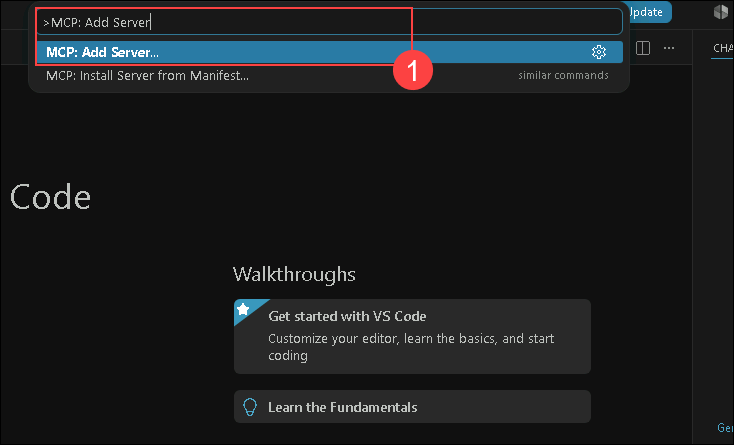

1. When prompted to select the connection type, choose **HTTP (1)** (Server-Sent Events / SSE).

    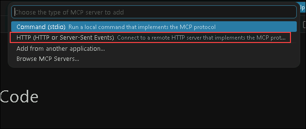

1. In the **Server URL** field, enter the **Triage** endpoint, then press **Enter**:

    ```
    https://sentinel.microsoft.com/mcp/triage
    ```

    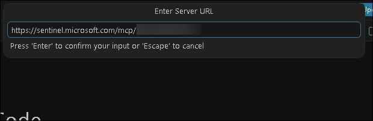

   > **Important:** Use the **triage** endpoint (`/mcp/triage`), not the data-exploration endpoint (`/mcp/data-exploration`). The data-exploration endpoint requires the Sentinel data lake; the triage endpoint does not.

1. Accept the default **Server ID** and press **Enter**.

    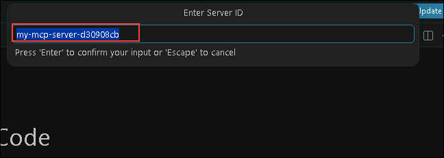

1. When prompted to authorize the connection, click **Allow (1)**. VS Code launches a browser window for **Microsoft Entra ID authentication** - sign in with your lab credentials.

    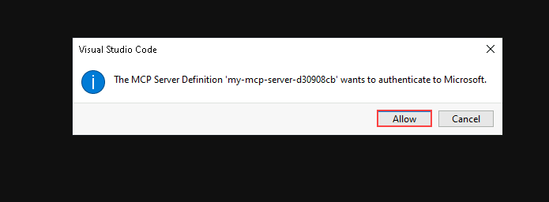

    >**Note:** If the authorization pop-up does not appear automatically, open the `mcp.json` file and click **Start** above the server definition to trigger the sign-in prompt manually. Once you click **Start**, VS Code will launch the Microsoft Entra ID authentication window, and you can continue with the account selection.

1. Select the **Work or school account** and click on the **Continue**.

    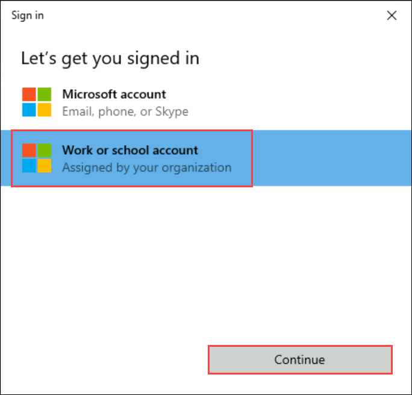

1. Once authenticated, VS Code confirms the MCP server connection. You will see the **Microsoft Sentinel** triage tools listed in the VS Code Chat panel under **Tools (1)**.

    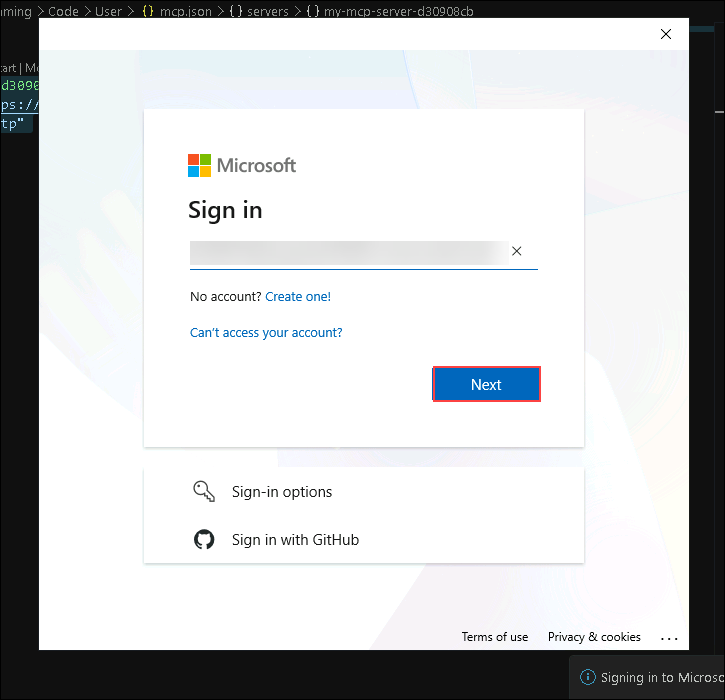

    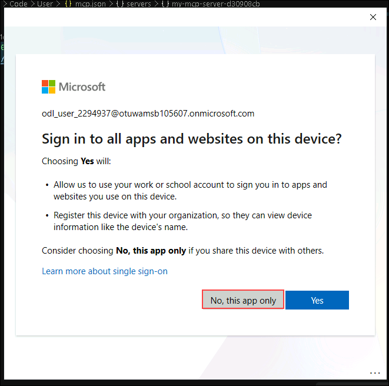

    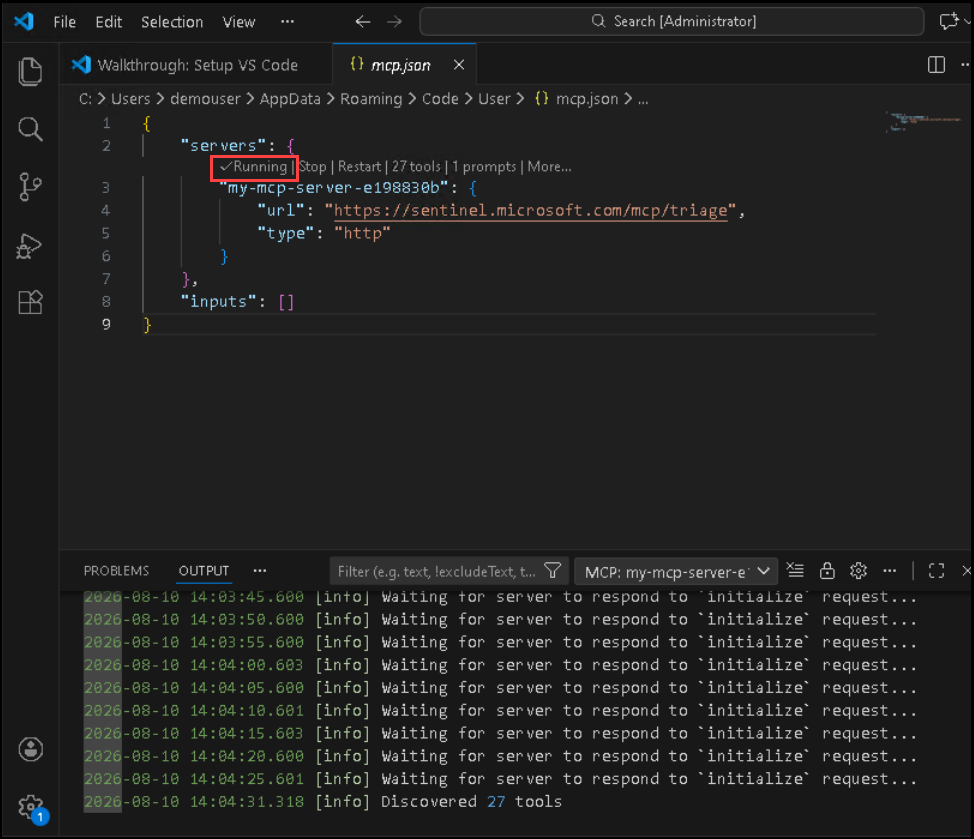

   > **Note:** The triage tool collection provides capabilities to list and triage incidents and alerts, and to run advanced hunting queries - all using natural-language prompts that are translated to KQL internally, without touching the data lake.

1. Click the **Copilot** icon at the bottom, then click **Continue with GitHub**.

      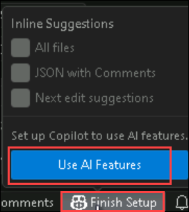

      > **Note:** A pop-up prompts you to log in to GitHub. Use your personal GitHub credentials.

      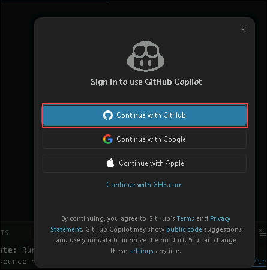

1. On the **Sign in to GitHub** page, enter your personal GitHub username and password, then click **Sign in**.

1. You may need to log in to Outlook to retrieve a verification code. Enter it to complete sign-in.

1. On the **Authorize Visual Studio Code** page, click **Continue** to proceed with your account.

1. On the next **Authorize Visual Studio Code** page, click **Authorize Visual Studio Code**, then click **Allow**.

### Task 2.2: Test the MCP Connection

In this task, you will validate that the MCP connection works and that Copilot can access your Sentinel data.

1. In the Chat pane, enter this prompt:

   ```
   List the most recent security incidents in my Sentinel environment.
   ```

2. Click **Allow** when prompted to let Copilot access Sentinel data.

3. Review the result - you should see recent incidents or alerts from your environment returned.

   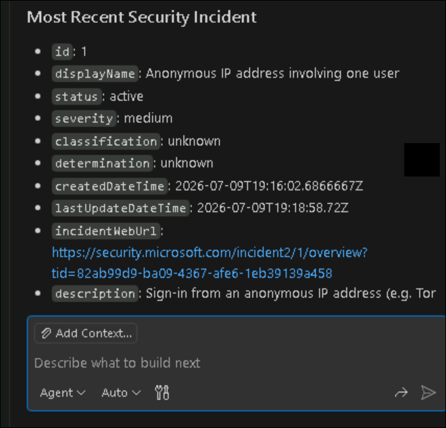

   > **Success criteria:** Incident or alert data from your environment appears in the response. This confirms the MCP triage connection is working and Copilot can access your Sentinel data through Advanced Hunting.

### Task 3: Investigate Real Attacks Using MCP and Natural Language

**Objective:** Use the MCP triage connection to investigate whatever attack evidence exists in your environment using natural language instead of KQL. The prompts in this task are generic on purpose — they work regardless of which specific alerts, devices, or accounts are present in your tenant.

> **Context:** Instead of writing complex KQL queries, you will use natural language, and the triage tools will query your alerts and advanced hunting data behind the scenes. Your environment may contain different alerts, incidents, device names, and user accounts than the screenshots show — that is expected. Focus on the *investigation workflow*: ask a broad question, review what comes back, then drill deeper into whatever the AI surfaces.

### Task 3.1: Investigate Alerts and Potential Compromise

In this task, you will use Copilot (via MCP) to surface recent security alerts and investigate whatever suspicious activity exists in your environment.

1. In the VS Code Chat pane (Agent mode), enter:

   ```
   Show me all security alerts from the last 7 days related to credential theft, compromised accounts, hands-on-keyboard attacks, hacktools, or suspicious authentication. Include the device name, account, severity, and timestamp.
   ```

2. Click **Allow** if prompted to let Copilot access Sentinel data.

3. Review the results Copilot returns. The specific alerts will depend on what exists in your environment, but look for high-value indicators such as:

   - High- or critical-severity alerts (these are usually the best starting point)
   - Alerts indicating interactive or hands-on-keyboard activity
   - Hacktool, malware, or credential-access detections
   - Reconnaissance activity such as suspicious LDAP queries or account enumeration
   - Any single account or device appearing across multiple alerts

   > **What to look for:** Note the **highest-severity alert** and the device and account associated with it — that is typically your strongest lead. If the same account or device shows up in several alerts, that repetition is often a sign of a multi-stage attack rather than isolated noise.

4. Pick the most significant alert, device, or account from the results, and follow up with a deeper investigation. Replace the bracketed values with whatever your results surfaced:

   ```
   For the most severe alert you found, show me the complete process execution chain on the affected device. What commands were executed by the involved account? Include parent processes and command lines.
   ```

5. Review how MCP translates your natural language into advanced hunting queries behind the scenes and returns structured results, such as the executed commands, any tools used, and follow-on activity.

   > **Important:** You may observe differences between Copilot's output and the lab screenshots. This is expected — Copilot does not always generate identical output, and your environment's data differs from the lab reference. The investigation workflow and the type of insights remain the same.

### Task 3.2: Investigate Lateral Movement and Timeline

In this task, you will analyze how activity is distributed across devices over time to identify possible lateral movement.

1. Enter this prompt:

   ```
   Show me all security alerts from the last 7 days grouped by device name. I want to see the timeline of alerts across devices to understand whether an attacker moved between systems. Include the alert name, timestamp, severity, and account.
   ```

2. Review the results. Look at the timeline across devices and consider:

   - Which device shows the **earliest** suspicious activity (a possible entry point)
   - Whether activity then appears on **additional devices** afterward (a possible pivot)
   - Whether the **same account** appears across multiple devices (a common sign of lateral movement using compromised credentials)

   > **Note:** The exact devices and sequence will differ in your environment. The goal is to read the timeline and reason about *whether and how* activity spread — not to match a specific set of device names.

3. Go deeper with a targeted follow-up prompt:

   ```
   Based on the timeline, what reconnaissance and credential-access activity happened after the earliest compromise? Was there any sign of the attacker attempting to move to other systems or reuse credentials elsewhere?
   ```

4. Review the response. Depending on your data, Copilot may surface activity such as account or group enumeration, credential-access attempts, connections to other hosts, or persistence techniques. Note whatever it finds and how it connects the events together.

### Task 3.3: Generate an Investigation Summary

In this task, you will use Copilot to generate a structured executive summary based on everything analyzed so far.

1. In the same VS Code Chat pane (Agent mode), ask Copilot to synthesize its findings:

   ```
   Based on all the Sentinel data you've analyzed in this session, create an executive investigation summary that includes:
   1. Timeline of the activity
   2. Affected devices and users
   3. MITRE ATT&CK techniques observed
   4. Severity assessment
   5. Recommended next steps
   ```

2. Review the AI-generated summary and compare it against the evidence you discovered in the previous tasks. Confirm the summary reflects what you actually observed, and note anything it may have over- or under-stated.

   > **Tip:** Treat the AI summary as a first draft an analyst reviews, not a final report. Validating it against the underlying alerts and hunting results is what turns an AI-assisted investigation into a defensible one.

## Summary

In this lab, you completed the following:
- Verified your Sentinel workspace connection to the Defender portal and confirmed attack data exists in Advanced Hunting - with no dependency on the Sentinel data lake.
- Connected GitHub Copilot in Visual Studio Code to Microsoft Sentinel using the MCP **triage** collection.
- Tested the connection by listing recent incidents.
- Conducted natural-language investigations into credential theft and lateral movement.
- Generated a structured executive investigation summary.

You have seen how the Sentinel MCP triage collection brings AI-assisted, natural-language investigation to your existing incidents, alerts, and advanced hunting data - without requiring the data lake to be provisioned.

## You have successfully completed the lab!

In this hands-on lab, **Threat Protection and Incident response with Microsoft Sentinel within Unified Platform**, you successfully deployed Microsoft Sentinel, integrated key data sources, enriched insights with threat intelligence, applied UEBA for anomaly detection, optimized data retention through table tiering, and used the Sentinel MCP server to run AI-assisted, natural-language investigations. You are now equipped to build a robust security monitoring setup, detect potential threats, and respond effectively to incidents - with the help of AI-driven investigation tools.