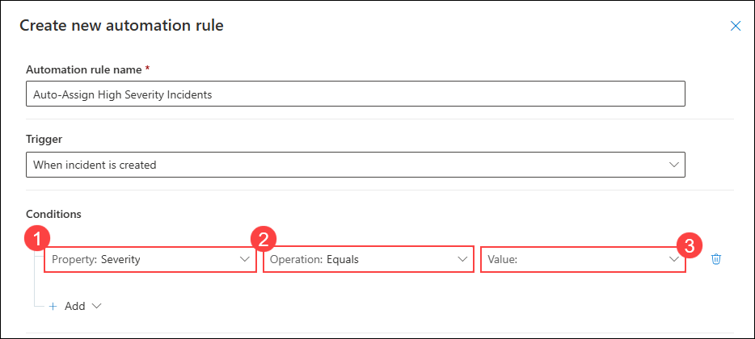
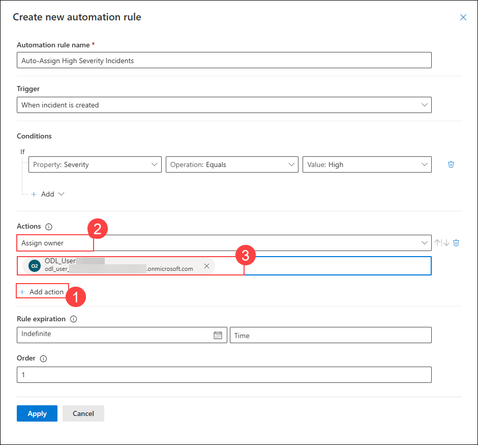

# Exercise 1: Responding to Threats Using Automation

## Estimated Duration: 120 Minutes

## Overview

In this exercise, you will explore **Microsoft Sentinel's** advanced automation capabilities for responding to security threats. You will start by creating an analytics rule that detects new Azure CloudShell users, then create automation rules that automatically manage and respond to incidents based on predefined conditions. Next, you will design and build playbooks using Azure Logic Apps to orchestrate complex incident response workflows, including automated notifications, entity enrichment, and incident assignment. Finally, you will test the complete workflow by creating a new CloudShell user to trigger an actual alert. By completing this exercise, you will establish a proactive threat response infrastructure that reduces Mean Time to Respond (MTTR) and minimizes manual intervention in your security operations.

## Lab Objectives

In this lab, you will perform the following:

- Task 1: Create an Analytics Rule 
- Task 2: Create an Automation Rule for Incident Assignment
- Task 3: Create a Playbook for Automated Response
- Task 4: Link Playbooks to Automation Rules

### Task 1: Create an Analytics Rule  

In this task, you will create an analytics rule using a Microsoft-provided template that detects when a new user creates an Azure CloudShell session. This will serve as the trigger for your automation workflows.

1. Navigate to **Microsoft Defender Portal**

    ```
    https://security.microsoft.com/
    ```

1. On the left side menu, select **Microsoft Sentinel (1)** > **Configuration (2)** > **Analytics (3)**.

    

1. Click on **Rule templates (1)** and in the **Search** box, type **New CloudShell User (2)** and select the **New CloudShell User (1)** template from the results and click on **Create rule (4)**

    

1. In the rule creation wizard, change the Severity to **Medium (1)** and click **Next: Set rule logic (2)**.

    

1. On the **Set rule logic** page, review the detection query:

    ```KQL
    let match_window = 3m;
    AzureActivity
    | where ResourceGroup has "cloud-shell"
    | where (OperationNameValue =~ "Microsoft.Storage/storageAccounts/listKeys/action")
    | where ActivityStatusValue =~ "Success"
    | extend TimeKey = bin(TimeGenerated, match_window), AzureIP = CallerIpAddress
    | join kind = inner
    (AzureActivity
    | where ResourceGroup has "cloud-shell"
    | where (OperationNameValue =~ "Microsoft.Storage/storageAccounts/write")
    | extend TimeKey = bin(TimeGenerated, match_window), UserIP = CallerIpAddress
    ) on Caller, TimeKey
    | summarize count() by TimeKey, Caller, ResourceGroup, SubscriptionId, TenantId, AzureIP, UserIP, HTTPRequest, Type, Properties, CategoryValue, OperationList = strcat(OperationNameValue, ' , ', OperationNameValue1)
    | extend Name = tostring(split(Caller,'@',0)[0]), UPNSuffix = tostring(split(Caller,'@',1)[0])
    ```

    This query looks for new CloudShell session activities in Azure Activity logs.

    Click **Next: Incident settings**.

    

1. On the **Incident settings** page, configure the incident settings:

    - **Incident settings:** Ensure **Create incidents from alerts triggered by this detection rule (1)** is **Enabled**
    - Group related alerts, triggered by this analytics rule, into incidents is **Enabled (2)**
    - **Alert grouping:** Select **Group all alerts into a single incident (3)** for this template
    - **Lookback period:** Leave as default

    Click **Next: Automated response (4)**.

    

1. On the **Automated response** page:

    - **Alert automation rules:** Leave empty for now (you'll link playbooks via automation rules in later tasks)
    - Click **Next: Review**

1. Review the rule configuration:

    - **Rule name:** New CloudShell User Detection
    - **Status:** **Enabled** 
    - **Severity:** Medium
    - Click **Save (2)** to create the analytics rule

    

1. The analytics rule is now created and active. You should see a success message (1).

1. The rule is now running and will generate alerts when a new user creates a CloudShell session. You can verify it's enabled by navigating to **Analytics** and seeing it in the list with **Status: Enabled (1)**.

    

### Task 2: Create an Automation Rule for Incident Assignment

In this task, you will create an automation rule that automatically assigns incidents to specific users or groups based on incident severity and other criteria.

1. Navigate to **Microsoft Sentinel (1)** > **Configuration (2)** > **Automation (3)**.

    

1. Click on **+ Create (1)** and select **Automation rule (2)** from the dropdown menu.

    

1. On the **Create automation rule** page, enter the following details:

    - **Automation rule name:** Enter **Auto-Assign Ḥigh Serverity Incidents (1)**
    - **Trigger:** Select **When incident is created (2)** from the dropdown menu

    

1. Add a condition for severity. Click **+ Add** again:

    - **Property:** Select **Severity (2)**
    - **Operation:** Select **Equals (3)**
    - **Value:** Select **Medium (4)** and **High (5)**
    - Click **Add (6)**

    

1. In the **Actions (1)** section, click **+ Add action (2)** and select **Assign owner** from the dropdown menu. In the **Assign owner (1)** action:

    - **Assigned to:** Select your Azure admin email address **(2)**
    - Click **Add (3)**

    

1. Add another action by clicking **Change status (1)** and select **New (2)** from the dropdown menu and then **Apply (3)**

    

1. The automation rule is now created. You should see it in the Automation rules list (1).

### Task 3: Create a Playbook for Automated Response

In this task, you will create a playbook using Azure Logic Apps to automate incident response actions such as sending notifications and enriching incident data.

1. Still in the **Automation** section, click **+ Create (1)** and select **Playbook with incident trigger (2)** from the dropdown menu.

    

1. On the **Create playbook** page, enter the following details:

    - **Subscription:** Default subscription **(1)**
    - **Resource group:** Select **sentinel-rg (2)**
    - **Name:** Enter **Incident-Notification-Playbook (3)**
    - **Enable diagnostics logs in Log Analytics:** Checked **(4)**
    - **Log Analytics workspace:** uniquenameSentinel **(5)**
    - Click **Next:Connections>** **(6)**

    

1. Click on Next, and then click and click on **Create playbook** and once the playbook is created click on Close and go to playbook

    

1. Click **+ New step (1)** to add the first action in the workflow.

    

1. Search for and select **Send an email (V2)** action from the Office 365 Outlook connector.

    

1. On **Create connection** page click on Sign in and then select 
**<inject key="AzureAdUserEmail"></inject>** in the pop-up browser

    

1. Enter the below details and click on **X**.
    - **To:** <inject key="AzureAdUserEmail"></inject>
    - **Subject:** Incident alert email
    - **Body:**
        ```
        Incident Name:@{item()}
        User details: @{triggerBody()?['incidentUpdates']?['updatedBy']?['name']}
        Source: @{triggerBody()?['incidentUpdates']?['updatedBy']?['source']}
        ```

1. Click **Save (1)** to save the playbook workflow.

    

### Task 4: Link Playbooks to Automation Rules

In this task, you will create an automation rule that triggers your newly created playbook when CloudShell incidents are generated.

1. Navigate back to **Microsoft Sentinel (1)** > **Configuration (2)** > **Automation (3)**.

1. Click **+ Create (1)** and select **Automation rule (2)** from the dropdown menu.

    

1. On the **Create automation rule** page, enter the following details:

    - **Automation rule name:** Enter **Trigger Notification Playbook (1)**
    - **Trigger:** Select **When incident is created (2)**

    

1. In the **Conditions** section, click **+ Add condition (1)**:

    - **If:** Select **Analytic rule name (2)**
    - **Operation:** Select **Contains (3)**
    - **Value:** Type **New CloudShell user (4)**

    

1. In the **Actions (1)** section, click **+ Add action (2)** and select **Run playbook (3)** from the dropdown menu.
 In the **Run playbook** action:

    - **Playbook:** Select **Incident-Notification-Playbook (1)** from the dropdown
    - Click **Add (2)**

1. Configure the rule settings:

    - **Rule expiration:** Leave as **Indefinite (1)**
    - **Order:** Enter **2 (2)** (this will run after the assignment rule)
    - Click **Apply (3)**

    

1. The automation rule is now created and linked to your playbook. Verify it appears in the automation rules list (1).

    


## Summary

In this exercise, you successfully:

- **Created an analytics rule** that detects new Azure CloudShell users
- **Created automation rules** that automatically assign incidents and add tags
- **Designed a playbook** that sends email notifications and enriches incidents
- **Linked the playbook** to automation rules for automated triggering

## You have successfully completed the exercise!

### Now, click on **Next >>** from the lower right corner to move on to the next page.

   