# Exercise 2: Hunt Threats Using KQL Across the Data Lake

## Estimated Duration: 30 Minutes

## Overview

In this exercise, you will develop advanced threat hunting capabilities using **Kusto Query Language (KQL)** across **Microsoft Sentinel's data lake**. You will start by understanding the structure and capabilities of the data lake tier for long-term storage and cost-effective querying. Next, you will craft sophisticated KQL queries to hunt for indicators of compromise, suspicious behaviors, and advanced attack patterns across multiple data sources. Finally, you will create hunting queries that can be saved and reused, establishing a repeatable threat hunting methodology for your security team.

## Lab Objectives

In this lab, you will perform the following:

- Task 1: Explore the Data Lake Structure and Tables
- Task 2: Create Basic Threat Hunting Queries
- Task 3: Build Advanced Hunting Queries with Multi-Source Correlation
- Task 4: Save Hunting Queries for Reuse

### Task 1: Explore the Data Lake Structure and Tables

In this task, you will explore the Microsoft Sentinel data lake structure to understand available data sources and tables for threat hunting.

1. Navigate to **Microsoft Defender Portal**

    ```
    https://security.microsoft.com/
    ```

1. On the left side menu, select **Microsoft Sentinel (1)** > **Configuration (2)** and select **Tables (3)** under Configuration.

    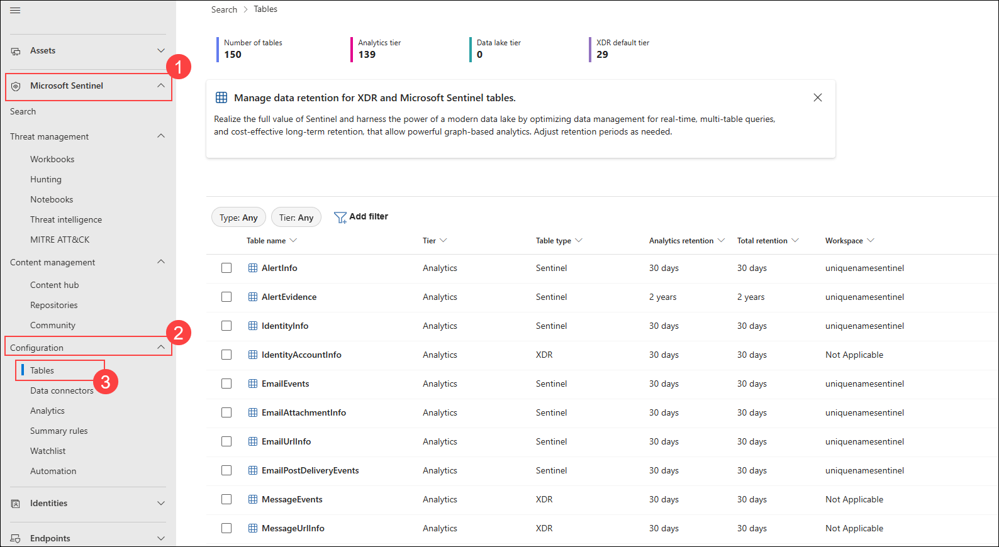

1. On the **Tables** page, you will see a comprehensive list of tables available in your Sentinel workspace. Review available tables including SecurityAlert, AzureActivity, SigninLogs, AuditLogs, Heartbeat, and more.

    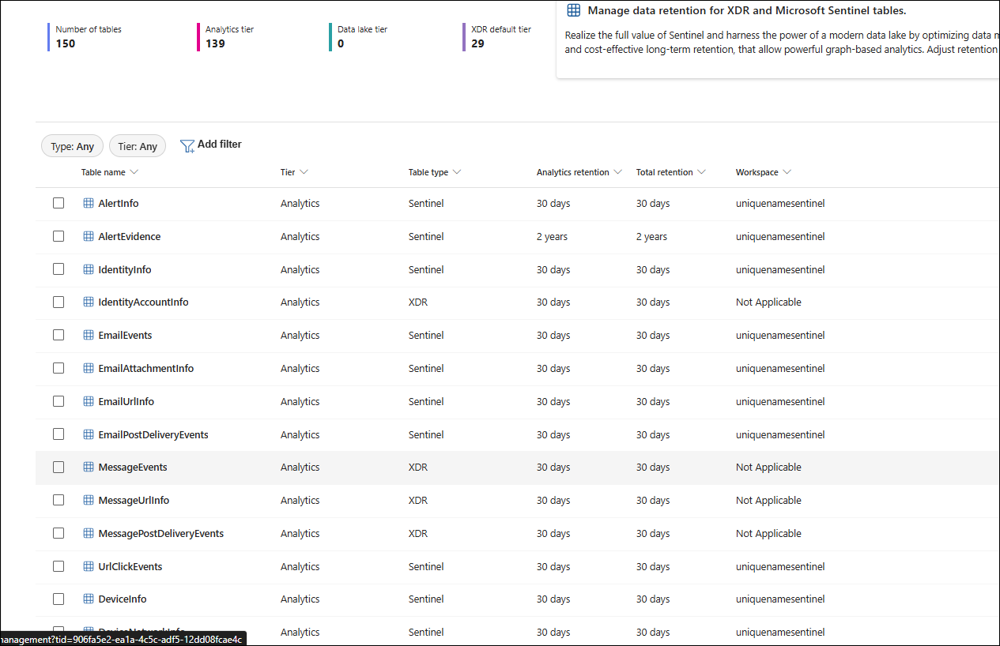

1. Navigate to the Azure portal and search for uniquenameSentinel Log analytics workspace and click on Logs

    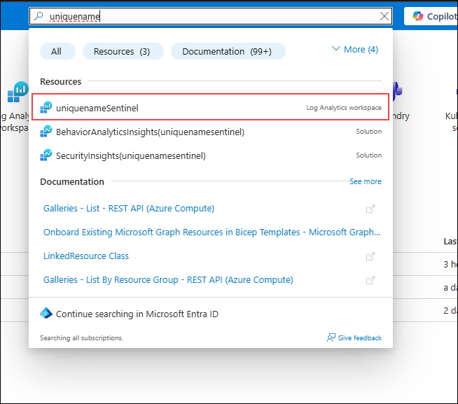

    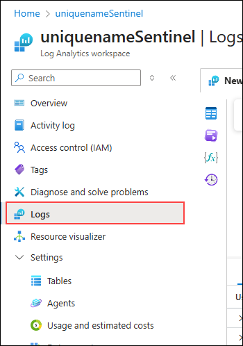

1. Select the **Logs** option under **General** on the left hand menu and **Close** all the **pop-ups** if they appear.

    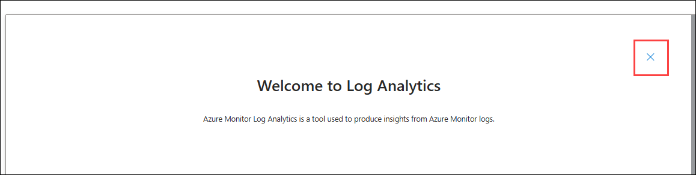
    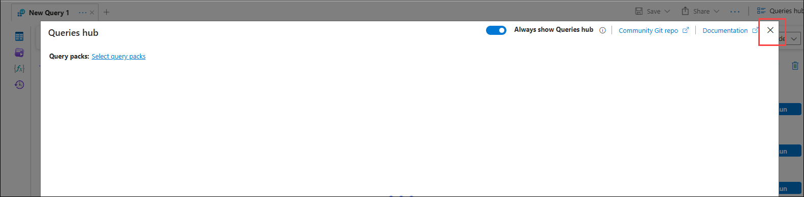

1. Ensure you are in **KQL mode (1)** for writing queries. The query editor provides syntax highlighting and query assistance.

    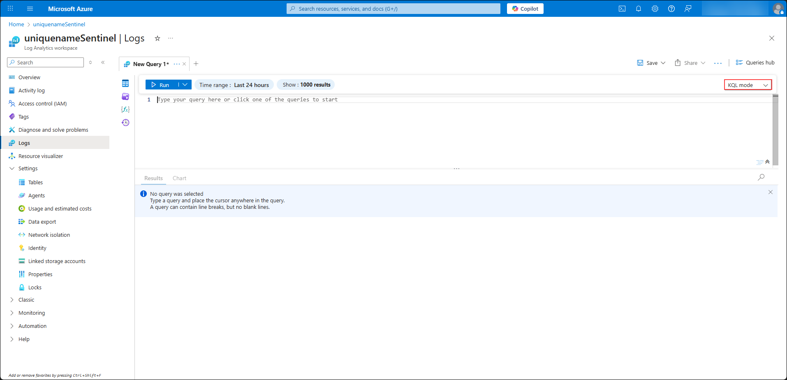

### Task 2: Create Basic Threat Hunting Queries

In this task, you will create basic KQL queries to hunt for common security threats and suspicious activities.

1. In the KQL query editor, enter a query to identify **SignIn logs**:

    ```KQL
    SigninLogs
    | where ResultType == "0"
    | extend Location = strcat(LocationDetails.countryOrRegion, "-", LocationDetails.city)
    | summarize Locations = dcount(Location), LocationList = make_set(Location) by UserPrincipalName
    | where Locations > 1
    ```

1. Click **Run (1)** to execute the query and review the results showing users with multiple failed login attempts.

    > **Note:** This query may return no results since no alerts have have been created; it is intended solely for demonstration purposes.

1. Enter a query to detect **suspicious Azure Activity - unusual resource creation**:

    ```KQL
    AzureActivity
    | where TimeGenerated >= ago(7d)
    | where OperationName contains "Create or Update"
    | where ActivityStatus == "Succeeded"
    | distinct Caller, ResourceGroup, TimeGenerated
    | sort by TimeGenerated desc
    ```

1. Click **Run (2)** to execute the query.
    > **Note:** This query may return no results since no Azure resources have been created; it is intended solely for demonstration purposes.

### Task 3: Build Advanced Hunting Queries with Multi-Source Correlation

In this task, you will create sophisticated queries that correlate data across multiple sources to identify advanced attack patterns.

1. The below KQL query identifies users with multiple failed sign-ins in the last 24 hours and correlates them with any administrative actions they initiated, helping detect potentially compromised accounts performing admin operations.

    ```KQL
    let SuspiciousUsers = SigninLogs
    | where CreatedDateTime >= ago(24h)
    | where ResultType != "0"
    | summarize FailedLogins = count() by UserPrincipalName
    | where FailedLogins > 1;
    AuditLogs
    | where InitiatedBy.user.userPrincipalName in (SuspiciousUsers)
    | sort by TimeGenerated desc
    ```
    > **Note:** This query may return no results since no alerts have have been created; it is intended solely for demonstration purposes.

1. Click **Run (1)** to identify actions from users with suspicious login patterns.

1. The below KQL query scans the last 7 days of successful network connections to common lateral-movement ports (SMB, RDP, SSH, WinRM), counts how often each device connects on those ports, and flags devices with unusually high connection volumes as potential lateral movement indicators.

    ```KQL
    DeviceNetworkEvents
    | where TimeGenerated >= ago(7d)
    | where RemotePort in (445, 3389, 22, 5985, 5986)
    | where ActionType == "ConnectionSuccess"
    | summarize ConnectionCount = count() by DeviceName, RemotePort
    | where ConnectionCount > 5
    | sort by ConnectionCount desc
    ```

1. Click **Run (2)** to identify potential lateral movement using suspicious ports.

    > **Note:** This query may return no results since no alerts have have been created; it is intended solely for demonstration purposes.

1. Below query helps detect potential data exfiltration activity by identifying devices that are communicating with external (public) IP addresses

    ```KQL
    DeviceNetworkEvents
    | where TimeGenerated >= ago(24h)
    | where RemoteIP !startswith "10." and RemoteIP !startswith "192.168."
    ```

1. Click **Run (3)** to detect large data transfers to external networks.
    > **Note:** This query may return no results since no alerts have have been created; it is intended solely for demonstration purposes.

1. Below query helps identify high-severity security alerts that may be related to known malicious IP addresses from your threat intelligence feeds. It combines alert data with active threat intelligence to prioritize incidents that are more likely to represent real threats.

    ```KQL
    let TI_IPs =
    ThreatIntelligenceIndicator
    | where Active == true
    | where ExpirationDateTime > now()
    | where IndicatorType in ("IPv4", "IPv6")
    | project NetworkIP;

    SecurityAlert
    | where TimeGenerated >= ago(24h)
    | where AlertSeverity == "High"
    | project TimeGenerated, DisplayName, AlertSeverity
    | sort by TimeGenerated desc
    ```

1. Click **Run (4)** to correlate known threat indicators with generated alerts.
    > **Note:** This query may return no results since no alerts have been created; it is intended solely for demonstration purposes.

### Task 4: Save Hunting Queries for Reuse

In this task, you will save your hunting queries as saved queries for future use and team collaboration.

1. Enter a query in the editor:

    > **Note:** This query may return no results since no alerts have have been created; it is intended solely for demonstration purposes.

    ```KQL
    SigninLogs
    | where ResultType == "0"
    | extend Location = strcat(LocationDetails.countryOrRegion, "-", LocationDetails.city)
    | summarize Locations = dcount(Location), LocationList = make_set(Location) by UserPrincipalName
    | where Locations > 1
    ```

1. Click **Save (1)** in the query editor toolbar and select **Save as query (2)**.

    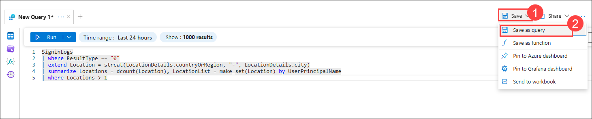

1. In the **Save query** dialog, enter the following details:

    - **Query name:** Enter **Login Attempts Hunting Query (1)**
    - **Description:** Sign In logs **(2)**
    - **Category:** Select **Security (3)**
    - Click **Save (4)**

    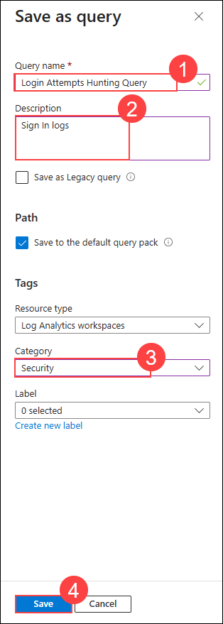

1. In the **Microsoft Sentinel** workspace, go to **Queries (1)**, search for **Login Attempts Hunting Query (2)**, and select it from the **Security** section **(3)** to view the results.

    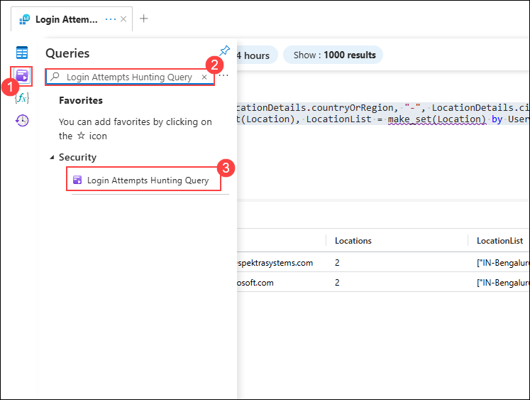

1. Your saved hunting queries will appear in the list. Click on a saved query to **load and run** it.

1. You can also **share saved queries** with your team by selecting the query and clicking **Share**.

    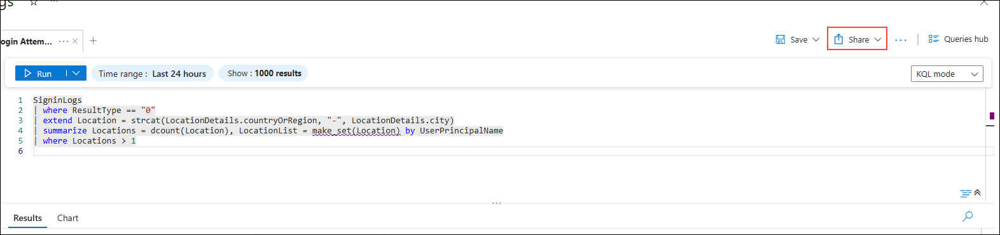

1. **To create a hunting rule from a saved query**, select the saved query, click on **(…) (1)**, choose **New alert rule (2)**, and then select **Create Azure Monitor alert (3)** to convert the query into an analytics rule for automated detection.

    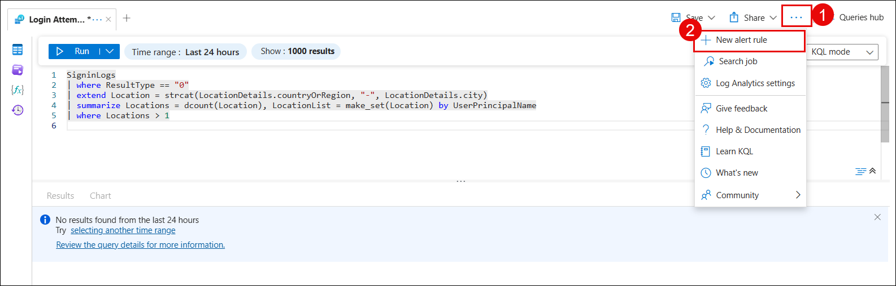

    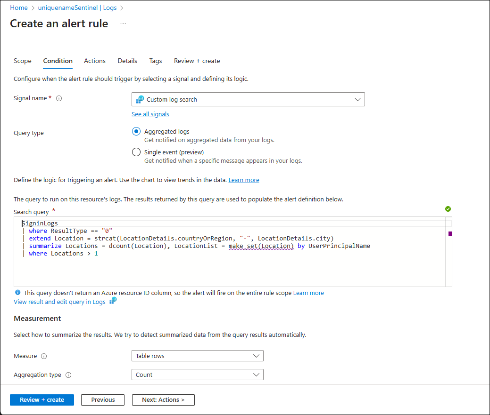

## Summary

In this exercise, you explored the Microsoft Sentinel data lake structure, created basic and advanced threat hunting queries using KQL, correlated data across multiple sources to identify sophisticated attack patterns, and saved hunting queries for team reuse. You have established the foundation for proactive threat hunting and continuous security monitoring across your organization.

## You have successfully completed the exercise!

### Now, click on **Next >>** from the lower right corner to move on to the next page.

   