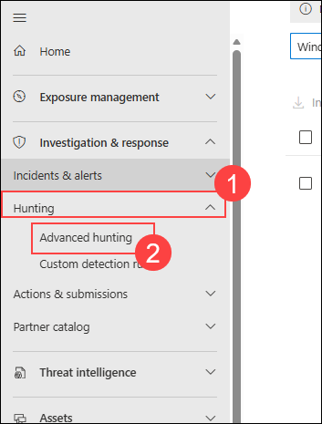
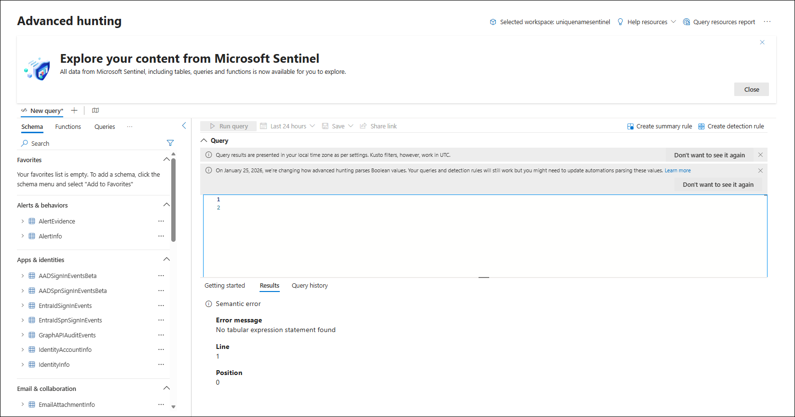

# Exercise 2: Hunt Threats Using KQL Across the Data Lake

## Estimated Duration: 50 Minutes

## Overview

In this exercise, you will develop advanced threat hunting capabilities using **Kusto Query Language (KQL)** across **Microsoft Sentinel's data lake**. You will start by understanding the structure and capabilities of the data lake tier for long-term storage and cost-effective querying. Next, you will craft sophisticated KQL queries to hunt for indicators of compromise, suspicious behaviors, and advanced attack patterns across multiple data sources. Finally, you will create hunting queries that can be saved and reused, establishing a repeatable threat hunting methodology for your security team.

## Lab Objectives

In this lab, you will perform the following:

- Task 1: Explore the Data Lake Structure and Tables
- Task 2: Create Basic Threat Hunting Queries
- Task 3: Build Advanced Hunting Queries with Multi-Source Correlation
- Task 4: Save Hunting Queries for Reuse

### Task 1: Explore the Data Lake Structure and Tables

In this task, you will explore the Microsoft Sentinel data lake structure to understand available data sources and tables for threat hunting.

1. Navigate to **Microsoft Defender Portal**

    ```
    https://security.microsoft.com/
    ```

1. On the left side menu, select **Microsoft Sentinel (1)** > **Configuration (2)** and select **Tables (3)** under Configuration.

    

1. On the **Tables** page, you will see a comprehensive list of tables available in your Sentinel workspace. Review available tables including SecurityAlert, AzureActivity, SigninLogs, AuditLogs, Heartbeat, and more.

    

1. Click on the **Data Lake Explorer (1)** button to view the data lake tier structure for long-term storage and cost-effective analysis.

    

1. Navigate to the **Logs (1)** section in the left menu under **General** to access the KQL query editor.

    

1. Ensure you are in **KQL mode (1)** for writing queries. The query editor provides syntax highlighting and query assistance.

    

### Task 2: Create Basic Threat Hunting Queries

In this task, you will create basic KQL queries to hunt for common security threats and suspicious activities.

1. In the KQL query editor, enter a query to identify **failed authentication attempts**:

    ```KQL
    SigninLogs
    | where ResultType != "0"
    | where CreatedDateTime >= ago(24h)
    | summarize FailedAttempts = count() by UserPrincipalName, ClientAppUsed
    | where FailedAttempts > 5
    | sort by FailedAttempts desc
    ```

1. Click **Run (1)** to execute the query and review the results showing users with multiple failed login attempts.

    

1. Enter a query to detect **suspicious Azure Activity - unusual resource creation**:

    ```KQL
    AzureActivity
    | where TimeGenerated >= ago(7d)
    | where OperationName contains "Create or Update"
    | where ActivityStatus == "Succeeded"
    | distinct Caller, ResourceGroup, TimeGenerated
    | sort by TimeGenerated desc
    ```

1. Click **Run (2)** to execute the query.

    

1. Enter a query to identify **potentially malicious process execution**:

    ```KQL
    DeviceProcessEvents
    | where Timestamp >= ago(24h)
    | where ProcessCommandLine contains_any ("powershell.exe -nop", "cmd.exe /c", "wmic")
    | project Timestamp, DeviceName, ProcessCommandLine, AccountName
    | sort by Timestamp desc
    ```

1. Click **Run (3)** to view suspicious process executions on endpoints.

    

1. Enter a query to detect **brute force attack patterns**:

    ```KQL
    SigninLogs
    | where ResultType == "50058"
    | where CreatedDateTime >= ago(24h)
    | summarize SignInAttempts = count() by UserPrincipalName, IPAddress
    | where SignInAttempts >= 10
    | sort by SignInAttempts desc
    ```

1. Click **Run (4)** to identify potential brute force attacks.

    

### Task 3: Build Advanced Hunting Queries with Multi-Source Correlation

In this task, you will create sophisticated queries that correlate data across multiple sources to identify advanced attack patterns.

1. Enter a query to **correlate user actions across authentication and admin operations**:

    ```KQL
    let SuspiciousUsers = SigninLogs
    | where CreatedDateTime >= ago(24h)
    | where ResultType != "0"
    | summarize FailedLogins = count() by UserPrincipalName
    | where FailedLogins > 10;
    AuditLogs
    | where InitiatedBy.user.userPrincipalName in (SuspiciousUsers)
    | project TimeGenerated, Activity, Result
    | sort by TimeGenerated desc
    ```

1. Click **Run (1)** to identify admin actions from users with suspicious login patterns.

    

1. Enter a query to detect **lateral movement indicators**:

    ```KQL
    DeviceNetworkEvents
    | where Timestamp >= ago(7d)
    | where RemotePort in (445, 3389, 22, 5985, 5986)
    | where ActionType == "ConnectionSuccess"
    | summarize ConnectionCount = count() by DeviceName, RemotePort
    | where ConnectionCount > 5
    | sort by ConnectionCount desc
    ```

1. Click **Run (2)** to identify potential lateral movement using suspicious ports.

    

1. Enter a query to **identify data exfiltration patterns**:

    ```KQL
    DeviceNetworkEvents
    | where Timestamp >= ago(24h)
    | where RemoteIP !startswith "10." and RemoteIP !startswith "192.168."
    | summarize TotalBytes = sum(BytesSent), UniqueRemoteIPs = dcount(RemoteIP)
        by DeviceName
    | where TotalBytes > 1000000
    | sort by TotalBytes desc
    ```

1. Click **Run (3)** to detect large data transfers to external networks.

    

1. Enter a query to **correlate threat intelligence indicators with security alerts**:

    ```KQL
    SecurityAlert
    | where TimeGenerated >= ago(24h)
    | where Severity == "High"
    | join kind=inner (
        ThreatIntelIndicators
        | where ExpirationTime >= now()
    ) on Entities
    | project TimeGenerated, DisplayName, AlertSeverity, IndicatorType
    | sort by TimeGenerated desc
    ```

1. Click **Run (4)** to correlate known threat indicators with generated alerts.

    

### Task 4: Save Hunting Queries for Reuse

In this task, you will save your hunting queries as saved queries for future use and team collaboration.

1. Enter a query in the editor:

    ```KQL
    SigninLogs
    | where ResultType != "0"
    | where CreatedDateTime >= ago(24h)
    | summarize FailedAttempts = count() by UserPrincipalName
    | where FailedAttempts > 5
    | sort by FailedAttempts desc
    ```

1. Click **Save (1)** in the query editor toolbar.

    

1. In the **Save query** dialog, enter the following details:

    - **Query name:** Enter **Failed Login Attempts Hunting Query (1)**
    - **Category:** Select **Threat Hunting (2)**
    - **Description:** Enter description of the query **(3)**
    - Click **Save (4)**

    

1. Enter another hunting query and save it similarly with appropriate name and category.

    

1. To view your saved queries, click **Saved queries (1)** in the left navigation.

    

1. Your saved hunting queries will appear in the list. Click on a saved query to **load and run (1)** it.

    

1. You can also **share saved queries (1)** with your team by selecting the query and clicking **Share (2)**.

    

1. To create a **hunting rule from a saved query**, select a saved query and click **Create rule (1)** to convert it into an analytics rule for automated detection.

    

## Summary

In this exercise, you explored the Microsoft Sentinel data lake structure, created basic and advanced threat hunting queries using KQL, correlated data across multiple sources to identify sophisticated attack patterns, and saved hunting queries for team reuse. You have established the foundation for proactive threat hunting and continuous security monitoring across your organization.

## You have successfully completed the exercise!

### Now, click on **Next >>** from the lower right corner to move on to the next page.

   