# Exercise 3: Analytics Rules and Incident Management

## Estimated Duration: 40 Minutes

## Overview
In this exercise, you will configure **Microsoft Sentinel** to detect and respond to security threats. You will start by creating a Log Analytics Workspace and deploying Microsoft Sentinel to it. Next, you will create and export an analytics rule to detect suspicious activities. Finally, you will generate and investigate an incident to understand Sentinel’s incident management process.

## Lab Objectives

 In this lab, you will perform the following:

- Task 1: Create and export an analytical rule
- Task 2: Connect VM to the Log Analytics workspace
- Task 3: Create and Investigate an Incident

### Task 1: Create and export an analytical rule

In this task, you will enable Entity behavior analytics in Microsoft Sentinel.

1. In the Microsoft Defender portal, select **Analytics (2)** under **Configuration (1)** from the left hand pane

   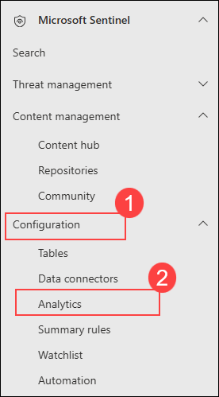 

     >**Note:** If you do not see the expected Microsoft Sentinel features or options, sign out of the Defender portal and sign back in to refresh your session.

1. On the Analytics page, in the search bar under **Rule template (1)** type **Suspicious Resource deployment (2)** and press the enter key, then select **Suspicious Resource deployment (3)** rule from the list and click **Create rule (4)**.

   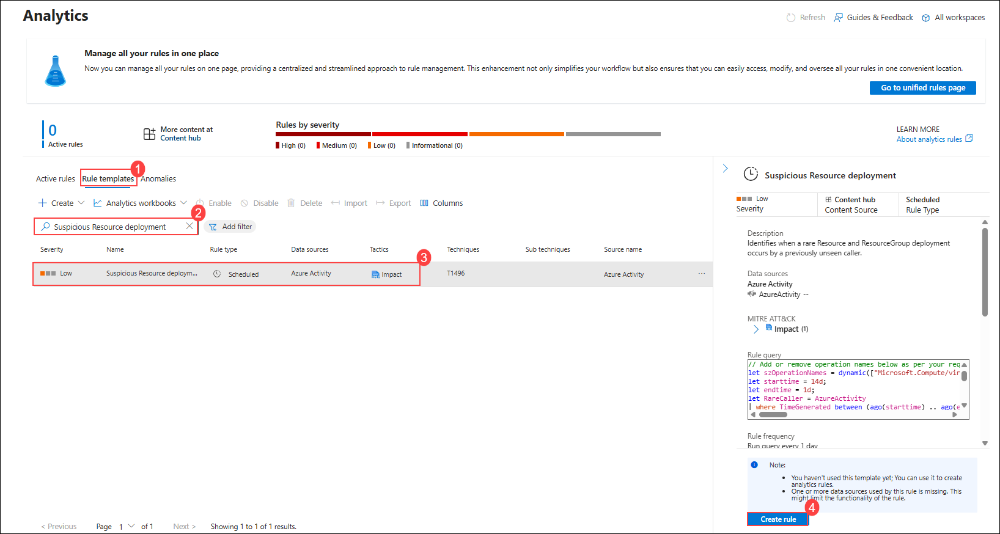

    > **Note:** If you are unable to find **Suspicious Resource deployment** under rule templates. Wait for the **Azure Activity** data connector to show a **Connected** status after configuration.   

1. In the Analytics Rule Wizard, review the General section, then click **Next: set rule logic>.**

   >**Note:** You can click either the tab at the top or the button at the bottom to continue.

   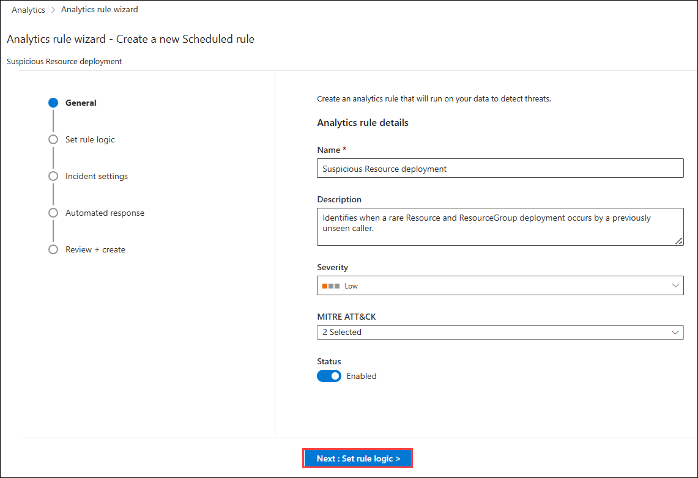

6. On the **Set rule logic** screen, you can create or modify the KQL query, control entity mapping, enable and adjust alert grouping, and define the scheduling and lookback time range, then **Next: Incident settings>**.

	  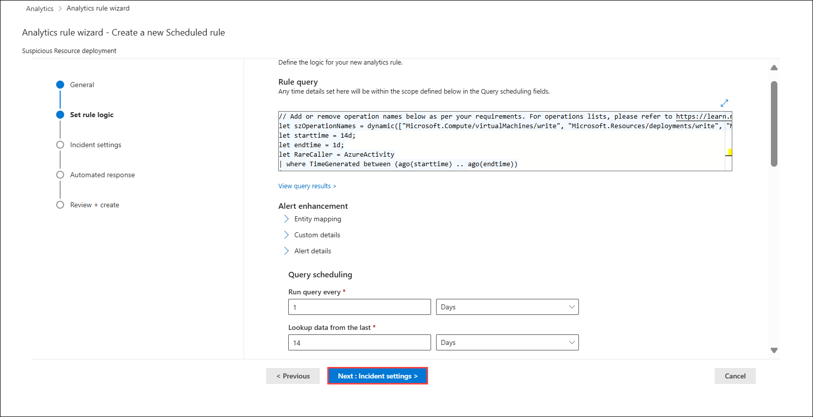

7. On the **Incident settings** tab, note that **Incident creation** is **Enabled (1)**, and **Alert grouping** is **Disabled (2)**. Not every Alert detected by Sentinel must be promoted into an Incident - particularly noisy alerts! These settings can always be modified later if desired, then click **Next: Automated response> (3)**.
   
	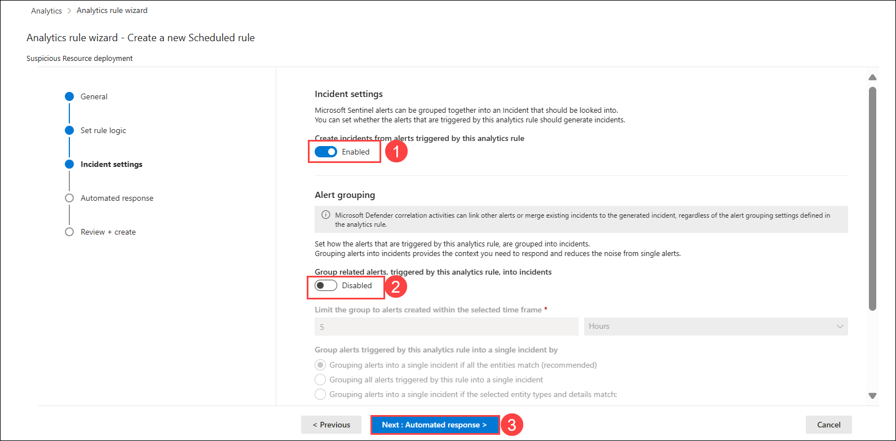

1. In the Automated response section, keep everything as default and click on **Review and Create**.

9. On the *Review and create* tab, review the rule configuration, and then click **Save** to deploy your new rule to the Active rule set.

1. On the Analytics page, select the **Suspicious Resource deployment (1)** rule that you created.

1. Select the **Export (2)** from the toolbar.

   >**Note:** You might need to select the ellipsis icon **(...)** to see it.

   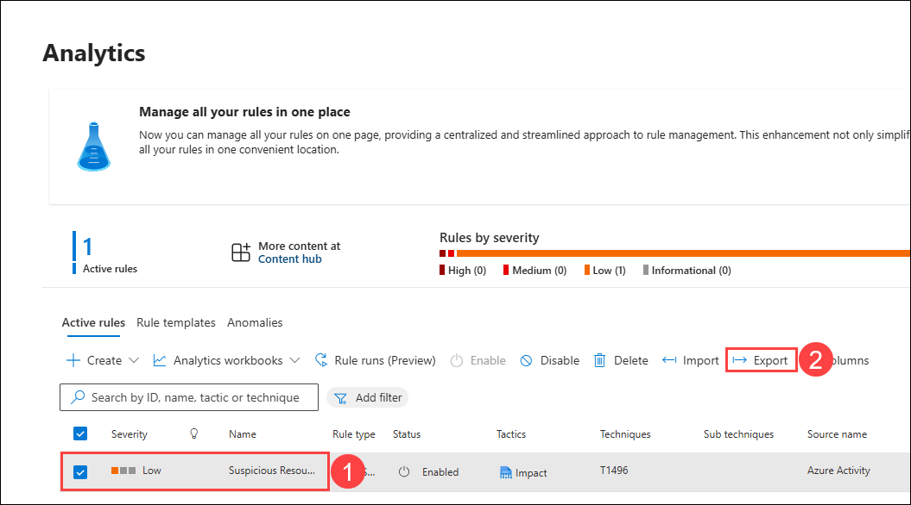

1. The rule is exported to a text file named *Azure_Sentinel_analytic_rule.json*.

   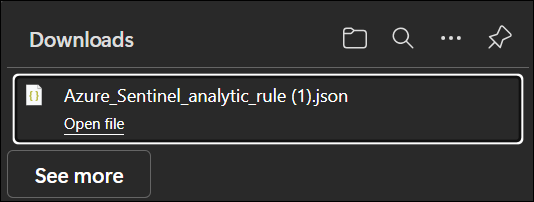

1. Select **Open file** below the name of the downloaded file and then select **More apps**.

1. Select **Notepad** and then select **OK**.

1. Review the Azure Resource Manager template and close it when done.

### Task 2: Connect VM to the Log Analytics workspace

1. In the Search bar of the Azure portal, type **Log Analytics (1)**, then select **Log Analytics workspaces (2)**.

    

1. On the **Log Analytics workspaces** and select **uniquenameSentinel** workspace you created in task-1.

    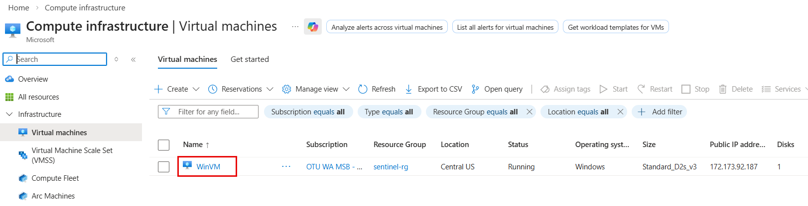

1. In the workspace, select **Virtual machines (deprecated) (1)** from the left navigation pane under Classic, then locate and select **WinVM (2)** from the list displayed.

    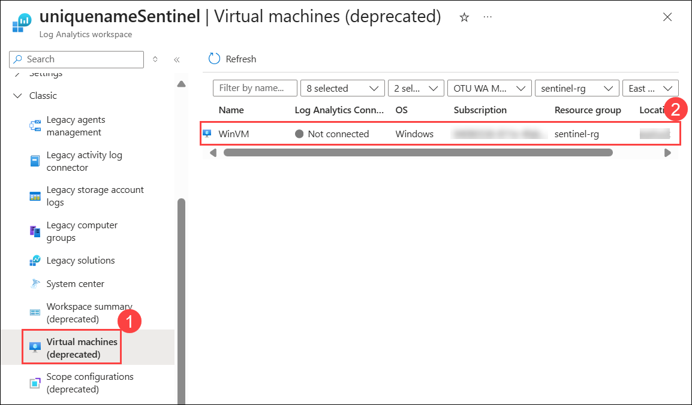

1. Click **Connect** to link it to the workspace.

    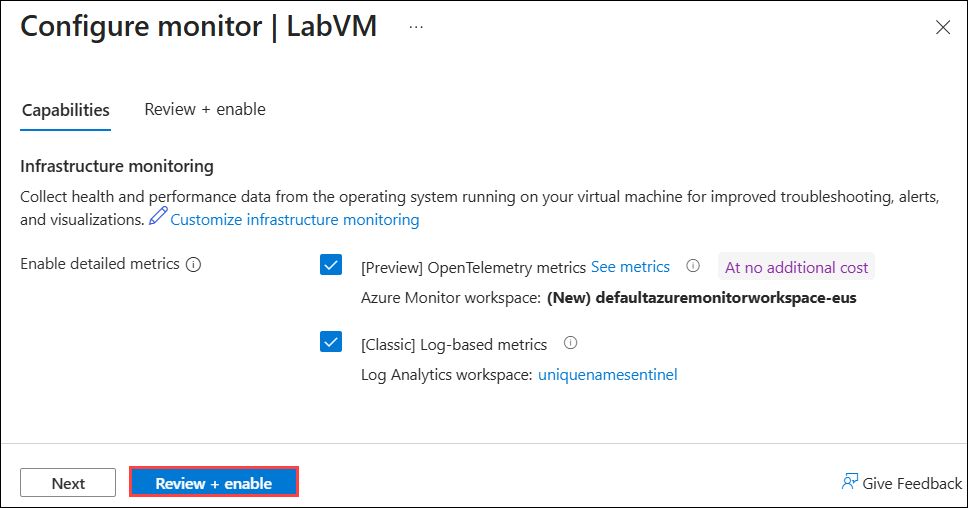

1. Wait until the **Status** shows **Connected**.

1. In the Search bar of the Azure portal, type **Microsoft Sentinel (1)**, then select **Microsoft Sentinel (2)**.

   

1. Select the **Microsoft Sentinel Workspace** you created earlier.

   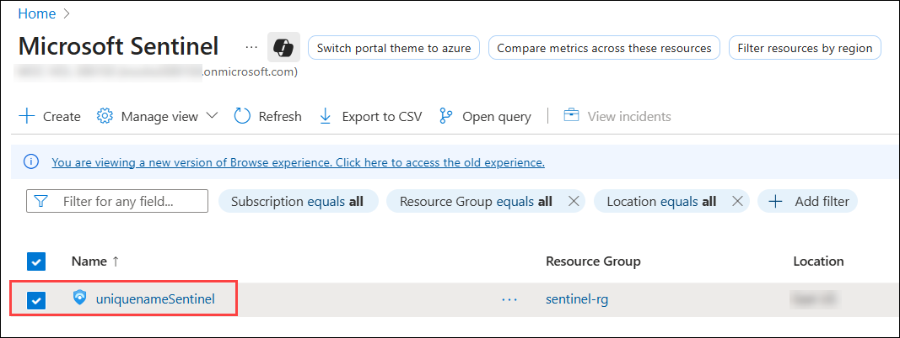   

1. Select the **Logs (1)** option under **General** on the left hand menu. 

   >**Note:** You may need to disable the "Always show queries" option and close the *Queries* window to run the statements.

1. Choose working mode as **KQL mode (2)**, enter the below given query **(3)**, then click **Run (4)** and in **Results (5)** section see the output of the query.  

    ```KQL
    Heartbeat | take 10
    ```  

    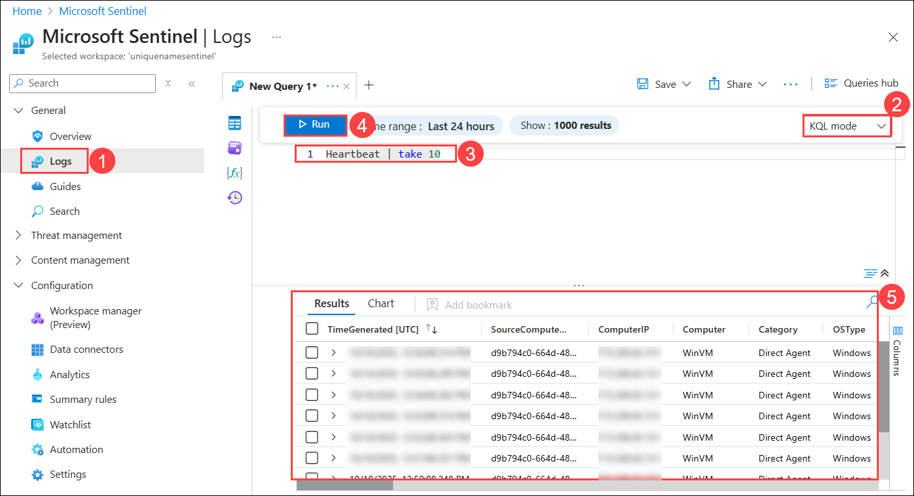

   >**Note:** If no output is generated, wait 5–10 minutes, then rerun the query to confirm data ingestion.

### Task 3: Create and Investigate an Incident

In this task, you will create and investigate an incident.

1. Navigate to **Microsoft Defender Portal**

   ```
   https://security.microsoft.com/
   ```

1. Navigate **Advanced Hunting (3)** by expanding **Hunting (2)** under **Investigation & response (1)**, enter the below given **query (4)** and click on **Run Query (5)**.

   ```
   Heartbeat
   | summarize LastSeen = max(TimeGenerated) by Computer, RemoteIPCountry, OSType, OSMajorVersion
   | extend HoursSinceLastSeen = datetime_diff('hour', now(), LastSeen)
   | extend TimeGenerated = LastSeen
   | project TimeGenerated, Computer, OSType, OSMajorVersion, RemoteIPCountry, LastSeen, HoursSinceLastSeen
   | order by HoursSinceLastSeen desc
   | extend Host_0_HostName = Computer
   ```

1. Select the **result (6)** shown and click on **Link to incident (7)**.

    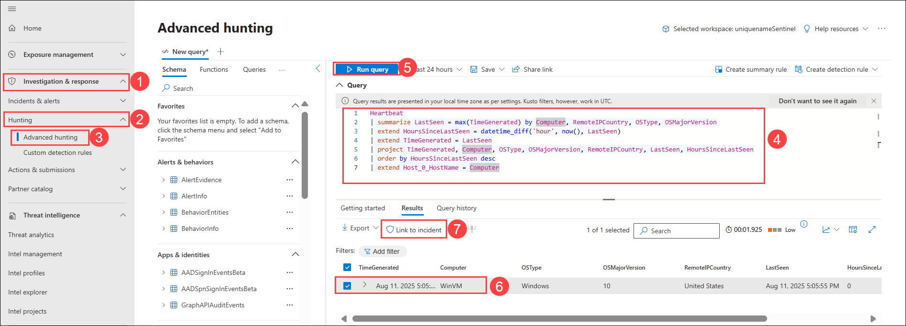

1. On the Link incident page, for Alert details, enter the following details:

   - **Connect a new incident (1)** should be checked.
   - Alert title: **Hunting Query incident (2)**.
   - Severity: Select **Low (3)** from the drop-down menu.
   - Category: Select **Command and Control (4)** from the drop-down menu.
   - Description: Provide **Creating an incident form hunting query**.
   - Then click on **Next (7)**.

      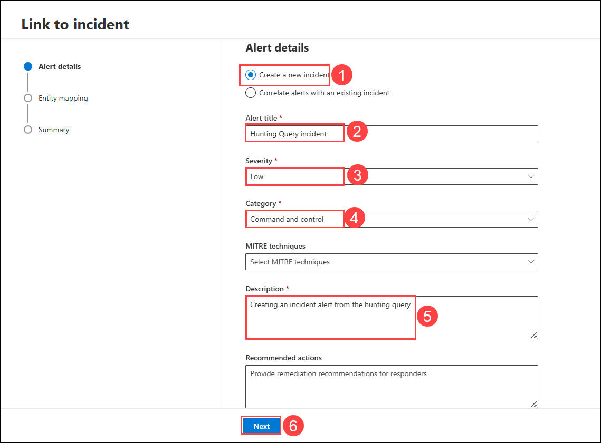

1. On the Entity mapping page, enter the following details:

    - Click on **+ Add assets (1)**.
    - Entity: Select **Devices(2)** form the dropdown menu.
    - Identifier: Select **HostName (3)** from the dropdown menu.
    - Colum: Select **Computer (4)** from the dropdown menu. 

    - under Related Evidences, Click on **+ Add entities (5)**.
    - Entity: Select **URL (6)** from the dropdown menu.
    - Identifier: Select **URL (7)** from the dropdown menu.
    - Colum: Select **Computer (8)** from the dropdown menu. 
    - Click on **+ Add entities (5)** again to add another entity.
    - Entity: Select **IP (9)** from the dropdown menu.
    - Identifier: Select **Address (10)** from the dropdown menu.
    - Colum: Select **RemoteIPCountry (11)** from the dropdown menu.
    - Then click on **Next (12)**.

      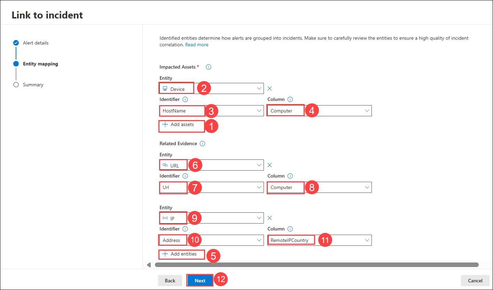

1. On the summary page, click on **Submit.**

    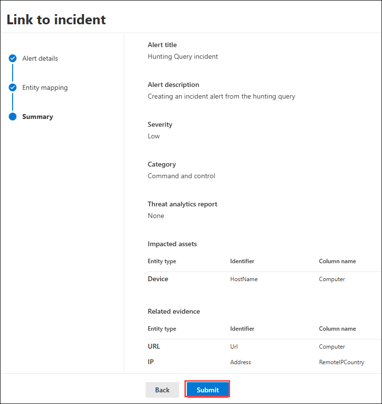

1. Click on **Done**.

1. In the left navigation pane, expand **Investigation & response (1)**, select **Incidents & alerts (2)**, and then click **Incidents (3)**. From the incidents list, select the **Hunting Query incident (4)** to view the incident details.

   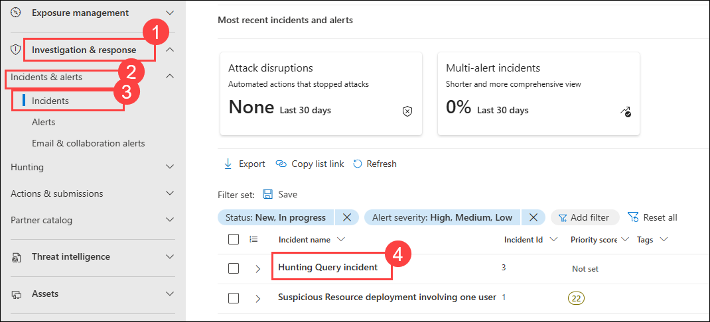

1. On the **Hunting Query incident** page, you will see the incident graph.

   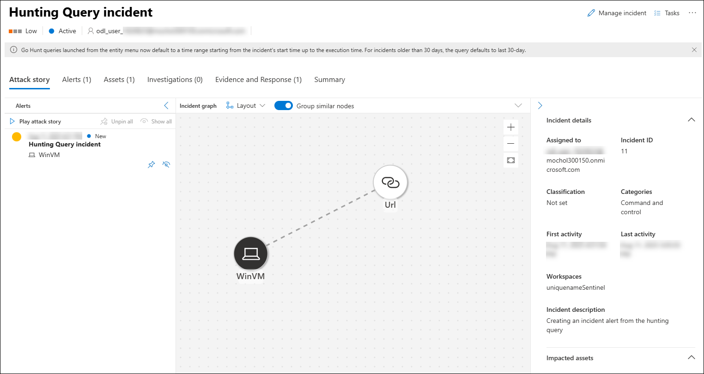

> **Congratulations** on completing the task! Now, it's time to validate it. Here are the steps:
> - If you receive a success message, you can proceed to the next task.
> - If not, carefully read the error message and retry the step, following the instructions in the lab guide.
> - If you need any assistance, please contact us at cloudlabs-support@spektrasystems.com. We are available 24/7 to help you out.

<validation step="51caa58a-e8a2-4a4e-a2ce-3bed17db30ad" />

## Summary
In this exercise, you successfully created and exported an analytics rule, and investigated an incident. You have gained practical experience in configuring detection rules and managing security incidents within Sentinel.

## You have successfully completed the exercise!

### Now, click on **Next >>** from the lower right corner to move on to the next page.

   
