# Exercise 4: Hunting queries and Watchlists

## Estimated Duration: 30 Minutes

## Overview
In this exercise, you will leverage Microsoft Sentinel’s proactive threat-hunting capabilities. You will begin by creating a hunting query to search for potential security threats in collected data. Then, you will bookmark significant query results for future reference and promote a bookmark to an incident for deeper investigation. Finally, you will create a watchlist to enrich your queries and streamline threat detection.

## Lab Objectives

 In this lab, you will perform the following:

- Task 1: Create a hunting query
- Task 2: Create a Watchlist

### Task 1: Create a hunting query

In this task, you will create a hunting query, bookmark a result, and create a Livestream.

1. From the left navigation pane, select **Hunting (1)**. On the **Queries** tab **(2)**, click **+ New query (3)** to create a new hunting query.

   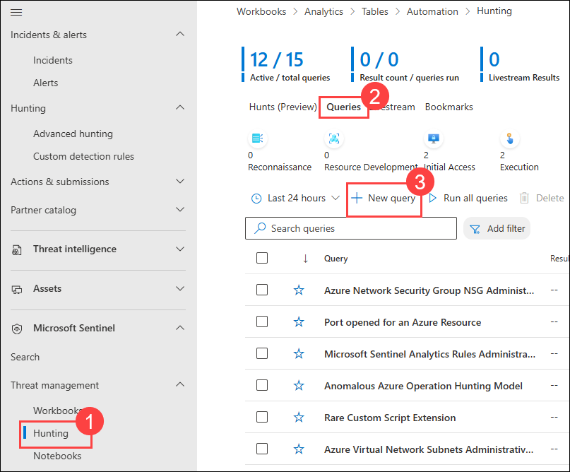

1. Scroll down and under *Entity mapping*, click on **+ Add new Entity (3)**, then select:

   - Name: **Heartbeat Health Check (1)**
   - For the *Entity type* drop-down list select **Host (4)**.
   - For the *Identifier* drop-down list select **HostName (5)**.
   - For the *Value* drop-down list select **Computer (6)**.

1. Add the following query **(2)**.

    ```KQL
    let lookback = 1d;
    Heartbeat
    | where TimeGenerated >= ago(lookback)
    | summarize LastSeen = max(TimeGenerated) by Computer, RemoteIPCountry, OSType, OSMajorVersion
    | extend HoursSinceLastSeen = datetime_diff('hour', now(), LastSeen)
    | project Computer, OSType, OSMajorVersion, RemoteIPCountry, LastSeen, HoursSinceLastSeen
    | order by HoursSinceLastSeen desc
    ```

1. Scroll down and under *Tactics & Techniques* select **Command and Control (7)** and then select **Create (8)** to create the hunting query.

   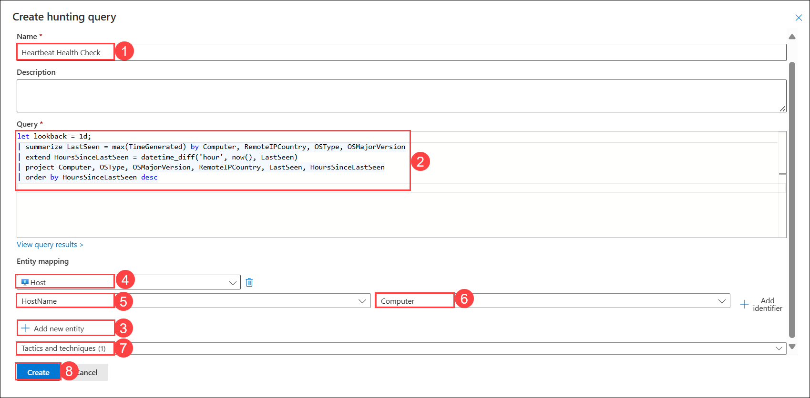

1. From the left navigation pane, select **Hunting (1)**. On the **Queries** tab **(2)**, click **+ New query (3)** to create a new hunting query.

   

1. Select **Heartbeat Health Check (1)** query, click on the **ellipsis (...) (2)**, then select **+ Add to livestream (3)**.

   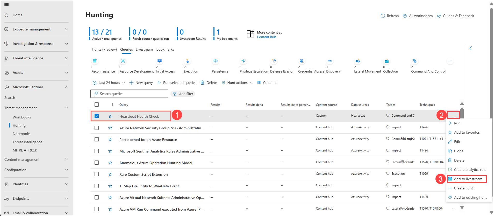

1. Review that the *Status* is now *Running*. This will be running every 30 seconds in the background, and you will receive a notification in the Azure Portal (bell icon) when a new result is found. Click on the refresh.

   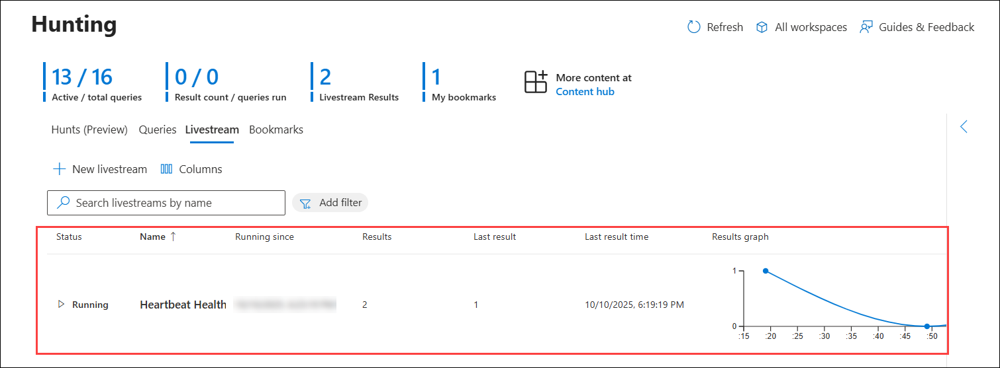

### Task 2: Create a Watchlist

In this task, you will create a watchlist in Microsoft Sentinel.

1. In the **search box (1)** at the bottom of the Windows 10 screen, enter **Notepad (2)**, then select **Notepad (3)** from the results.

    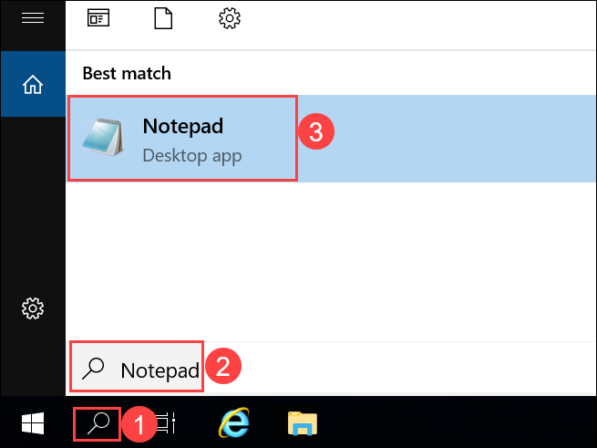

1. In the notepad, copy the following hostnames, each one in a different line:

    ```Notepad
    Hostname
    Host1
    Host2
    Host3
    Host4
    Host5
    ```

   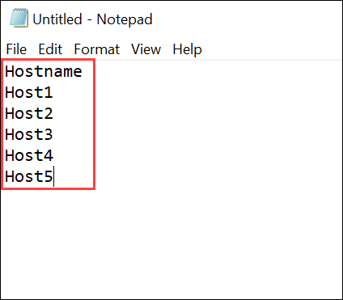

1. Click on **File (1)**, select **Save As (2)** to save the file.

   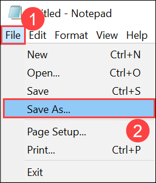

1. On the **Save As** window, Enter File name as **HighValue.csv (1)**, for Save as type select **All Files (2)**, then click **Save (3)** to save the file. 

   >**Note:** The file will be saved in the *Documents* folder.

   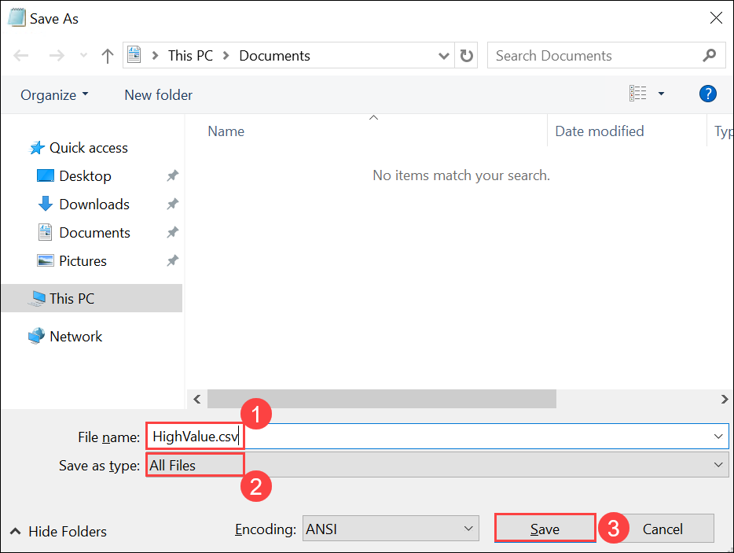

1. Navigate back to the Defender portal, navigate to the **Watchlist (1)** option under the Configuration from the left-hand menu, select **+ New (2)** from the **My Watchlists** section.

   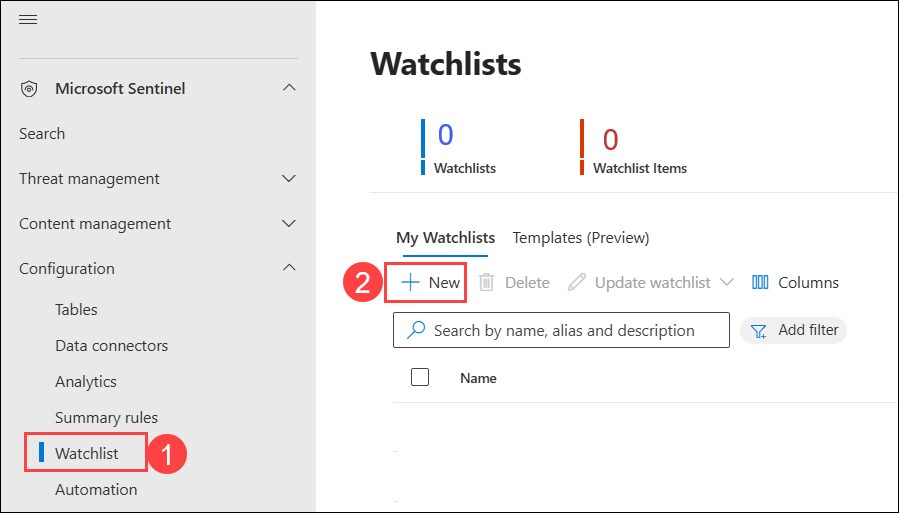

1. In the General section of the Watchlist wizard, enter the following details, then select **Next: Source > (4)**.

    |General setting|Value|
    |---|---|
    |Name|**HighValueHosts (1)**|
    |Description|**High Value Hosts (2)**|
    |Watchlist alias|**HighValueHosts (3)**|

    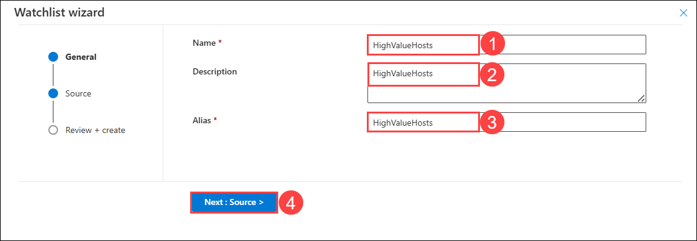

1. In the Source section of the Watchlist wizard, add the following details, then select **Next: Review and Create > (6).**

   - Source type: Ensure **Local file (1)** is selected.
   - File type: Select **CSV file with a header (.csv) (2)** from the dropdown menu.
   - Number of lines before row with headings: **Set to 0 (3)**
   - Upload file: Select **Browse for files (4)** to add *HighValue.csv* file you created.
   - SearchKey: Select **Hostname (5)** from the dropdown menu.

     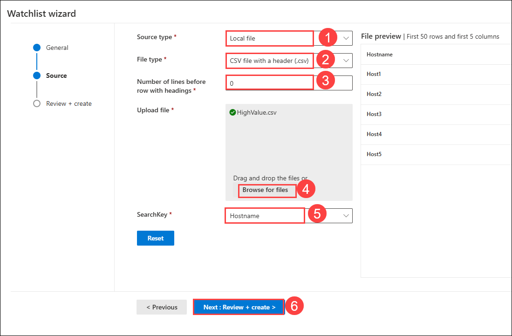

      >**Note:** To upload file click on **Browse for files**, upload window will open. Navigate to **This PC-> Documents (1)** path, select the **HighValue.csv (2)** file, then click on **Open (3).**

      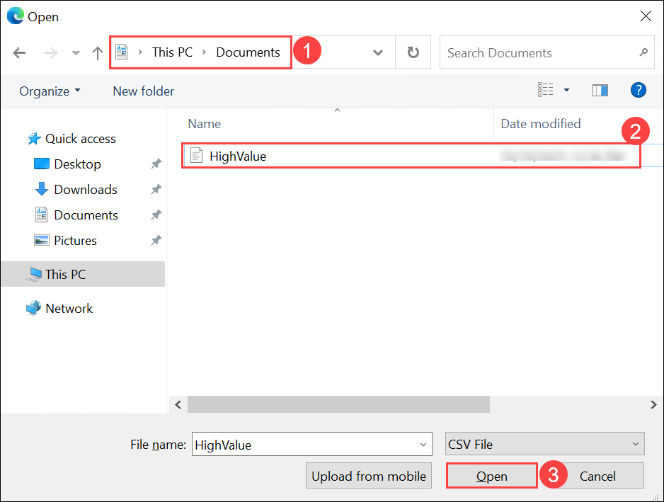

1. Review the settings you entered and select **Create**.

   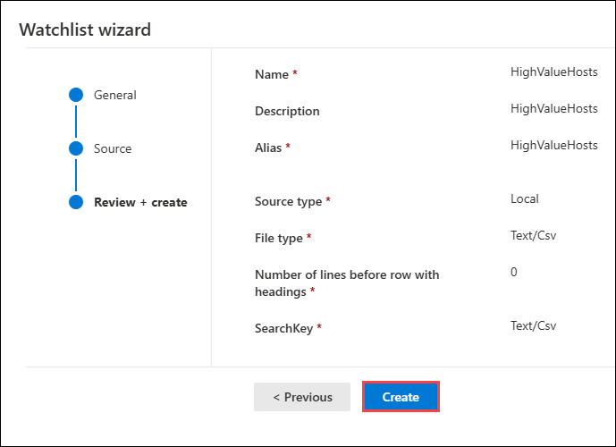

1. The screen returns to the Watchlist page.

1. You will be navigated back to the Watchlist page, select the **HighValueHosts (1)** watchlist, and on the right pane, select **View in logs (2)**.

   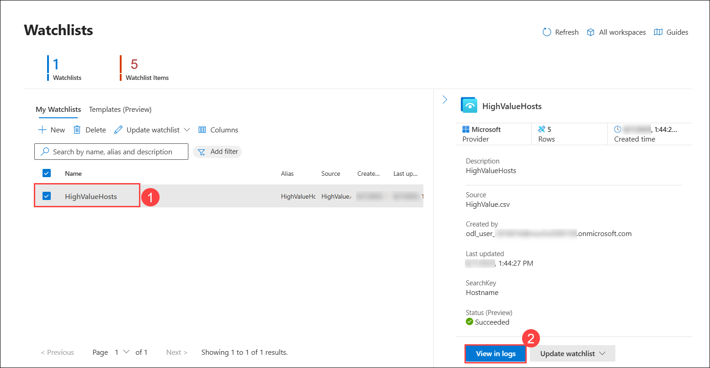

    >**Important:** It could take up to **10** minutes for the watchlist to appear. **Please continue with the next lab**. You can check in between and perform the steps below.

1. You will be directed to the Advanced hunting page. In the query section, ensure the *_GetWatchlist('HighValueHosts')* **(1)** query is there by default, click on **Run query (2)**, and you will output in the **Result (3)** section.
    
    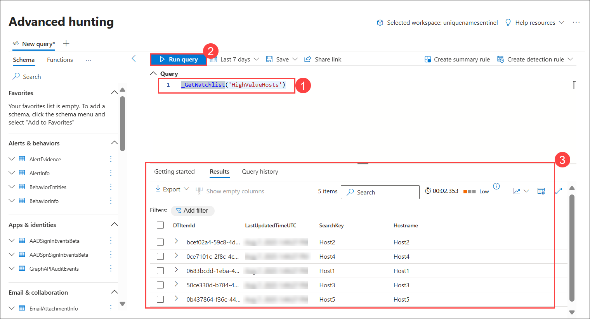

> **Congratulations** on completing the task! Now, it's time to validate it. Here are the steps:
> - If you receive a success message, you can proceed to the next task.
> - If not, carefully read the error message and retry the step, following the instructions in the lab guide.
> - If you need any assistance, please contact us at cloudlabs-support@spektrasystems.com. We are available 24/7 to help you out.

<validation step="e7797283-ec3e-4c29-a1ff-06f5f1bf3189" />

### Summary
In this exercise, you created and executed a hunting query, bookmarked important findings, escalated a bookmark to an incident, and built a watchlist. You have gained hands-on experience in using Microsoft Sentinel to proactively identify, investigate, and track potential threats. 

## You have successfully completed the exercise!

### Now, click on **Next >>** from the lower right corner to move on to the next page.


   
