# Exercise 5: Advanced Threat Hunting with Jupyter Notebooks in Microsoft Sentinel

## Estimated Duration: 30 Minutes

## Overview

In this comprehensive lab exercise, you will leverage **Jupyter notebooks** integrated with **Microsoft Sentinel** and the **MSTICPy Python library** to conduct advanced threat hunting. Jupyter notebooks provide a flexible, interactive environment for security analysis, combining **Kusto Query Language (KQL)** queries, Python data processing, and sophisticated visualizations. You will configure a complete notebook environment, establish secure connections to your Sentinel workspace, perform advanced data analysis using MSTICPy's threat hunting capabilities, and create reusable workflows for ongoing security investigations. By completing this exercise, you will develop powerful, reproducible threat hunting workflows that your security team can leverage for continuous incident investigation and proactive threat detection.

## Lab Objectives

In this lab, you will perform the following:

- Task 1: Access and Configure Jupyter Notebooks in Microsoft Sentinel
- Task 2: Create and Configure Your First Notebook
- Task 3: Initialize MSTICPy and Connect to Sentinel Workspace
- Task 4: Perform Advanced Threat Hunting Queries
- Task 5: Create Visualizations
- Task 6: Perform Anomaly Detection

### Task 1: Access and Configure Jupyter Notebooks in Microsoft Sentinel

In this task, you will access the Microsoft Sentinel notebook environment and configure the necessary resources for threat hunting.

1. Open your web browser and navigate to **Microsoft Defender Portal**:

    ```
    https://security.microsoft.com/
    ```

1. In the left sidebar, locate the **Microsoft Sentinel** section and click to expand menu options under **Threat management**, select **Notebooks** from the menu options.

    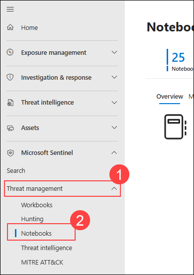

1. Click on the **Configure Azure Machine Learning** button to begin the setup process and select **Create a new ML workspace** from the available options.

    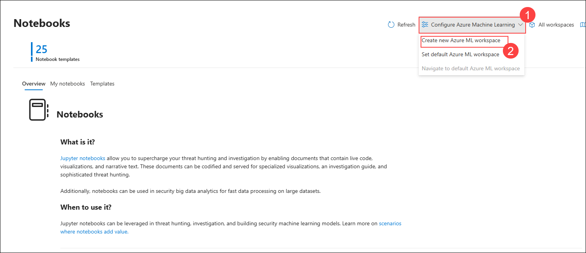

1. Fill in the following details in the configuration form:

    | Field | Value |
    |-------|-------|
    | **Subscription** | Default subscription |
    | **Resource group** | sentinel-rg |
    | **Workspace name** | `aml` |
    | **Region** | Same region as sentinel |
    | **Storage account** | Auto-created |
    | **Key vault** | Auto-created |
    | **Application Insights** | Auto-created |

1. Click **Review + Create** and wait 3-5 minutes for the workspace to provision.

    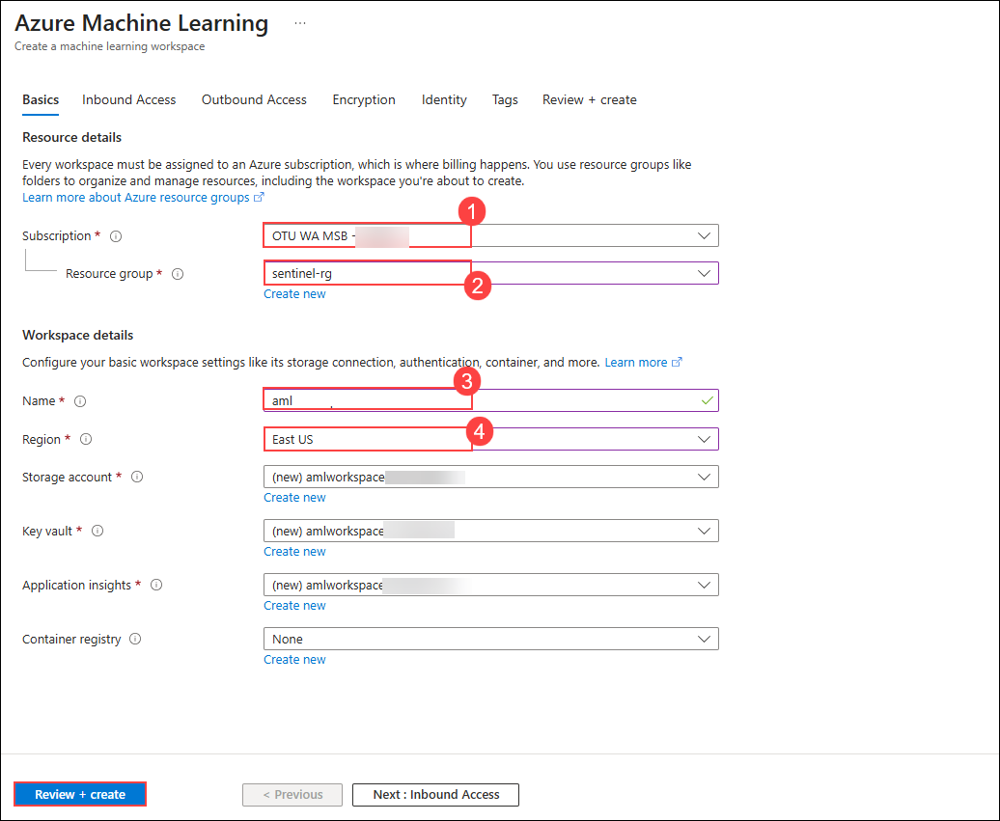

### Task 2: Create and Configure Your First Notebook

In this task, you will create a new notebook from a template and configure it for your threat hunting analysis.

1. Click on **Templates (1)** and select **A Getting Started Guide For Microsoft Sentinel ML Notebooks (2)**

    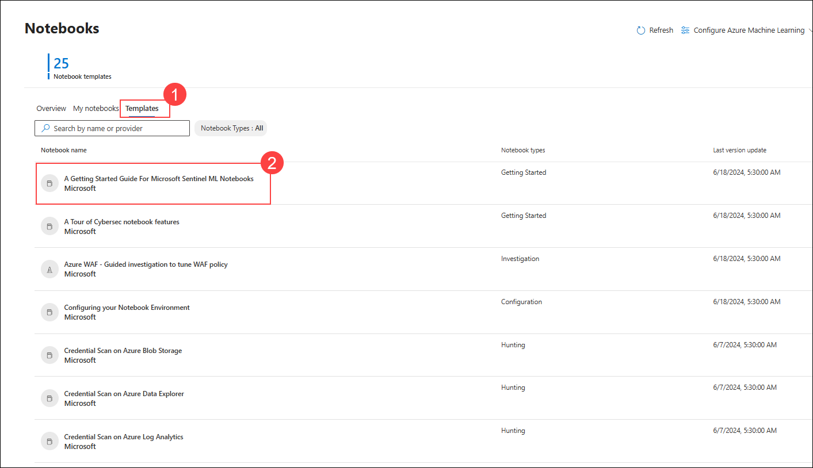

1. Select **Create from template**

    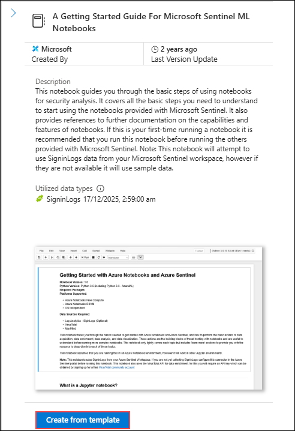

1. Leave the name of your notebook to default and the Azure Machine Learning workspace to **aml** and cick **Save** to save the notebook configuration to your ML workspace.

    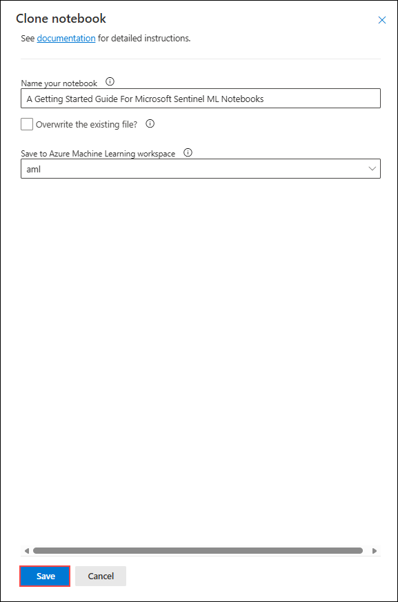

1. Click **Save** to save the notebook configuration to your ML workspace.

1. Wait for the notebook to be created and provisioned (approximately 1-2 minutes).

1. Click **Launch notebook** to open the notebook in the Jupyter environment.

    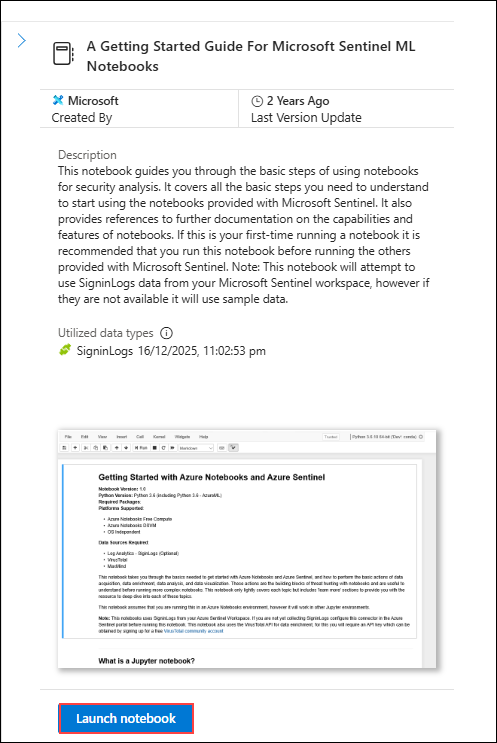

1. Once the Notebook is launched, select **Serverless Spark Compute** for Compute

    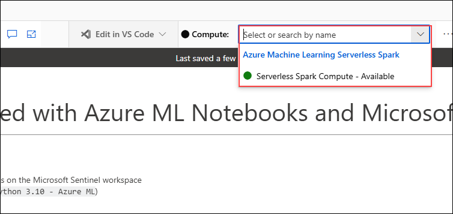

1. Wait for the Compute session to start, it may take upto 10 minutes, once it is ready you can see that the compute session is ready

    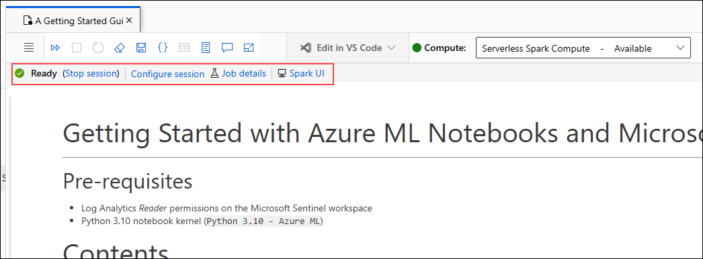

### Task 3: Review the code and output for the Notebook

In this task, you will initialize the MSTICPy library and establish a secure connection to your Microsoft Sentinel workspace.

#### Import Required Libraries

1. Navigate to code cell, **2. Initializing the notebook and MSTICPy** and review the code block and then review the output 

    ```python
    # import some modules needed in this cell
    from IPython.display import display, HTML

    display(HTML("Checking upgrade to latest msticpy version"))
    %pip install --upgrade --quiet msticpy\[sentinel\]


    REQ_PYTHON_VER = "3.10"
    REQ_MSTICPY_VER = "2.12.0"

    # initialize msticpy
    import msticpy as mp
    mp.init_notebook(namespace=globals());
    ```

    **Output**: The code displays the version numbers for each library and print a success message confirming all libraries have been imported.

    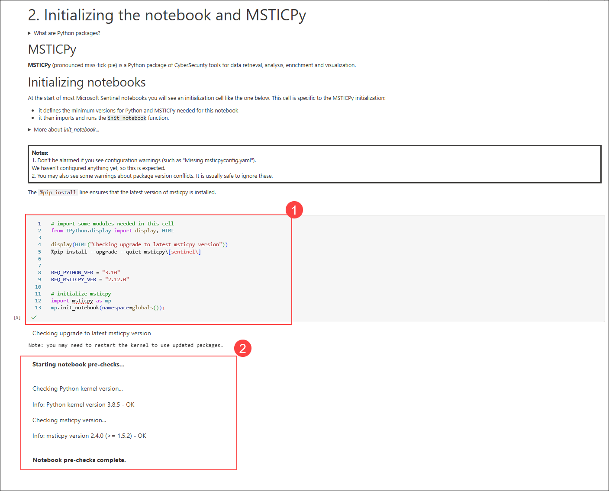

    > **Note:** You won’t be able to run the notebook because the compute isn’t configured; this exercise is intended for review only.

#### Configure MSTICPy Settings

1. Navigate to code cell, **3.1 Verifying Microsoft Sentinel settings** and review the code block and then review the output

    ```python
    import msticpy
    from msticpy.config import MpConfigFile, MpConfigEdit
    import os
    import json
    from pathlib import Path

    mp_conf = "msticpyconfig.yaml"

    # check if MSTICPYCONFIG is already an env variable
    mp_env = os.environ.get("MSTICPYCONFIG")
    mp_conf = mp_env if mp_env and Path(mp_env).is_file() else mp_conf

    if not Path(mp_conf).is_file():
        print(
            "No msticpyconfig.yaml was found!",
            "Please check that there is a config.json file in your workspace folder.",
            "If this is not there, go back to the Microsoft Sentinel portal and launch",
            "this notebook from there.",
            sep="\n"
        )
    else:
        mpedit = MpConfigEdit(mp_conf)
        mpconfig = MpConfigFile(mp_conf)
        print(f"Configured Sentinel workspaces: {json.dumps(mpconfig.settings, indent=4)}")

    msticpy.settings.refresh_config()
    ```

    **Output**:
    The Azure Sentinel workspace is successfully configured with the specified workspace name, workspace ID retrieved from Sentinel, and the associated Azure AD tenant ID.

    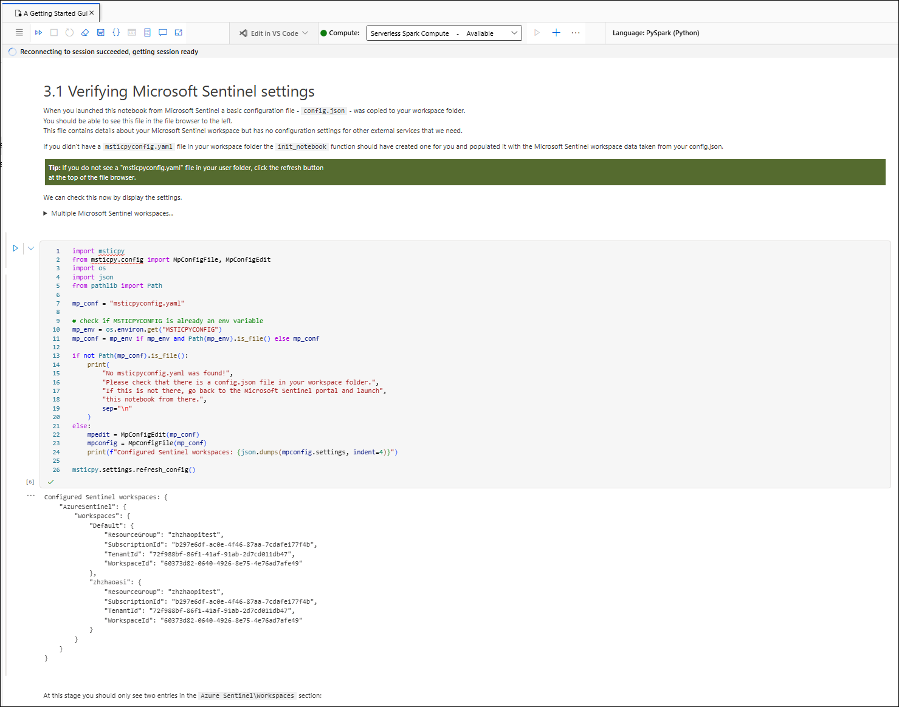

    > **Note:** You won’t be able to run the notebook because the compute isn’t configured; this exercise is intended for review only.

#### Load a QueryProvider

1. Navigate to code cell, **3.3 Load a QueryProvider for Microsoft Sentinel** and review the code block and then review the output

    ```python
    # Refresh any config items that might have been saved
    # to the msticpyconfig in the previous steps.
    msticpy.settings.refresh_config()

    # Initialize a QueryProvider for Microsoft Sentinel
    qry_prov = mp.QueryProvider("AzureSentinel")
    ```

    **Output**:
    The Azure Sentinel workspace is successfully configured with the specified workspace name, workspace ID retrieved from Sentinel, and the associated Azure AD tenant ID.

    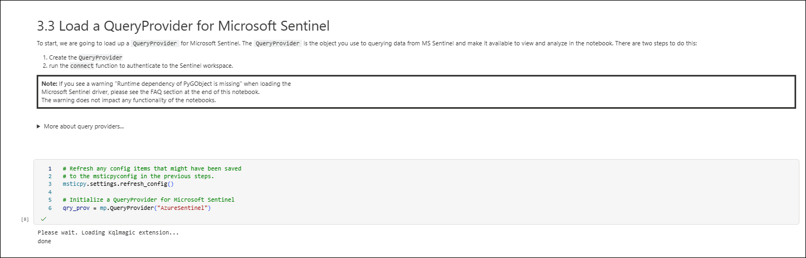

    > **Note:** You won’t be able to run the notebook because the compute isn’t configured; this exercise is intended for review only.

#### Establish Connection to Sentinel Workspace

1.Navigate to code cell, **3.4 Authenticate to the Microsoft Sentinel workspace** and review the code block and then review the output.

    ```python
    # Get the default Microsoft Sentinel workspace details from msticpyconfig.yaml

    ws_config = mp.WorkspaceConfig()

    # Connect to Microsoft Sentinel with our QueryProvider and config details
    qry_prov.connect(ws_config)
    ```
    
**Output**:
    The Azure Sentinel workspace is successfully authenticated.

   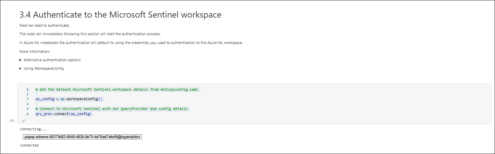

#### Verify Connection with Test Query

1. Navigate to code cell, **3.5 Test your connection using a MSTICPy built-in Microsoft Sentinel query** and review the code block and then review the output.

    ```python
    # The time parameters are taken from the qry_prov.query_prov time settings
    # attribute, which provides the default query time range. You can
    # change interactively this by running qry_prov.query_time.
    alerts_df = qry_prov.SecurityAlert.list_alerts(start=qry_prov.query_time.start)

    if alerts_df.empty:
        md("The query returned no rows for this time range. You might want to increase the time range")

    # display first 5 rows of any results
    alerts_df.head() # If you have no data you will just see the column headings displayed
    ```
    **Output**:
    The Azure Sentinel workspace logs are fetched from sentinel.

    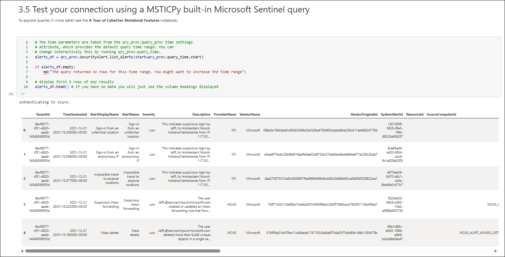

## Summary

In this exercise, you successfully:

- **Accessed and configured** Jupyter notebooks in Microsoft Sentinel
- **Created and deployed** your first notebook with proper environment setup
- **Initialized MSTICPy** and established a secure connection to your Sentinel workspace
- **Executed advanced threat hunting** queries using KQL within Python

## You have successfully completed the exercise!

### Now, click on **Next >>** from the lower right corner to move on to the next page.

   