# Exercise 7: Repositories in Microsoft Sentinel

## Estimated Duration: 30 Minutes

## Overview

In this exercise, you will learn how to use Microsoft Sentinel’s repository integration for managing and version-controlling security content. You will begin by exporting an analytical rule, then set up an Azure DevOps environment to store and manage your exported content. Finally, you will connect Microsoft Sentinel to your Azure DevOps repository, enabling centralized management, collaboration, and automated deployment of security rules.

## Lab Objectives

 In this lab, you will perform the following:

- Task 1: Export an Analytical Rule 
- Task 2: Create our Azure DevOps environment
- Task 3: Connect Sentinel to Azure DevOps

### Task 1: Export an analytical rule

1. On the **Defender portal**, navigate to **Analytics (1)** under the **Configuration** from the left hand menu, select the **Suspicious Resource deployment (2)** rule that you created earlier, then select the **Export (3)** from the toolbar. 

   >**Note:** You might need to select the ellipsis icon **(...)** to see it.

    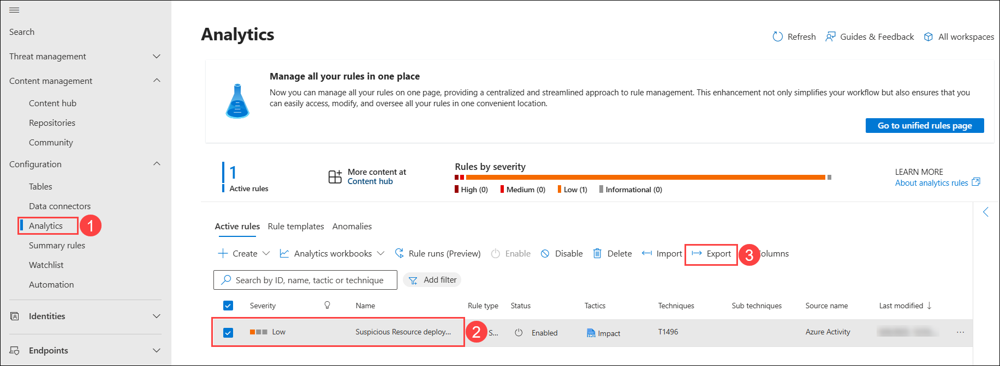

1. The rule is exported to a text file named **Azure_Sentinel_analytic_rule.json**.

1. Select **Open file** below the name of the downloaded file and then select **More apps**.

1. Select **Notepad** and then select **OK**.

1. Review the Azure Resource Manager template and close it when done.

### Task 2: Create our Azure DevOps environment

In this task, you will create an Azure DevOps repository.

1. Open another tab in the browser and navigate to (https:/aexprodcus1.vsaex.visualstudio.com/me?mkt=en-US).

1. On the *We need a few more details* page, leave everything as default, then select **Continue**.

   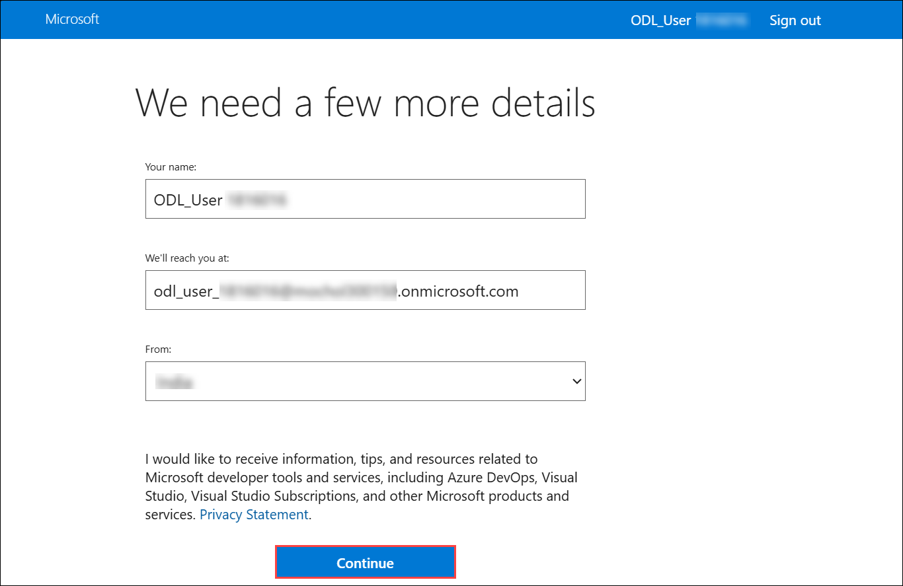

1. On the *Get started with Azure DevOps* page, select **Create new organization**.

   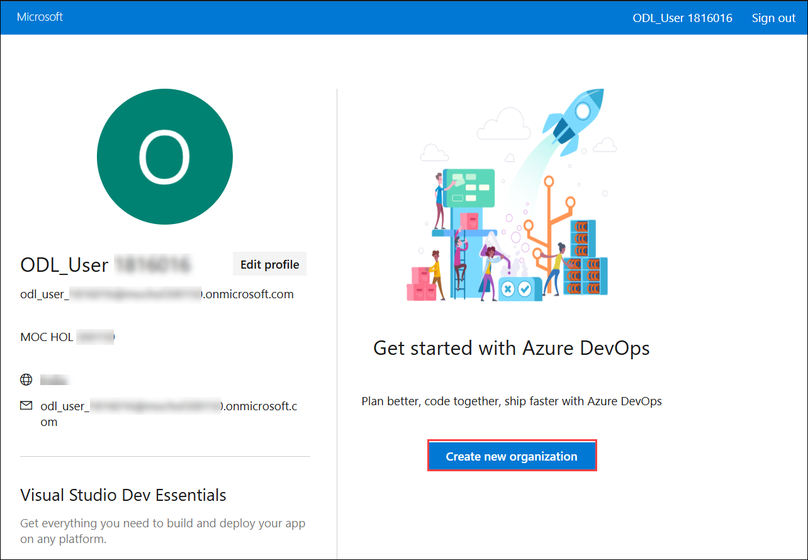

1. On the next page, select **Continue**.   
  
   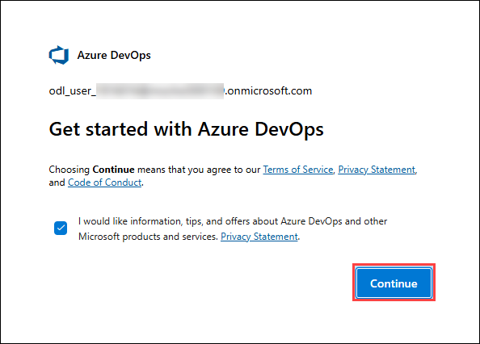

1. On the **Almost done...** page, enter the following details:

   - Name your Azure DevOps organization: **Keep the default Name (1)**
   
   - We'll host your projects in: **Enter the country (2)** .
   - Enter the characters you see: **Enter the displayed characters (3)**
   - Click on **Continue (4)**.

      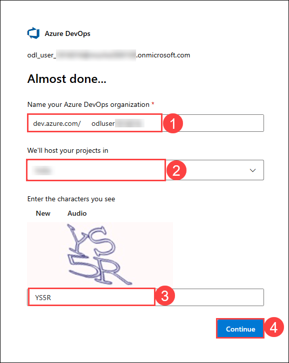

1. On the **Create a project to get started** page, enter Project name as **My Sentinel Content (1)**, then select **+ Create project (2)**.

   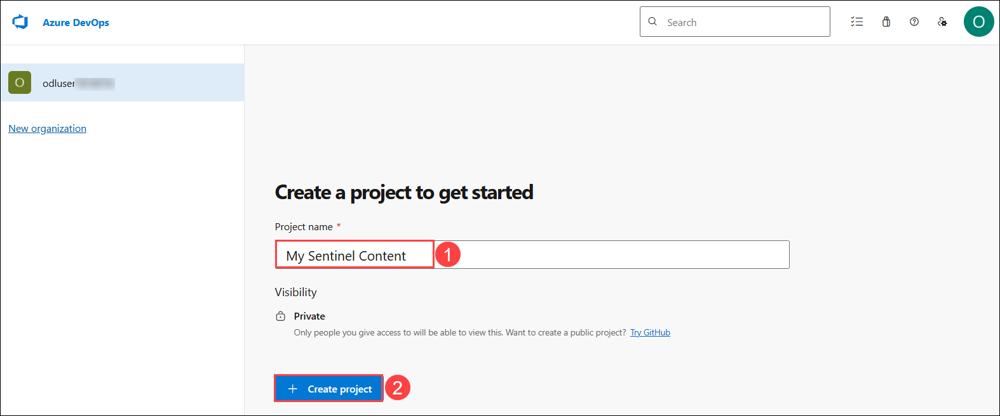

1. On the **My Sentinel Content** project page, select **Repos (1)** from the left pane, then click **Initialize (2)** at the bottom of the page in the section **Initialize main branch with a README or gitignore**.

   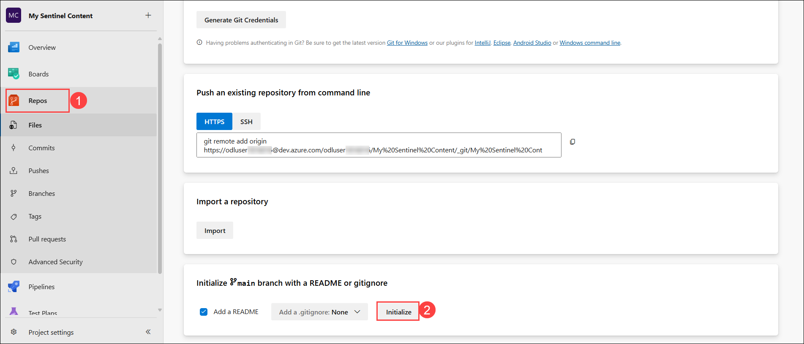

1. Click on the **three vertical dots (1)** icon located at the top-right corner of the Files section and from the dropdown menu, select **Upload file(s) (2)** to add new files to the repository.

    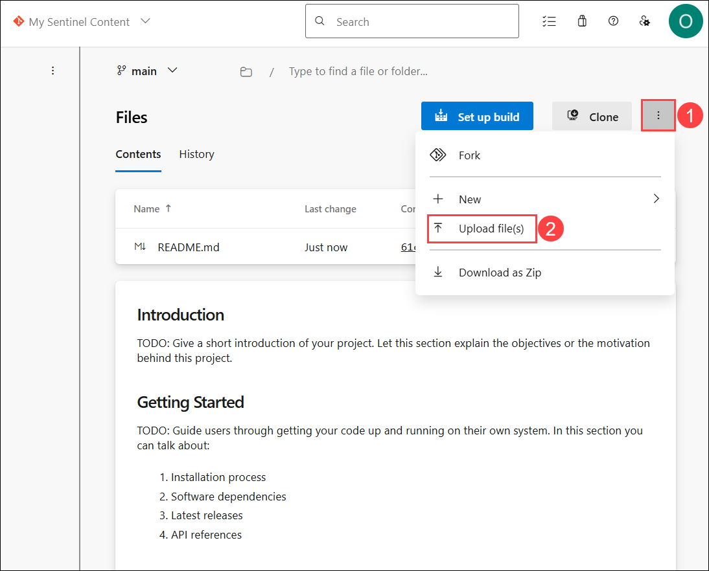

1. On Commit window, click **Browse...** to upload file.

    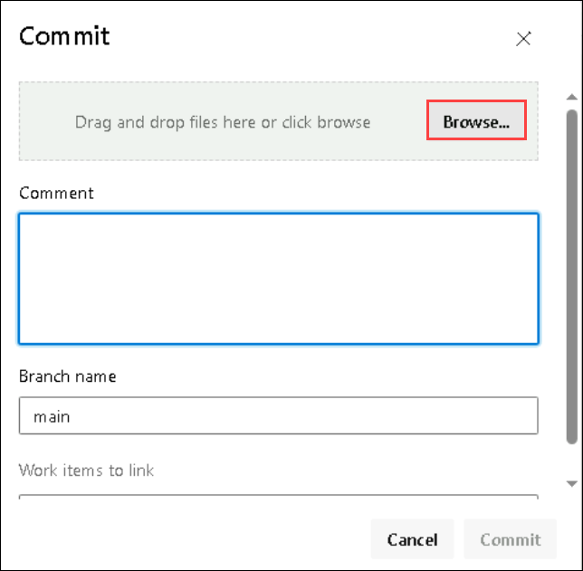

1. On the upload window, navigate to **Downloads (1)** path, and select the file **Azure_Sentinel_analytic_rule.json (2)** file and select **Open (3)**.

    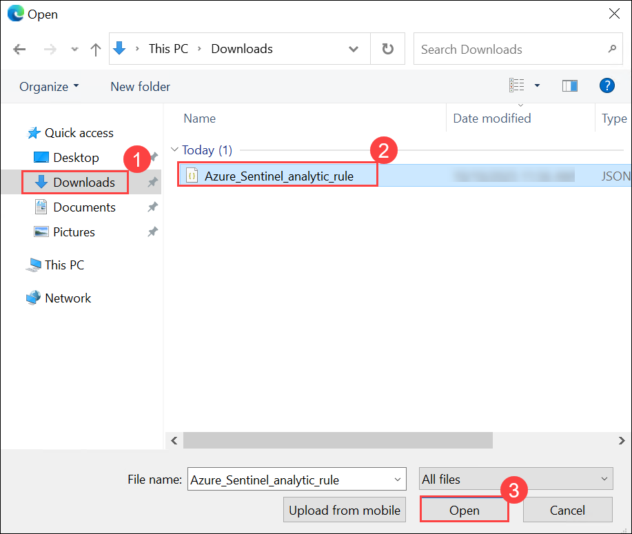

1. Once the file is uploaded, click on **Commit**.  

    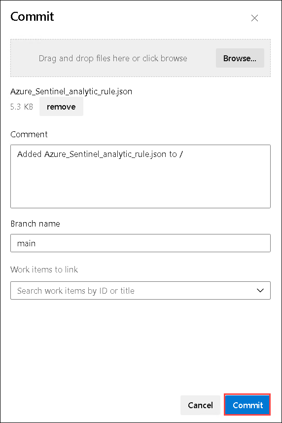

1. Select **Azure DevOps** on the top left corner of the page.  This displays your organization and projects.

1. Select **Organization settings** from the bottom left of the page.

    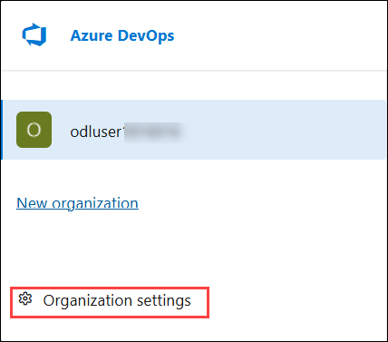

1. Select **Policies (1)** under the *Security* area of the left blade.

1. Toggle **On** **Third-party application access via OAuth (2)** under the **Application connection policies** section.

   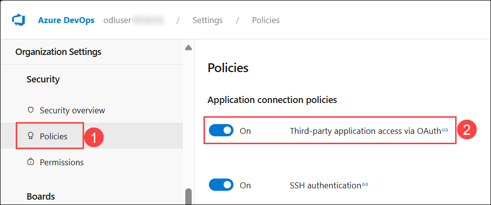

### Task 3: Connect Sentinel to Azure DevOps

1. Navigate back to the Azure portal, in the search bar type **Microsoft Sentinel (1)**, then select **Microsoft Sentinel (2)**.

   

1. Select the **Microsoft Sentinel Workspace** to proceed.

   

1. On the Microsoft Sentinel workspace page, in the **Overview (1)** section, you will find a **Click here to go to the Defender portal (2)** link, then click on it to navigate to the **Defender portal**.

   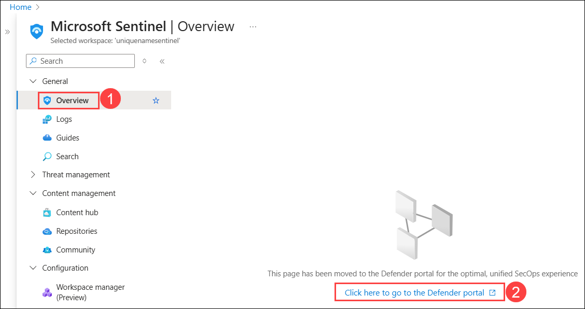

1. On the Defender portal, navigate to **Repositories (1)** from the left-hand menu under Content management, then click on **+ Add new (2)**.

   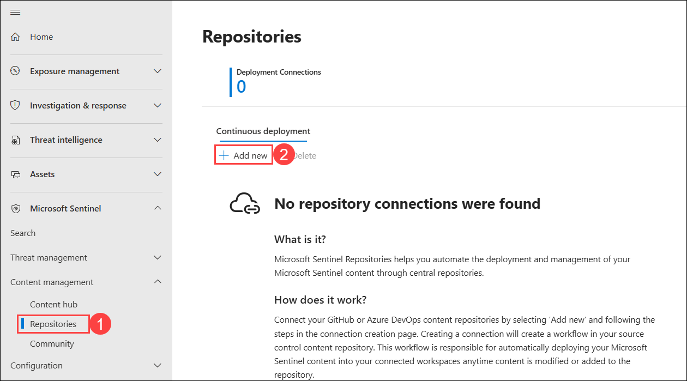

1. On the Create new deployment connection page, add the following details and then click on **Create (9)** to proceed.

   - **Name:** Enter **My Content (1)**.
   - **Source control:** Select **Azure DevOps (2)** from the dropdown menu.
   - Click on **Authorize (3)**.
   - **Organization**: Select the **organization (4)** you created earlier from the dropdown menu.
   - **Project:** Select the Project you created earlier, **My Sentinel Content (5)**.
   - **Repository:** Select the Repository, **My Sentinel Content (6)**. 
   - **Branch:**  Select **refs/heads/main (7)** from the dropdown menu.
   - **Content types:** Select **Analytics rules** from the dropdown menu.
  
      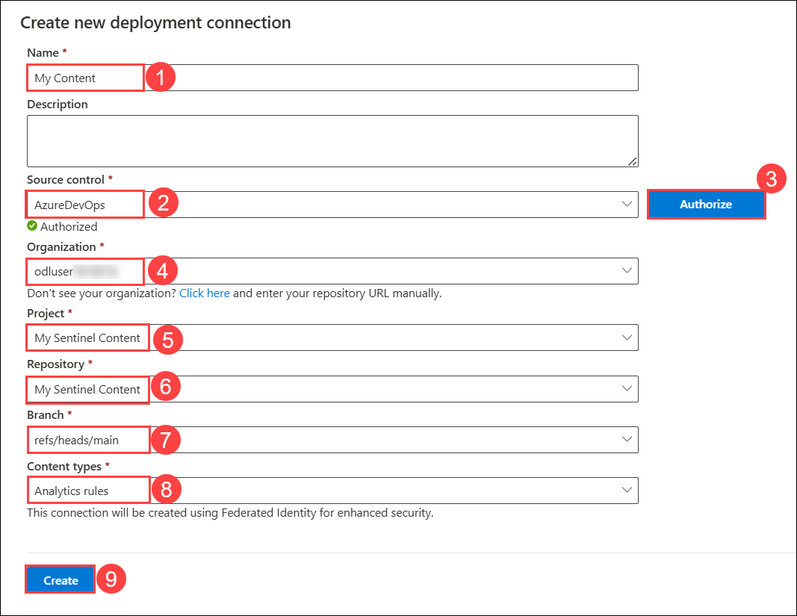

1. Go to the **Repositories** page, select **Refresh (1)**. Wait until the last deployment status is **Failed (2)**.  

    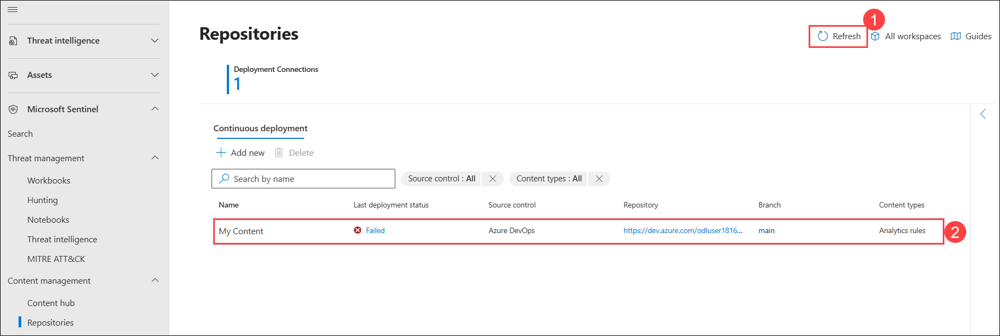

    >**Note:** The *Failed* status is due to limitations in the hosted lab environment. You would normally see *Succeeded*. Then you can see in the *Analytics* the imported rule *Rule from Azure DevOps*.

## Summary
In this lab, you successfully exported an **analytical rule** from Microsoft Sentinel and stored it in a version-controlled **Azure DevOps** repository. You created a DevOps environment and established a connection between Sentinel and Azure DevOps to enable automated rule deployments. This integration supports DevSecOps practices, enhancing collaboration, traceability, and operational efficiency in managing security rules.
   
## You have successfully completed the lab!

In this hands-on lab **Threat Protection and Incident Response with Microsoft Sentinel- Day 2**, you have strengthened your expertise in Microsoft Sentinel’s threat detection, investigation, and automation capabilities. You worked with analytics rules, hunting queries, watchlists, advanced features, and repository integrations to create a comprehensive and proactive security monitoring environment. These skills will help you detect threats earlier, investigate incidents effectively, and streamline security operations for improved protection.

