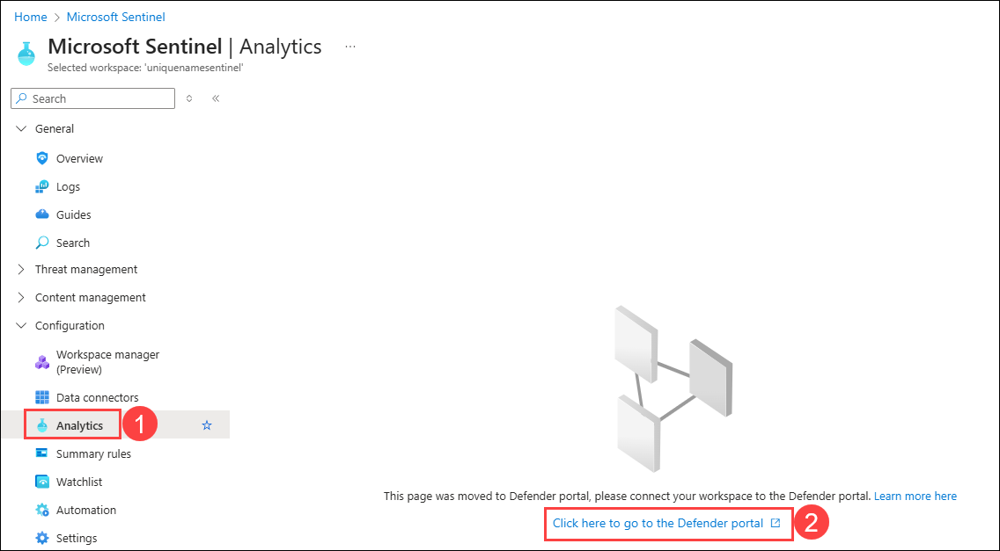
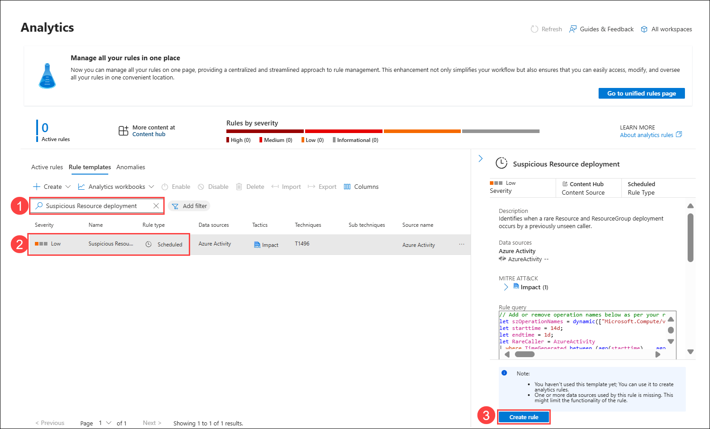

# Exercise 1: Analytics Rules and Incident Management

## Estimated Duration: 60 Minutes

## Overview
In this exercise, you will configure **Microsoft Sentinel** to detect and respond to security threats. You will start by creating a Log Analytics Workspace and deploying Microsoft Sentinel to it. Next, you will create and export an analytics rule to detect suspicious activities. Finally, you will generate and investigate an incident to understand Sentinel’s incident management process.

## Lab Objectives

 In this lab, you will perform the following:

- Task 1: Create a Log Analytics Workspace
- Task 2: Deploy Microsoft Sentinel to a workspace
- Task 3: Connect the Azure Activity connector
- Task 4: Create and export an analytical rule
- Task 5: Create and Investigate an Incident

### Task 1: Create a Log Analytics Workspace

In this task, you will create a Log Analytics workspace for use with Microsoft Defender for Cloud.

1. In the Search bar of the Azure portal, type **Log Analytics (1)**, then select **Log Analytics workspaces (2)**.

   

1. Select **+ Create** from the command bar.

   

1. To create a **log analytics workspaces**, follow these steps:

    - Leave the **Subscription (1)** as default.
    - Select **sentinel-rg (2),** for Resource group.
    - For the Name, enter **uniquenameSentinel (3)**.
    - Leave the **Region (4)** as default.
    - Select **Review + Create (5)**.

      

1. Once the workspace validation has passed, select **Create**.

   

1. Wait for the new workspace to be provisioned, this may take a few minutes.
   
   

### Task 2: Deploy Microsoft Sentinel to a workspace

In this task, you will deploy Microsoft Sentinel to an existing Log Analytics workspace, enabling it to collect, detect, and respond to security threats.

1. In the Search bar of the Azure portal, type **Microsoft Sentinel (1)**, then select **Microsoft Sentinel (2)**.

   

1. Select **+ Create** from the command bar.

   

1. Select the newly created workspace named **uniquenameSentinel (1)** and click on **Add (2)**.
  
   

1. In the **Microsoft Sentinel free trial activated** tab, select **Ok** to activate the free trial.

   

1. Now you will see the **Getting started** page for Microsoft Sentinel.

### Task 3: Connect the Azure Activity connector

In this task, you will connect the Azure Activity connector.

 1. On the left side menu, select **Data connectors (1)** under the Configuration. 
 
 1. On the **Data connectors** page, click on **Content Hub (2).** 

    

1. On **Content hub** page, search for **Azure Activity (1)** and select **Azure Activity (2)** Data connector from the list,  and click on **Install (3)** to install it.

   

1. On **Content hub** page, select the **Azure Activity (1)** Data connector, and select the **Open connector page (2)** on the connector information blade.

   

1. In the Configuration area, scroll down and under "2. Connect your subscriptions..." select **Launch Azure Policy Assignment wizard>**.

   

1. In the **Basics** tab, select the ellipsis button **(...) (1)** under **Scope** and select your **subscription (2)** from the drop-down list and click **Select (3)**.

   

1. In the **Primary** tab, click the ellipsis button **(...) (1)** next to **Primary Log Analytics workspace** and select your **workspace (2)** from the drop-down list and click **Select (3)**.

   

1. Select the **Remediation** tab and select the **Create a remediation task (1)** checkbox. This action will apply the policy to existing Azure resources.

1. Select the **Review + Create (2)** button to review the configuration.

   

1. On **Review + create**, select **Create** to finish. 

   

    > **Note:** It may take **15–20 minutes** for the **Azure Activity** data connector to show a **Connected** status after configuration.

### Task 4: Create and export an analytical rule

In this task, you will enable Entity behavior analytics in Microsoft Sentinel.

1. On the **Microsoft Sentinel Workspace** page, select **Analytics (1)** under the **Configuration** from the left-hand menu, and you will find a **Click here to go to the Defender portal (2)** link. Click on it to navigate to the **Defender portal**.

    

1. On the Analytics page, in the search bar under Rule template type **Suspicious Resource deployment (1)** and press the enter key, then select **Suspicious Resource deployment (2)** rule from the list and click **Create rule (3)**.

   

    > **Note:** If you are unable to find **Suspicious Resource deployment** under rule templates. Wait for the **Azure Activity** data connector to show a **Connected** status after configuration.   

1. In the Analytics Rule Wizard, review the General section, then click **Next: set rule logic>.**

   >**Note:** You can click either the tab at the top or the button at the bottom to continue.

   

6. On the **Set rule logic** screen, you can create or modify the KQL query, control entity mapping, enable and adjust alert grouping, and define the scheduling and lookback time range, then **Next: Incident settings>**.

	  

7. On the **Incident settings** tab, note that **Incident creation** is **Enabled (1)**, and **Alert grouping** is **Disabled (2)**. Not every Alert detected by Sentinel must be promoted into an Incident - particularly noisy alerts! These settings can always be modified later if desired, then click **Next: Automated response> (3)**.
   
	

1. In the Automated response section, keep everything as default and click on **Review and Create**.

9. On the *Review and create* tab, review the rule configuration, and then click **Save** to deploy your new rule to the Active rule set.

1. On the Analytics page, select the **Suspicious Resource deployment (1)** rule that you created.

1. Select the **Export (2)** from the toolbar.

   >**Note:** You might need to select the ellipsis icon **(...)** to see it.

   

1. The rule is exported to a text file named *Azure_Sentinel_analytic_rule.json*.

   

1. Select **Open file** below the name of the downloaded file and then select **More apps**.

1. Select **Notepad** and then select **OK**.

1. Review the Azure Resource Manager template and close it when done.

### Task 5: Connect VM to the Log Analytics workspace

1. In the Search bar of the Azure portal, type **Log Analytics (1)**, then select **Log Analytics workspaces (2)**.

    

1. On the **Log Analytics workspaces** and select **uniquenameSentinel** workspace you created in task-1.

    

1. In the workspace, select **Virtual machines (deprecated) (1)** from the left navigation pane under Classic, then locate and select **WinVM (2)** from the list displayed.

    

1. Click **Connect** to link it to the workspace.

    

1. Wait until the **Status** shows **Connected**.

1. In the Search bar of the Azure portal, type **Microsoft Sentinel (1)**, then select **Microsoft Sentinel (2)**.

   

1. Select the **Microsoft Sentinel Workspace** you created earlier.

      

1. Select the **Logs (1)** option under **General** on the left hand menu. 

   >**Note:** You may need to disable the "Always show queries" option and close the *Queries* window to run the statements.

1. Choose working mode as **KQL mode (2)**, enter the below given query **(3)**, then click **Run (4)** and in **Results (5)** section see the output of the query.  

    ```KQL
    Heartbeat | take 10
    ```  

    

   >**Note:** If no output is generated, wait 5–10 minutes, then rerun the query to confirm data ingestion.

### Task 6: Create and Investigate an Incident

In this task, you will create and investigate an incident.

1. in defender portal, navigate **Advanced Hunting (3)** by expanding **Hunting (2)** under **Investigation & response (1)**, enter the below given **query (4)** and click on **Run Query ()5**.

   ```KQL
    let lookback = 1d;
    Heartbeat
    | where TimeGenerated >= ago(lookback)
    | summarize LastSeen = max(TimeGenerated) by Computer, RemoteIPCountry, OSType, OSMajorVersion
    | extend HoursSinceLastSeen = datetime_diff('hour', now(), LastSeen)
    | project Computer, OSType, OSMajorVersion, RemoteIPCountry, LastSeen, HoursSinceLastSeen
    | order by HoursSinceLastSeen desc
    ```
1. Select the **result (6)** shown and click on **Link to incident (7)**.
    

1. On the Link incident page, for Alert details, enter the following details:

   - **Connect a new incident (1)** should be checked.
   - Alert title: **Hunting Query incident (2)**.
   - Severity: Select **Low (3)** from the drop-down menu.
   - Category: Select **Command and Control (4)** from the drop-down menu.
   - Description: Provide **Creating an incident form hunting query**.
   - Then click on **Next (7)**.

      

1. On the Entity mapping page, enter the following details:

    - Click on **+ Add entity (1)**.
    - Entity: Select **Devices(2)** form the dropdown menu.
    - Identifier: Select **HostName (3)** from the dropdown menu.
    - Colum: Select **Computer (4)** from the dropdown menu. 

    - under Related Evidences, Click on **+ Add entity (5)**.
    - Entity: Select **URL (6)** from the dropdown menu.
    - Identifier: Select **URL (7)** from the dropdown menu.
    - Colum: Select **Computer (8)** from the dropdown menu. 
    - Click on **+ Add entity (5)** again to add another entity.
    - Entity: Select **IP (9)** from the dropdown menu.
    - Identifier: Select **Address (10)** from the dropdown menu.
    - Colum: Select **RemoteIPCountry (11)** from the dropdown menu.
    - Then click on **Next (12)**.

      

1. On the summary page, click on **Submit.**

    

1. Navigate to the **Incident** page under **Investigation & response** , clcick on the newly create incident **Hunting Query incident (2)**. 

   

1. On the **Hunting Query incident** page, you will see the incident graph.

   

## Summary
In this exercise, you successfully set up Microsoft Sentinel, created and exported an analytics rule, and investigated an incident. You have gained practical experience in configuring detection rules and managing security incidents within Sentinel.

## You have successfully completed the exercise!

### Now, click on **Next >>** from the lower right corner to move on to the next page.

   
