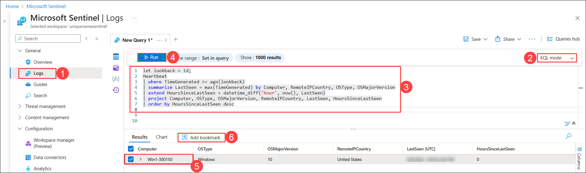
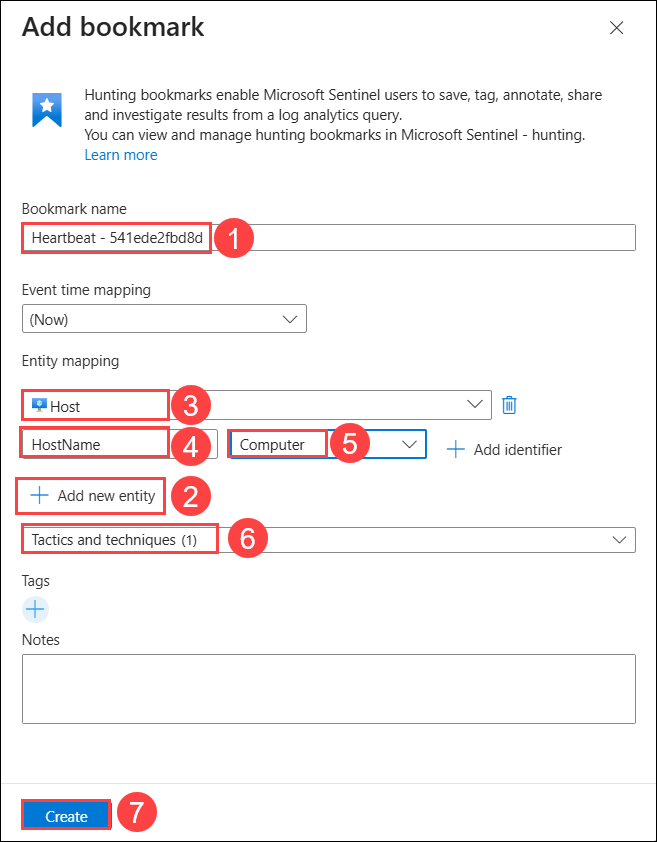
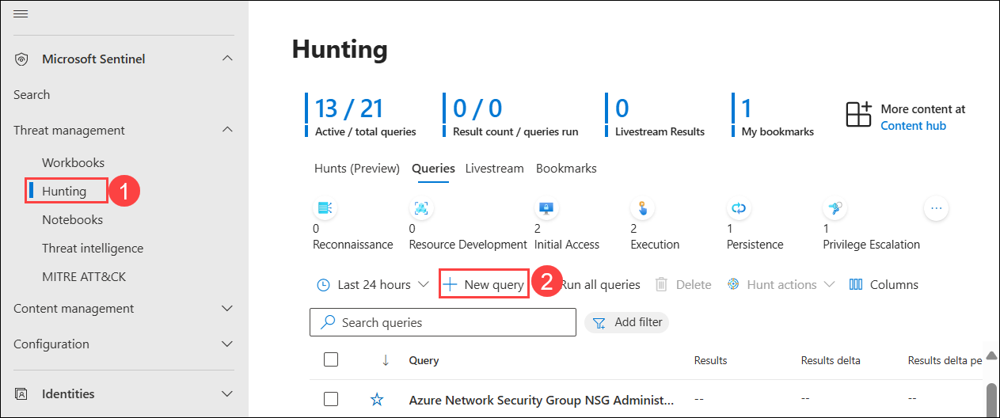

# Exercise 2: Hunting queries and Watchlists

## Estimated Duration: 

## Lab Scenario


## Lab objectives
 In this lab, you will perform the following:

- Task 1: Create a hunting query
- Task 2: Bookmarking hunting query results
- Task 3: Promote a bookmark to an incident
- Task 4: Create a Watchlist

### Task 1: Create a hunting query

In this task, you will create a hunting query, bookmark a result, and create a Livestream.

1. Navigate back to Azure portal, in search bar type **Microsoft Sentinel (1)**, then select **Microsoft Sentinel (2)**.

   

1. Select the **Microsoft Sentinel Workspace** to proceed.

   

1. On Microsoft Sentinel workspace page, select **Logs (1)**, Choose working mode as **KQL mode (2)** and enter the following KQL Statement in the **New Query 1 (3)** space, then click on **Run (4)**.

   >**Important:** Please paste any KQL queries first in Notepad and then copy from there to the *New Query 1* Log window to avoid any errors.

    ```KQL
    let lookback = 1d;
    Heartbeat
    | where TimeGenerated >= ago(lookback)
    | summarize LastSeen = max(TimeGenerated) by Computer, RemoteIPCountry, OSType, OSMajorVersion
    | extend HoursSinceLastSeen = datetime_diff('hour', now(), LastSeen)
    | project Computer, OSType, OSMajorVersion, RemoteIPCountry, LastSeen, HoursSinceLastSeen
    | order by HoursSinceLastSeen desc
    ```

1. In the *Results* section, select the **Computer (5)**, then click on **Add bookmark (6)** button.

     

1. On the **Add Bookmark** window, add the following details, then click on **Create (7)**.

   - Bookmark name: keep it as **Default (1)**.
   - Click on **+ Add new entity (2)**.  
   - Entity mapping: Select **Host (3)** from the dropdown menu.
   - Then **Hostname (4)** and **Computer (5)** for the values.
   - Tactics and Techniques: Select **Command and Control (6)** form the dropdown menu.

      

1. Close the *Logs* window by selecting the **X** in the top-right of the window and select **OK** to discard the changes. 

1. On Microsoft Sentinel workspace page, in **Overview (1)** section, you will find a **Click here to go to the Defender portal (2)** link, click on it to navigate to the **Defender portal**.

   

1. On Defender portal, navigate to **Hunting (1)** option under the Threat management from the left hand menu, select **+ New query (2)**.

   

1. 

1. For the *Custom query* enter the following KQL statement:

    ```KQL
    let lookback = 2d; 
    SecurityEvent 
    | where TimeGenerated >= ago(lookback) 
    | where EventID == 4688 and Process =~ "powershell.exe"
    | extend PwshParam = trim(@"[^/\\]*powershell(.exe)+" , CommandLine) 
    | project TimeGenerated, Computer, SubjectUserName, PwshParam 
    | summarize min(TimeGenerated), count() by Computer, SubjectUserName, PwshParam 
    | order by count_ desc nulls last 
    ```

1. Scroll down and under *Entity mapping* select:

    - For the *Entity type* drop-down list select **Host**.
    - For the *Identifier* drop-down list select **HostName**.
    - For the *Value* drop-down list select **Computer**.

1. Scroll down and under *Tactics & Techniques* select **Command and Control** and then select **Create** to create the hunting query.

1. In the *"Microsoft Sentinel - Hunting"* blade, search for the query you just created in the list, *PowerShell Hunt*.

1. Select **PowerShell Hunt** from the list.

1. Review the number of results in the middle pane under the *Results* column.

1. Select the **View Results** button from the right pane. The KQL query will automatically run.

1. Close the *Logs* window by selecting the **X** in the top-right of the window and select **OK** to discard the changes. 

1. Right-click the **PowerShell Hunt** query and select **Add to livestream**. **Hint:** This also can be done by sliding right and selecting the ellipsis **(...)** at the end of the row to open a context menu.

1. Review that the *Status* is now *Running*. This will be running every 30 seconds in the background and you will receive a notification in the Azure Portal (bell icon) when a new result is found. 

1. Select the **Bookmarks** tab in the middle pane.

1. Select the bookmark you just created from the results list.

1. On the right pane, scroll down and select the **Investigate** button. **Hint:** It might take a couple of minutes to show the investigation graph.

1. Explore the Investigation graph just like you did a the previous module. Notice the high number of *Related alerts* for *WINServer*.

1. Close the *Investigation* graph window by selecting the **X** in the top-right of the window. 

1. Hide the right blade by selecting the **>>** icon and then scroll right until you see the ellipsis **(...)** icon.

1. Select **Add to existing incident**. All the incidents appear in the right pane.

1. Select one of the incidents and then select **Add**.

1. Scroll left to notice that the *Severity* column is now populated with the incident's data.

### Task 4: Create a Watchlist

In this task, you will create a watchlist in Microsoft Sentinel.

1. In the **search box (1)** at the bottom of the Windows 10 screen, enter **Notepad (2)**, then select **Notepad (3)** from the results.

    

1. Type **Hostname** then press enter for a new line.

1. From row 2 of the notepad, copy the following hostnames, each one in a different line:

    ```Notepad
    Host1
    Host2
    Host3
    Host4
    Host5
    ```

   

1. Click on **File (1)**, select **Save As (2)** to save the file.

   

1. On the **Save As** window, Enter File name as **HighValue.csv (1)**, for Save as type select **All Files**, then click **Save** to save the file. 

   >**Note:** The file will be saved in the *Documents* folder.

   

1. Navigate back to Azure portal, in search bar type **Microsoft Sentinel (1)**, then select **Microsoft Sentinel (2)**.

   

1. Select the **Microsoft Sentinel Workspace** to proceed.

   

1. On Microsoft Sentinel workspace page, in **Overview (1)** section, you will find a **Click here to go to the Defender portal (2)** link, click on it to navigate to the **Defender portal**.

      

1. On Defender portal, navigate to **Watchlist (1)** option under the Configuration from the left hand menu, select **+ New (2)** from **My Watchlists** section.

   


1. In General section of the Watchlist wizard, enter the following details, then select **Next: Source > (4)**.

    |General setting|Value|
    |---|---|
    |Name|**HighValueHosts (1)**|
    |Description|**High Value Hosts (2)**|
    |Watchlist alias|**HighValueHosts (3)**|


   

1. In Source section of the Watchlist wizard, add the following details, then select **Next: Review and Create > (6).**

   - Source type: Ensure **Local file (1)** is selected.
   - File type: Select **CSV file with a header (.csv) (2)** from the dropdown menu.
   - Number of lines before row with headings: **Set to 0 (3)**
   - Upload file: Select **Browse for files (4)** to add *HighValue.csv* file you created.
   - SearchKey: Select **Hostname (5)** from the dropdown menu.

   

1. Review the settings you entered and select **Create**.

   

1. The screen returns to the Watchlist page.

1. You will be navigated back to Watchlist page, select the **HighValueHosts (1)** watchlist and on the right pane, select **View in logs (2)**.

   

    >**Important:** It could take up to ten minutes for the watchlist to appear. **Please continue to with the following task and run this command on the next lab**.

1. You will be directed to the Advanced hunting page, in the query section ensure the *_GetWatchlist('HighValueHosts')* **(1)** query is there by default, click on **Run query (2)** and you will output in **Result (3)** section.
    
    

### Summary
In this lab, 

### Now, click on **Next** from the lower right corner to move on to the next page.

   