# Exercise 3: Exploring Microsoft Sentinel Advanced Features

## Estimated Duration: 

## Overview

In this exercise, you will explore **Microsoft Sentinel’s** advanced capabilities for enhancing security monitoring and visualization. You will start by connecting the Threat Intelligence data connector to enrich your environment with actionable threat indicators. Next, you will explore available workbook templates, customize a selected template, and create a new workbook to present security insights in a meaningful and interactive way.

## Lab Objectives

 In this lab, you will perform the following:

- Task 1: Connect the Threat Intelligence connector
- Task 2:  Explore Workbook templates
- Task 3:  Save and modify a workbook template
- Task 4:  Create a Workbook

### Task 1: Connect the Threat Intelligence connector

In this task, you will connect the Threat Intelligence data connector in Microsoft Sentinel by installing it from the Content Hub to create threat indicators for analysis.

1. In the Azure portal search bar, type **Microsoft Sentinel (1)**, then select **Microsoft Sentinel (2)**.

   

1. Select the **Microsoft Sentinel Workspace** you created earlier.

   

1. In Microsoft Sentinel, on the left menu, select the **Content hub (1)** option under Content management, and you will find a **Click here to go to the Defender portal (2)** link, click on it to navigate to the **Defender portal**.

   

1. On Defender portal, Content hub page will open, in search bar type **Threat intelligence (1)**, select **Threat intelligence (2)** from the list, then click on **Install (3)**. 

   

1. On Microsoft Sentinel workspace page, in **Workbook (1)** section, you will find a **Click here to go to the Defender portal (2)** link, click on it to navigate to the **Defender portal**.

   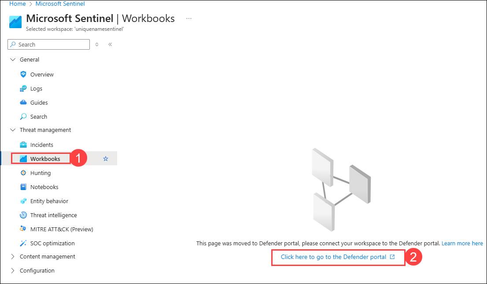

1. Select the *Templates* tab, and search for and select the **Threat Intelligence (1)** template workbook.

1. In the right details pane, scroll down and select the **View template (2)** button.

   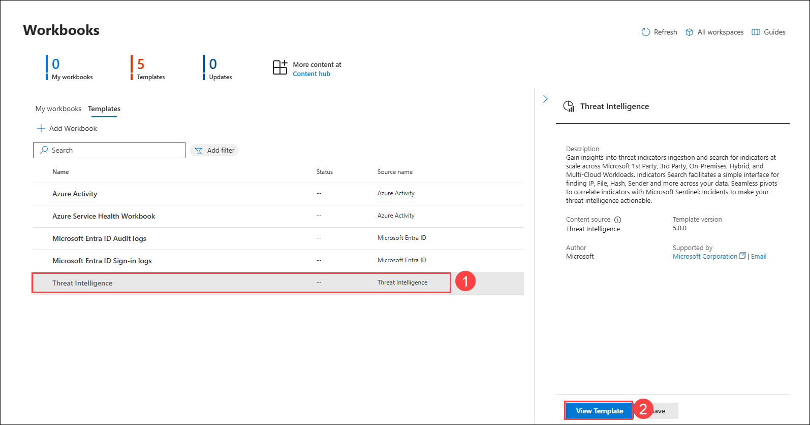

1. Review the contents of the workbook. It shows insights of your Azure subscription operations by collecting and analyzing the data from the Activity Log.

   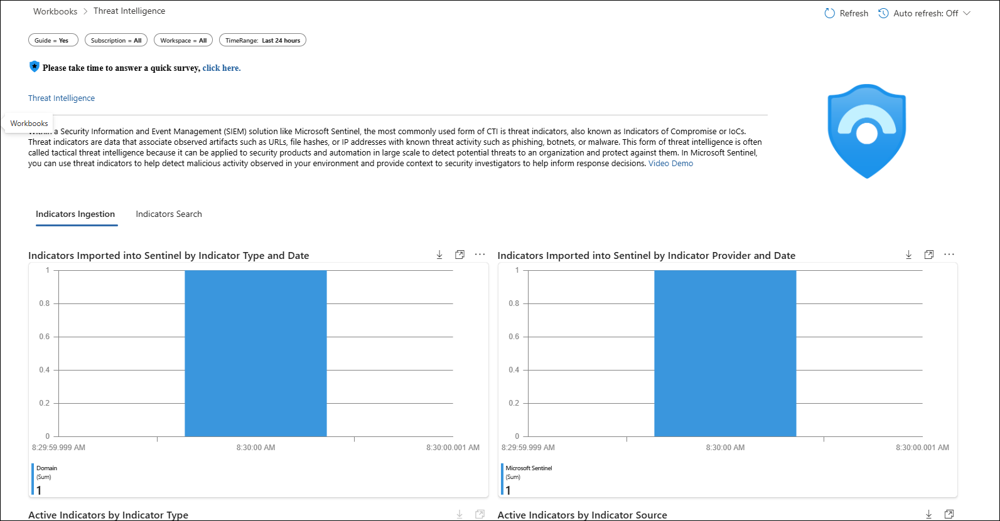

1. Close the workbook by selecting the **X** in the top-right corner.

### Task 2: Save a Workbook template

In this task, you will save a workbook template and modify it.

1. You should be back in the **Microsoft Sentinel | Workbooks | Templates** tab with the **Threat Intelligence** workbook still selected.

1. Scroll down again and select the **Save (2)** button in the **Threat Intelligence (1)** workbook details pane.

    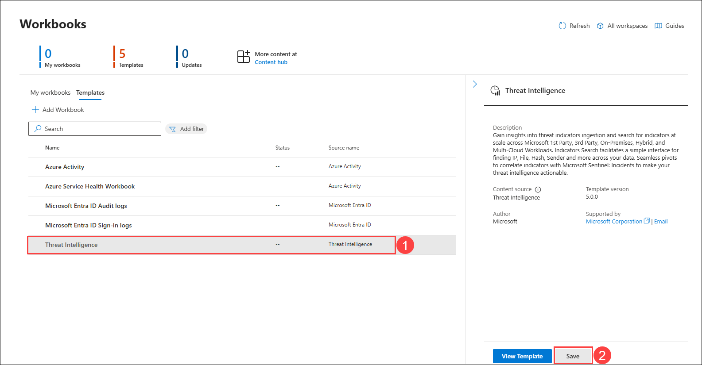

1. Leave the default value for **Region (1)** and select **Yes (2)**.

   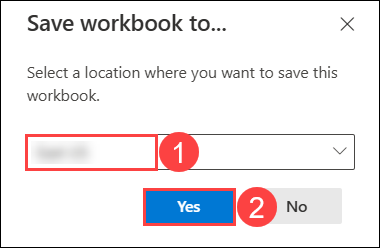

1. Select the **Threat Intelligence (1)** workbook, then select the **View saved workbook (2)** button.

   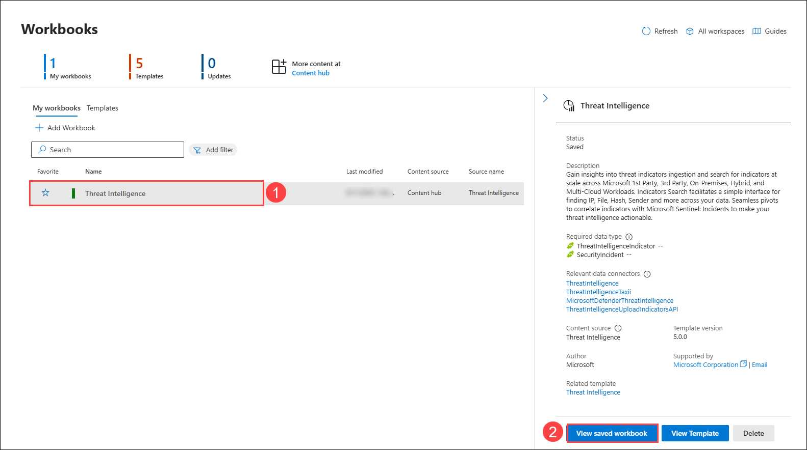

1. Close the workbook by selecting the **X** in the top-right corner.

### Task 3: Create a Workbook

In this task, you will create a new workbook with advanced visualizations.

1. You should be back at the **Workbooks** area of the Microsoft Sentinel portal.

1. Select **+ Add workbook** to create a new workbook from scratch. 

   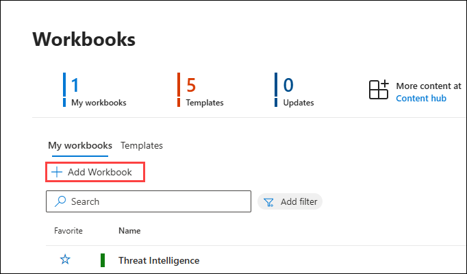

    >**Note:** Although it is a new workbook, a startup template is used.

1. You will be navigated to Azure portal, to edit the workbook, select **Edit** to edit New workbook.

   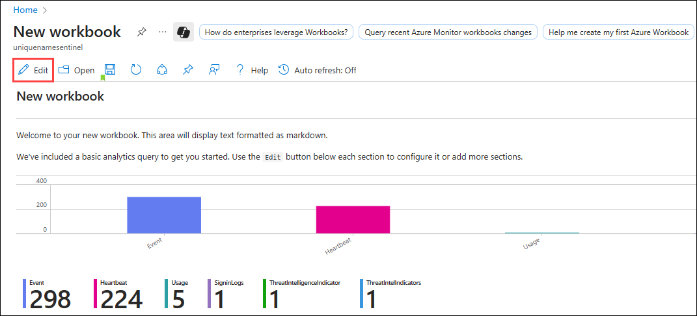

1. Select the **Edit** button below the first paragraph of the workbook.

   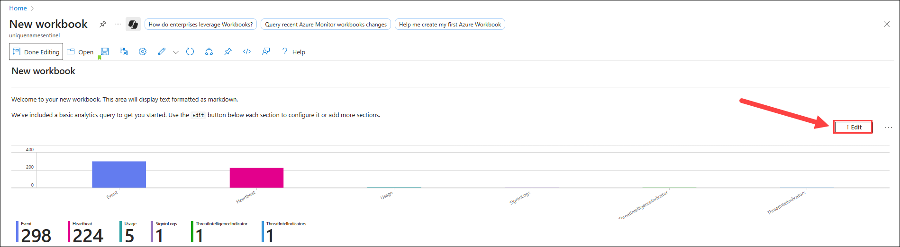

1. Type **# My workbook** in a new line on top of **## New workbook**, then click **Done Editing** on the bottom of this section,

   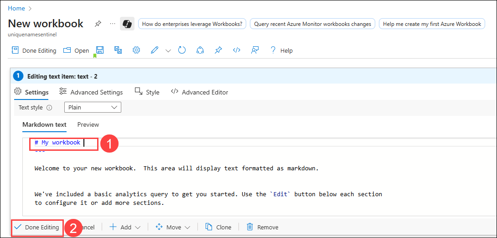

1. Select **Edit** below the only visible barchart graph.

   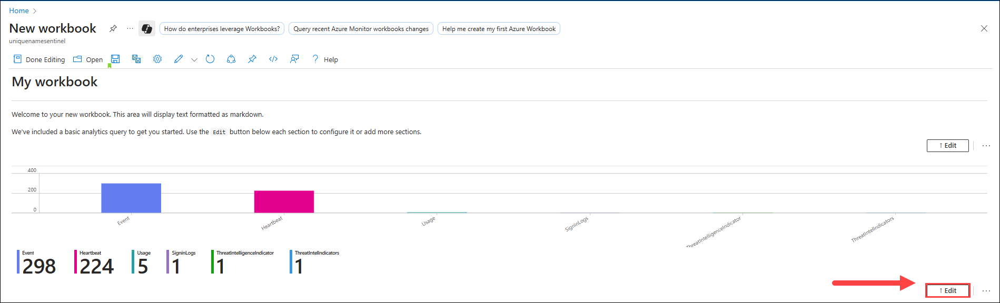

1. Review the KQL statement that provides a *union* statement of counts across all tables.

1. Scroll down and select the **Done Editing** on the bottom menu.

    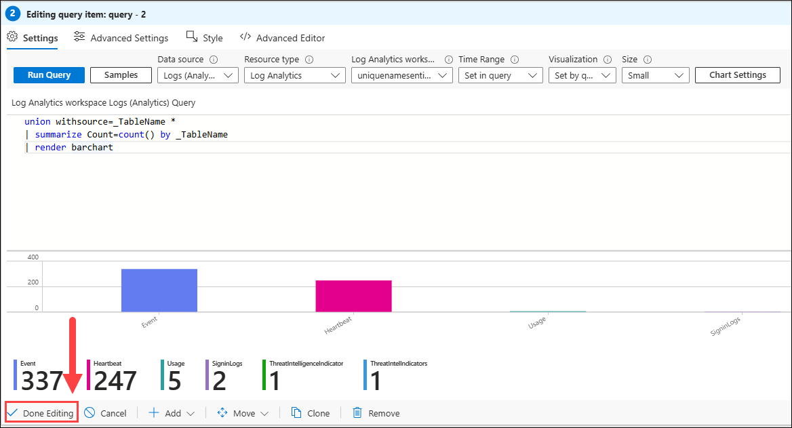

1. Select the **ellipsis (...) (1)** next to the *Edit* button of the barchart graph, then select **+ Add (2)**, then select **Add query (3)**.

   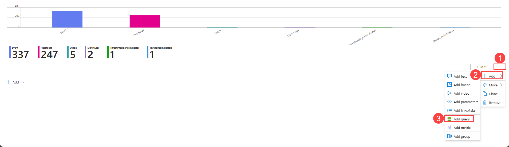

1. Type **Heartbeat (1)** into the query box.

1. Change the *Time Range* to **Last hour (2)**.

1. Change the *Visualization* to **Time chart (3)**.

1. Click on **Run Query (4)** and see the output.

1. Scroll down and select **Done Editing** on the bottom menu.

   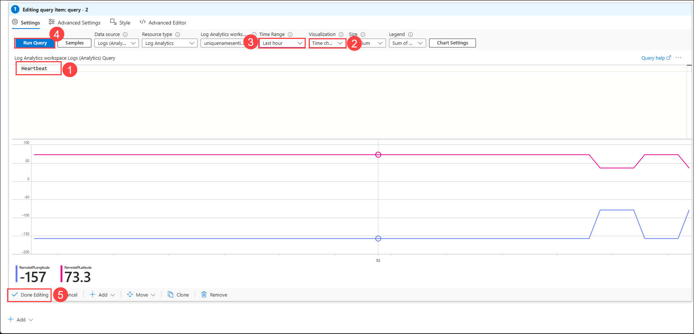

1. Scroll down and at the bottom of the workbook select **+ Add**, then **Add query**.

1. Type **Heartbeat (1)** into the query box.

1. Change the *Time Range* to **Last hour (2)**.

1. Change the *Visualization* to **Grid (3)**.

1. Click on **Run Query (4)** and see the output.

1. Scroll down and select **Done Editing (5)** on the bottom menu, for the new *Editing query item: query - 3*.

  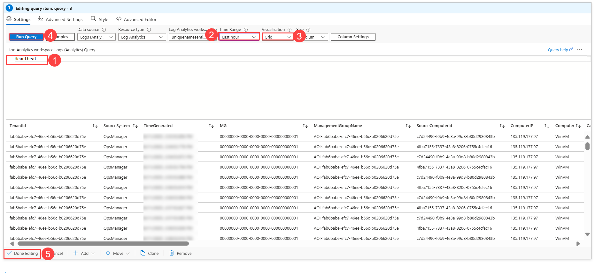

1. Select **Done Editing (1)** in Workbook's top command bar, then select the **Save (2)** icon.

   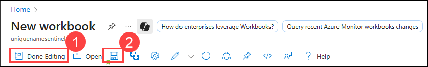

1. On **Save As** page, enter the following details:

    - Change the *Title* to **My Workbook (1)**.

    - Select the Default **Subscription (2)**.

    -  Select the **sentinel-rg (3)** resource group.

    - Keep the **Region (4)** as default.

    - Click on **Save As (5)**.

        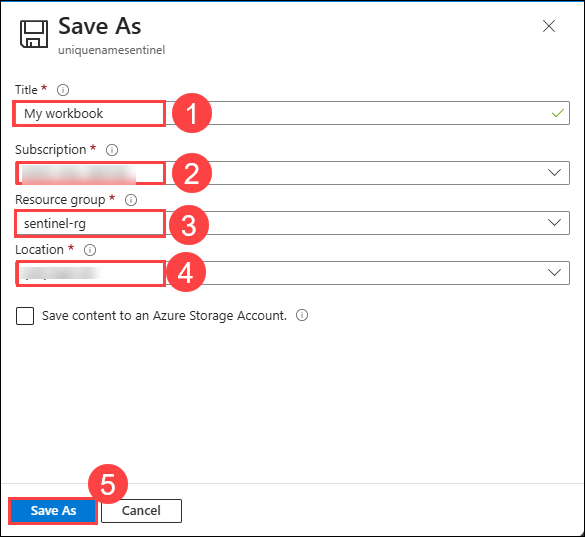

1. Navigate back to the **Workbooks (1)** page in Defender potal, under **My workbooks** tab, select the workbook you just created, **My workbook (2)**.

1. On the right pane, select **View saved workbook (3)** to review your workbook.

    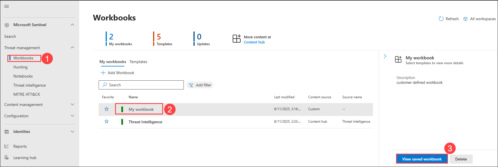

1. Now, you will see the newly created workbook.    

    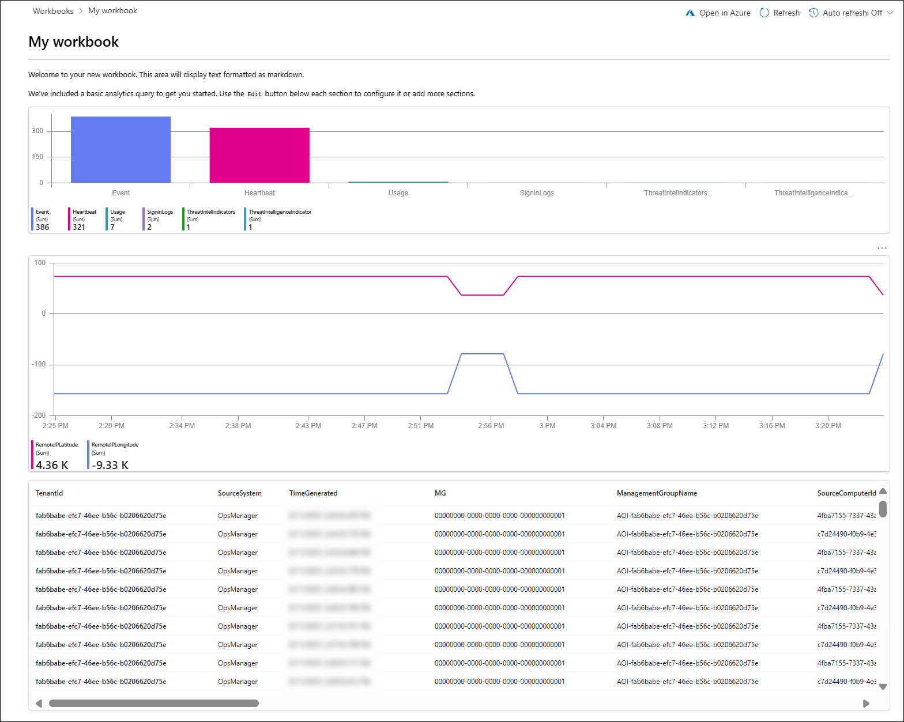

### Summary
In this exercise, you connected the Threat Intelligence data connector, explored workbook templates, customized an existing template, and created a new workbook. These steps equipped you with the skills to enhance security data visualization and leverage enriched threat intelligence within Microsoft Sentinel. 

## You have successfully completed the exercise!

### Now, click on **Next >>** from the lower right corner to move on to the next page.

   