# Lab 06: Hunting Across Your Data - Multi-Cloud Exploration (CrowdStrike, Palo Alto, Okta, AWS)

## Estimated Duration: 30 Minutes

## Overview

In this lab, you will act as a SOC analyst performing **threat hunting across multiple data sources** in Microsoft Sentinel's unified Advanced hunting experience. Before building detections, an analyst's first job is to *understand the data* - what tables exist, what events they hold, and what patterns are worth investigating. You will explore telemetry from four different security sources - **CrowdStrike** (endpoint), **Palo Alto** (firewall), **Okta** (identity), and **AWS** (cloud) - using KQL, then correlate them into a single timeline that reveals a multi-stage attack. Finally, you will turn one of your hunting queries into a reusable custom detection rule. All queries run against sample telemetry already staged in your workspace, so no external cloud access is required.

## Lab Objectives

In this lab, you will perform the following:

- Task 1: Discover which tables contain data
- Task 2: Explore each data source (CrowdStrike, Palo Alto, Okta, AWS)
- Task 3: Correlate the sources into a single attack timeline
- Task 4: Turn a hunting query into a custom detection rule

    > **Note:** This lab uses the sample tables `CrowdStrikeAlerts_CL`, `PaloAltoTraffic_CL`, `OktaSSO_CL`, and `AWSCloudTrail_CL` created by the sample-data injection script in the prerequisite lab. If these tables are not present, run `Inject-SentinelSampleData.ps1` from Cloud Shell before continuing.

    > **Scenario:** The sample data tells one connected story. A user, **bob.smith**, is compromised: his Okta account is taken over from a foreign IP and his MFA is disabled; his workstation **FINANCE-WKS-07** (`10.20.4.17`) then shows endpoint alerts across multiple attack stages and scans the internal network; and a service account enumerates the AWS environment. Your job is to piece this together from four separate data sources.

### Task 1: Discover Which Tables Contain Data

In this task, you will get a bird's-eye view of your workspace - which tables hold data and how much.

1. In the **LabVM** search bar, enter **File (1)**, and then select the **File Explorer (2)** app from the results.

   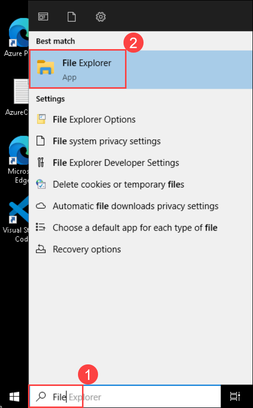

1. In **File Explorer**, navigate to **`C:\LabFiles`** **(1)**, and then select **Inject-HuntingSampleData.ps1** **(2)**.

   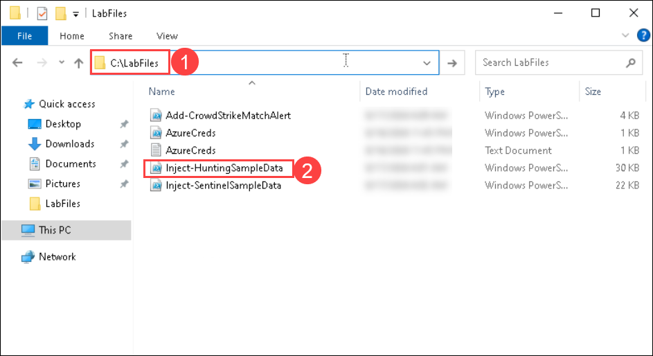

1. Update these lines at the top of the file: Replace each placeholder with your actual value and Save the file with **Ctrl+S**, then close the editor.

    ```powershell
    $SubscriptionId    = "YOUR_SUBSCRIPTION_ID"
    $ResourceGroupName = "YOUR_RESOURCE_GROUP"
    $WorkspaceName     = "YOUR_LOG_ANALYTICS_WORKSPACE"
    $Location          = "Use sentinel workspace location"
    ```

   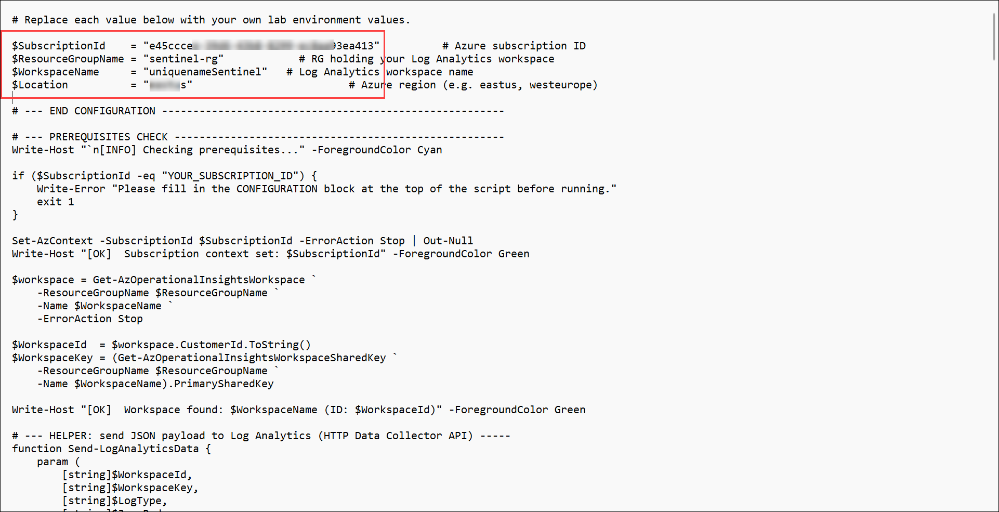

1. Open the **Inject-SentinelSampleData.ps1** and **Add-CrowdStrikeMatchAlert.ps1** files.

2. In both files, update the following variables with the appropriate values for your environment, and then save the changes.

   ```powershell
   $SubscriptionId    = "YOUR_SUBSCRIPTION_ID"
   $ResourceGroupName = "YOUR_RESOURCE_GROUP"
   $WorkspaceName     = "YOUR_LOG_ANALYTICS_WORKSPACE"
   $Location          = "Use the Microsoft Sentinel workspace location"
   ```

1. Navigate to Azure Portal and click on **Cloudshell.**

    

1. Click on the **PowerShell** option on the Welcome to Azure Cloud Shell page.

   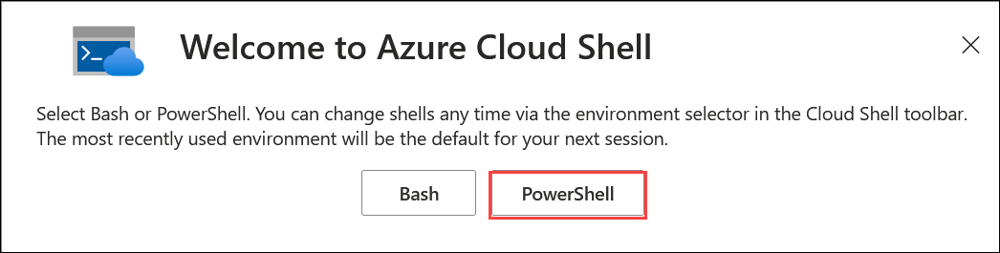

1. Select your subscription form the dropdown and then click on **Apply**.

   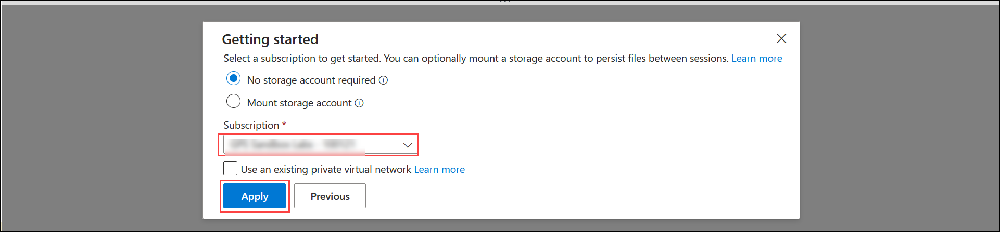

1. Click on the **Manage files**, from the drop-down select **Upload** option.

   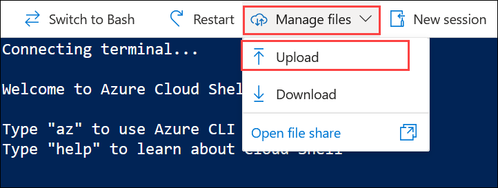

1. In the **Open** dialog, navigate to the **`C:\LabFiles`** folder **(1)**, select **Inject-SentinelSampleData** **(2)**, and then select **Open** **(3)**.  

   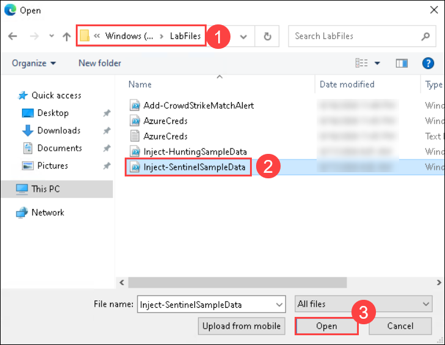

1. Once the file is uploaded you will receive a **Successfully uploaded a file** message.

   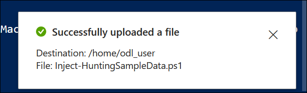

1. Similarly perform **step 9-10** to upload the remaining two files, **`Inject-SentinelSampleData.ps1` and `Add-CrowdStrikeMatchAlert.ps1`**.

1. Once the files are uploaded successfully, run using the below commands.

    ```
    .\Add-CrowdStrikeMatchAlert.ps1
    ```

    ```
    .\Inject-SentinelSampleData.ps1
    ```

    ```
    .\Inject-HuntingSampleData.ps1
    ```

    >**Note:** wait for 15-20 mins to sync the data, before running the queries.

### Task 2: Explore Each Data Source

In this task, you will run targeted queries against each of the four sources to understand what they contain and spot suspicious patterns.

#### Step A - CrowdStrike Endpoint Alerts

1. Navigate to the **Microsoft Defender Portal**.

    ```
    https://security.microsoft.com/
    ```

1. In the left navigation pane, select **Advanced hunting**.

1. CrowdStrike is the endpoint detection and response (EDR) source. Run the following to see the alert types and the MITRE tactics they map to:

    ```KQL
    CrowdStrikeAlerts_CL
    | summarize AlertCount = count() by Name_s, SeverityName_s, Tactic_s
    | sort by AlertCount desc
    ```

    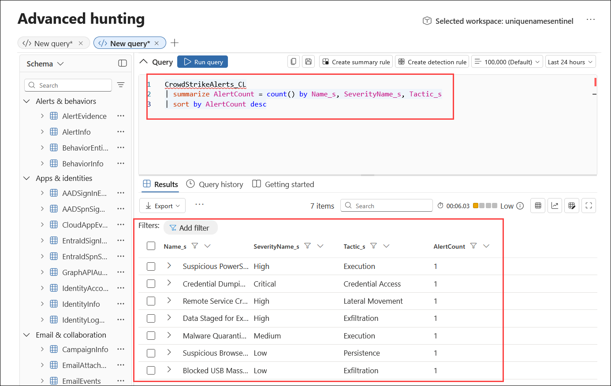

    >**Note:** If the query returns no results even after waiting for 15–20 minutes, the CrowdStrike solution may not be installed in your workspace. Complete the following steps, then run the query again:

   - In the left navigation pane, select **Microsoft Sentinel (1)** > **Content management (2)** > **Content hub (3)**.

      .png)

   - On the Content hub page search bar type **CrowdStrike Falcon Endpoint Protection (1)**, select **CrowdStrike Falcon Endpoint Protection (2)** from the list, then click on **Install with dependencies (3)** Once the status changes to Installed, return to **Advanced hunting** and run the query again..

      .png)

      .png)

1. Now identify which device is generating alerts across the most attack stages - a strong signal of a compromised host:

    ```KQL
    CrowdStrikeAlerts_CL
    | summarize
        AlertCount = count(),
        TacticCount = dcount(Tactic_s),
        Tactics = make_set(Tactic_s),
        FirstAlert = min(TimeGenerated),
        LastAlert = max(TimeGenerated)
        by DeviceName_s
    | sort by TacticCount desc
    ```

    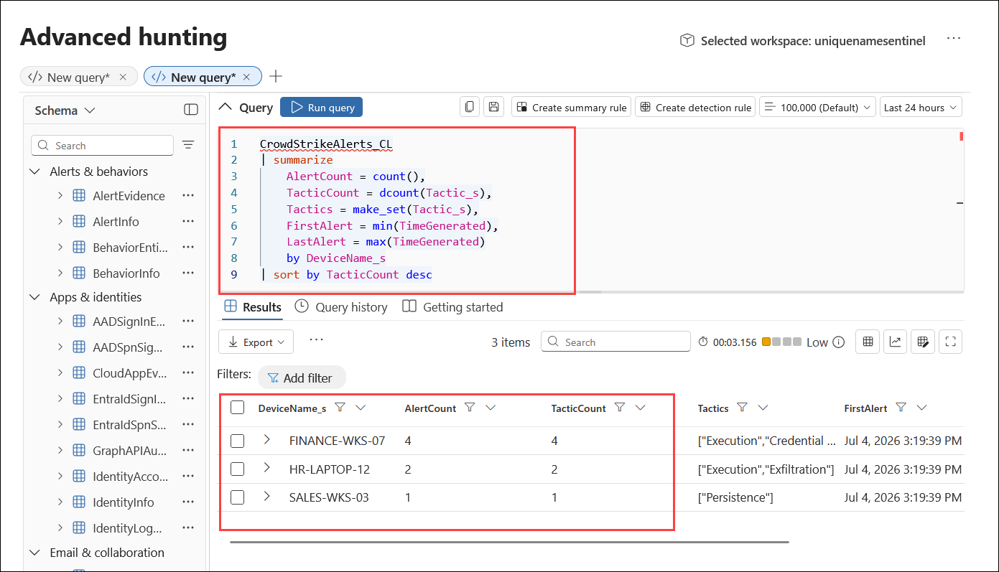

    > **Key insight:** `FINANCE-WKS-07` has alerts spanning **4 distinct MITRE tactics** (Execution, Credential Access, Lateral Movement, Exfiltration) in a short window. When a single device shows activity across multiple attack stages, it is very likely compromised and being used as a pivot point.

#### Step B - Palo Alto Firewall Traffic

1. Palo Alto provides network firewall logs. Start with a traffic overview by action:

    ```KQL
    PaloAltoTraffic_CL
    | summarize
        TotalEvents = count(),
        DistinctSources = dcount(SourceIP),
        DistinctDestinations = dcount(DestinationIP_s)
        by Activity_s
    | sort by TotalEvents desc
    ```

    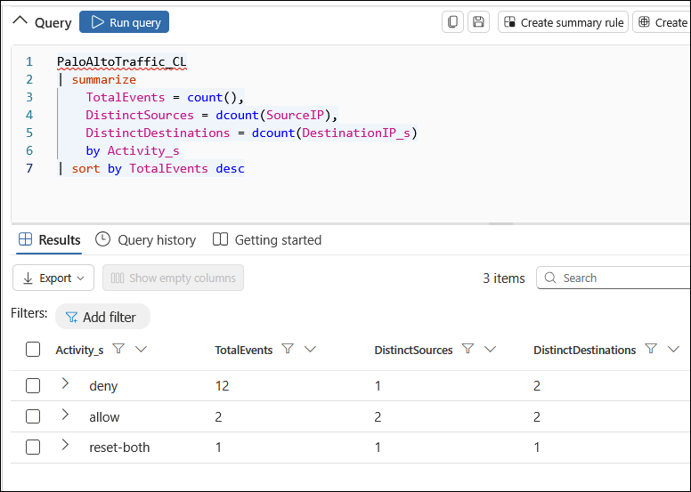

1. Now hunt for denied traffic that looks like a port scan - one source hitting many distinct ports:

    ```KQL
    PaloAltoTraffic_CL
    | where Activity_s in ("deny", "drop", "reset-both")
    | where ApplicationProtocol_s == "incomplete"
    | summarize
        BlockedConnections = count(),
        DistinctPorts = dcount(DestinationPort_d),
        PortList = make_set(DestinationPort_d, 25)
        by SourceIP, DestinationIP_s
    | sort by DistinctPorts desc
    ```

    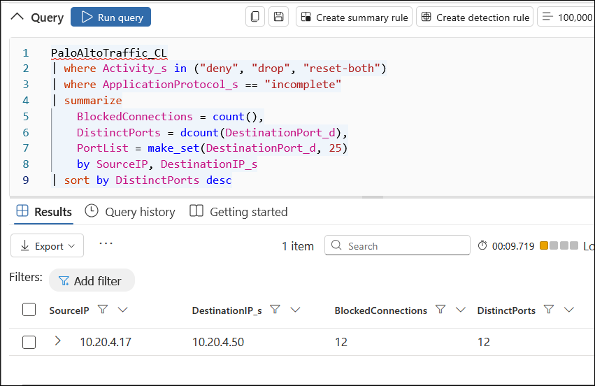

    > **Key insight:** Source `10.20.4.17` attempted connections to **12 distinct ports** on a single target, all denied with an `incomplete` application protocol - the classic signature of a port scan. Note that `10.20.4.17` is the internal IP of `FINANCE-WKS-07` from the CrowdStrike data. The compromised endpoint is now scanning the internal network for lateral-movement targets.

#### Step C - Okta Identity Events

1. Okta is the identity provider. Review the event types and outcomes:

    ```KQL
    OktaSSO_CL
    | summarize EventCount = count() by EventType_s, Outcome_s
    | sort by EventCount desc
    ```

    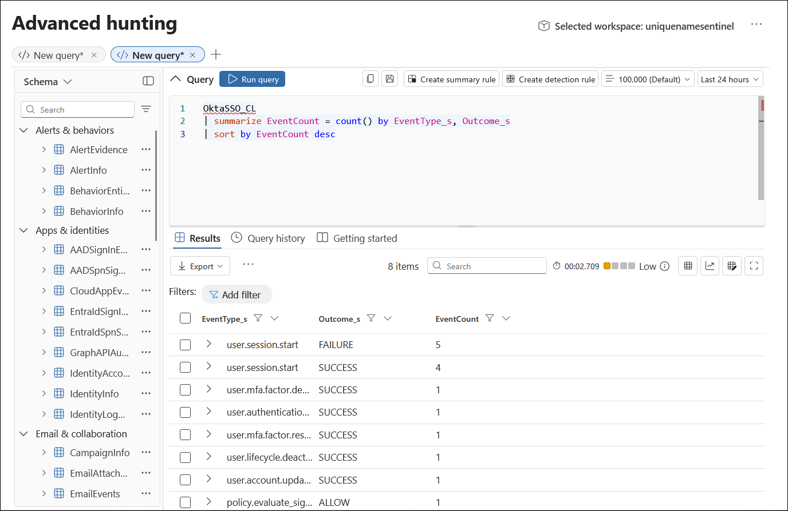

1. Now look specifically for MFA manipulation - a post-compromise persistence technique:

    ```KQL
    OktaSSO_CL
    | where EventType_s has "mfa"
    | project TimeGenerated, ActorAlternateId_s, EventType_s, Outcome_s, ClientIpAddress_s, Country_s
    | sort by TimeGenerated desc
    ```

    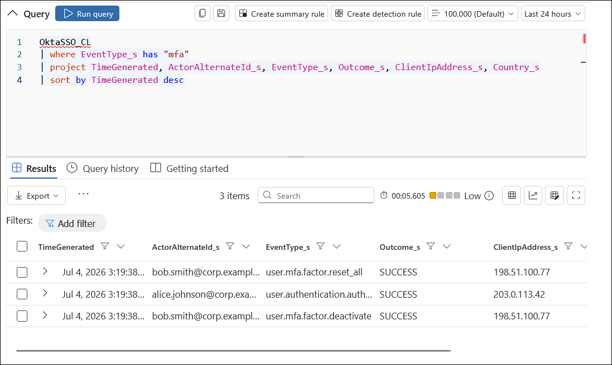

    > **Key insight:** `bob.smith` had his MFA factors deactivated and reset from a Russian IP (`198.51.100.77`) shortly after a successful login from that same foreign IP - a hallmark of account takeover. Note this is the same `bob.smith` who owns the compromised `FINANCE-WKS-07` endpoint.

#### Step D - AWS Cloud Activity

1. AWS CloudTrail tracks API calls in the cloud environment. See which actions occurred most:

    ```KQL
    AWSCloudTrail_CL
    | summarize EventCount = count() by EventName_s, EventSource_s
    | sort by EventCount desc
    | take 15
    ```

    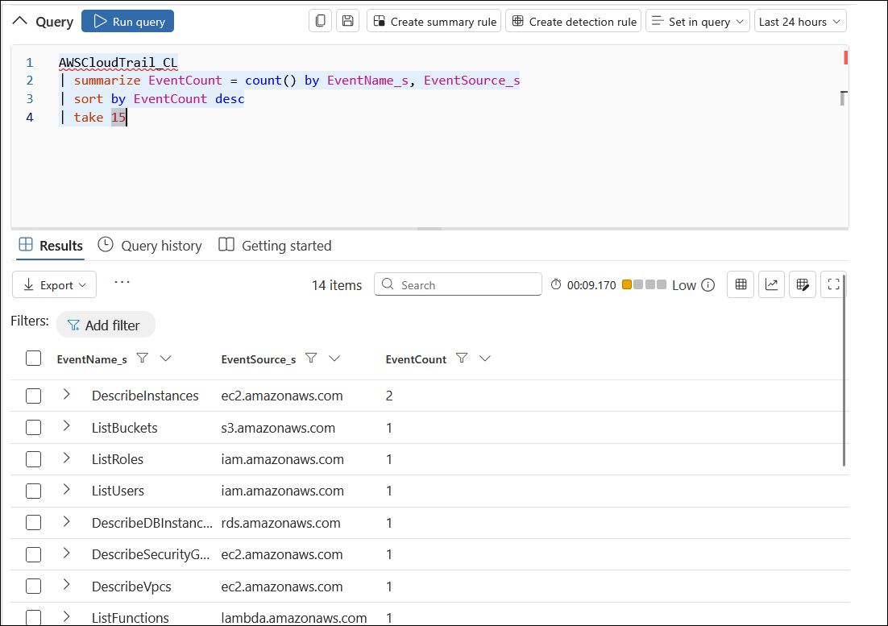

1. Hunt for a single identity enumerating many distinct services - cloud reconnaissance:

    ```KQL
    AWSCloudTrail_CL
    | summarize
        DistinctActions = dcount(EventName_s),
        Actions = make_set(EventName_s, 25),
        FirstSeen = min(TimeGenerated),
        LastSeen = max(TimeGenerated)
        by UserIdentityUserName_s, SourceIpAddress_s
    | sort by DistinctActions desc
    ```

    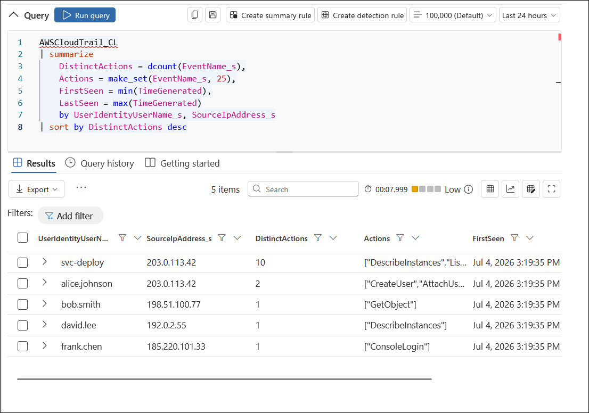

    > **Key insight:** The service account `svc-deploy` enumerated **10 distinct AWS API actions** (EC2, S3, IAM, Lambda, RDS, Secrets Manager, and more) from a single IP in a short window - reconnaissance of the cloud environment following the on-premises compromise.

### Task 3: Correlate the Sources into a Single Attack Timeline

In this task, you will combine all four sources into one chronological timeline - the foundation of any real investigation.

1. Run the following `union` query. It pulls the most significant events from each source, normalizes them into common columns, and sorts them by time:

    ```KQL
    union
        (CrowdStrikeAlerts_CL
        | where SeverityName_s in ("Critical", "High")
        | project TimeGenerated, Source = "CrowdStrike", Actor = UserName_s, Activity = Name_s, Detail = Tactic_s),
        (PaloAltoTraffic_CL
        | where DeviceEventClassID_s == "THREAT" or Activity_s in ("deny", "drop", "reset-both")
        | project TimeGenerated, Source = "Palo Alto", Actor = SourceIP, Activity = Activity_s, Detail = tostring(DestinationPort_d)),
        (OktaSSO_CL
        | where EventType_s has "mfa" or SuspiciousActivity_s == "true"
        | project TimeGenerated, Source = "Okta", Actor = ActorAlternateId_s, Activity = EventType_s, Detail = Country_s),
        (AWSCloudTrail_CL
        | where UserIdentityUserName_s == "svc-deploy"
        | project TimeGenerated, Source = "AWS", Actor = UserIdentityUserName_s, Activity = EventName_s, Detail = SourceIpAddress_s)
    | sort by TimeGenerated asc
    ```

    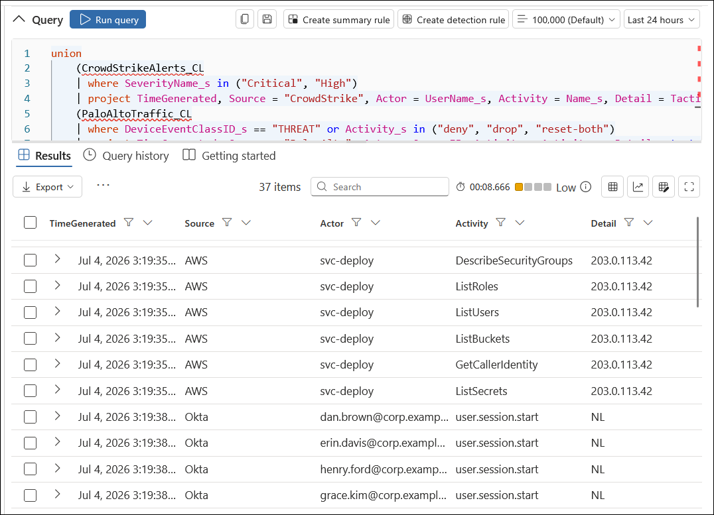

1. Review the combined timeline. Reading it top to bottom, you can reconstruct the full attack chain across all four sources:

    | Stage | Source | What happened |
    |---|---|---|
    | 1. Initial access | Okta | `bob.smith` logged in from Russia; MFA deactivated |
    | 2. Endpoint compromise | CrowdStrike | `FINANCE-WKS-07` shows Execution → Credential Access → Lateral Movement → Exfiltration |
    | 3. Internal recon | Palo Alto | `10.20.4.17` (that device) port-scans the internal network |
    | 4. Cloud recon | AWS | `svc-deploy` enumerates the AWS environment |

    > **Key insight:** No single source tells the whole story. Okta shows the identity takeover, CrowdStrike shows the endpoint activity, Palo Alto shows the network movement, and AWS shows the cloud recon. Correlating them with `union` turns four isolated signals into one coherent incident - this is the core value of a unified hunting experience.

1. To confirm the pivot points that link the sources, note the shared indicators:

    - **`bob.smith`** appears in both Okta (account takeover) and CrowdStrike (owner of the compromised device).
    - **`10.20.4.17`** is the CrowdStrike device IP for `FINANCE-WKS-07` *and* the Palo Alto port-scan source.
    - **`198.51.100.77`** is the Okta foreign-login IP *and* the Palo Alto exfiltration destination.

    > **Tip:** Shared entities - a username, an IP, a hostname - are the "glue" that connects events across sources during an investigation. Always look for these pivot points when correlating multi-cloud telemetry.

1. In the query editor, run the following query to list every table that contains data, ordered by event volume:

    ```KQL
    search *
    | where $table endswith "_CL"
    | summarize EventCount = count() by $table
    ```

    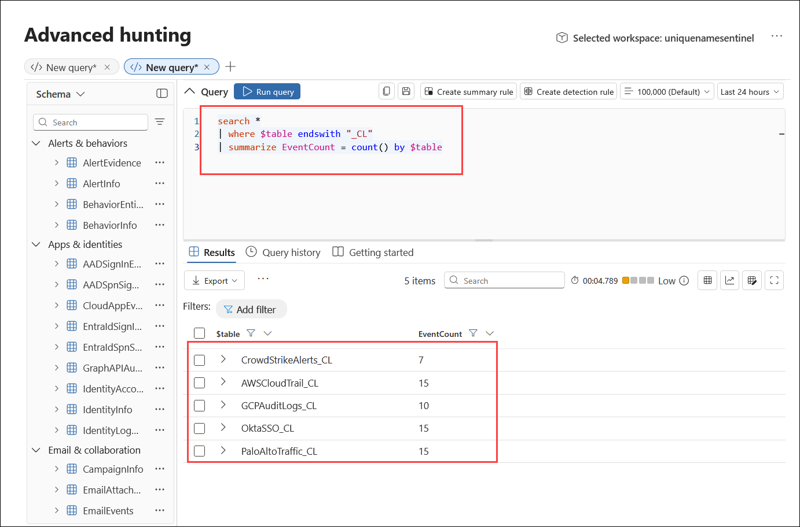

1. Review the results. You should see your four multi-cloud sample tables among the results:

    | Table | Source | Telemetry type |
    |---|---|---|
    | `CrowdStrikeAlerts_CL` | CrowdStrike | Endpoint (EDR) alerts |
    | `PaloAltoTraffic_CL` | Palo Alto | Firewall traffic logs |
    | `OktaSSO_CL` | Okta | Identity / sign-in events |
    | `AWSCloudTrail_CL` | AWS | Cloud API activity |

    > **Tip:** `search *` is the fastest way to discover what data exists in a workspace you are unfamiliar with. In a production environment it can be expensive to run broadly, so scope it with a time filter (for example, `search * | where TimeGenerated > ago(1h)`) when working with large datasets.

### Task 4: Turn a Hunting Query into a Custom Detection Rule

In this task, you will operationalize your hunting by converting the multi-tactic endpoint query into a scheduled analytics rule that alerts automatically.

1. In the left navigation pane, select **Microsoft Sentinel (1)** > **Configuration (2)** > **Analytics (3)**.

    

1. From the top menu, select **+ Create (1)**, then select **Scheduled query rule (2)**.

    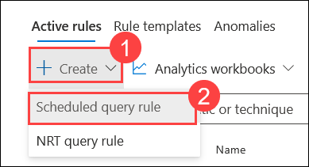

1. On the **General** tab, enter the following details, then map the rule to MITRE:

    - **Name:** `Multi-Tactic Compromise on Single Endpoint (Lab) (1)`
    - **Description:** `Detects when a single device has CrowdStrike alerts spanning 3 or more MITRE ATT&CK tactics, indicating a multi-stage compromise (2)`
    - **Severity:** **High (3)**
    - Under **MITRE ATT&CK**, select **Lateral Movement** and **Credential Access** (the tactics this pattern spans)

    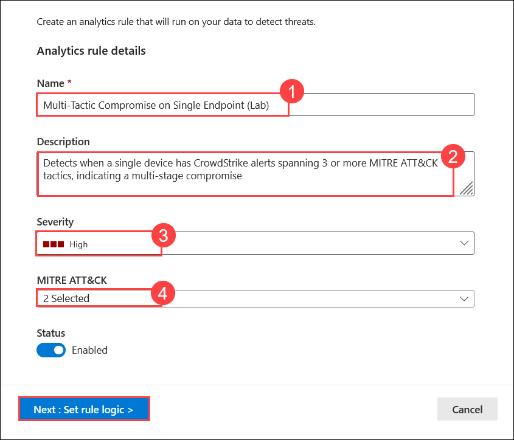
    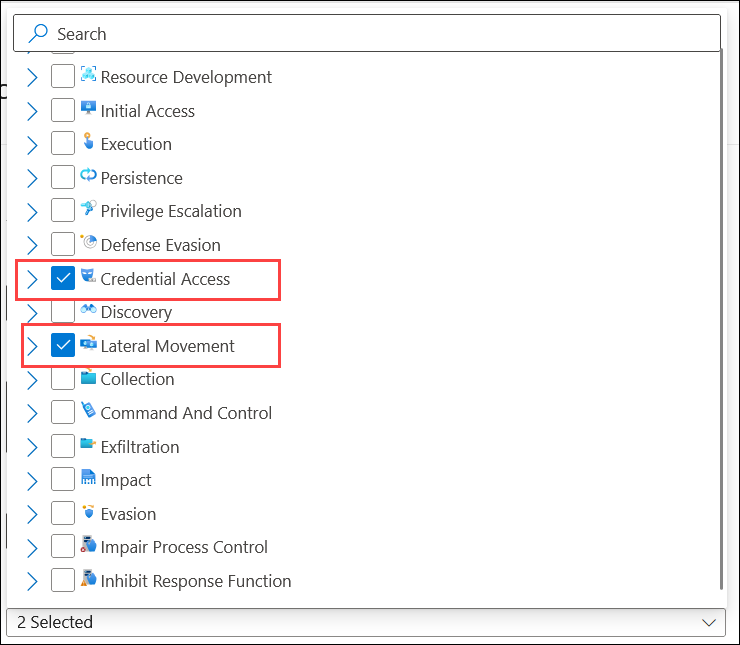

1. Select **Next: Set rule logic >**.

1. In the **Rule query** box, paste the following detection query. It finds devices with high-severity alerts spanning 3 or more tactics in a 4-hour window:

    ```KQL
    CrowdStrikeAlerts_CL
    | where TimeGenerated > ago(4h)
    | where SeverityName_s in ("Critical", "High")
    | summarize
        TacticCount = dcount(Tactic_s),
        Tactics = make_set(Tactic_s),
        AlertNames = make_set(Name_s, 10),
        AlertCount = count(),
        FirstSeen = min(TimeGenerated),
        LastSeen = max(TimeGenerated)
        by DeviceName_s, UserName_s
    | where TacticCount >= 3
    | extend
        TimeGenerated = FirstSeen,
        AccountName = UserName_s,
        HostName = DeviceName_s
    ```

    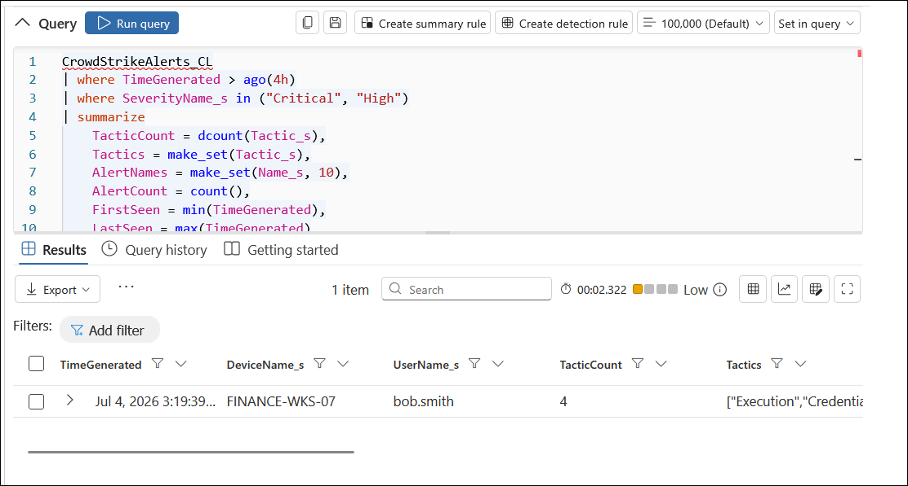

    > **Note:** With the sample data, this returns `FINANCE-WKS-07` (4 tactics). Devices with only 1-2 tactics are correctly excluded, keeping the alert high-fidelity.

1. Under **Query scheduling**, set **Run query every** to `1 Hour` and **Lookup data from the last** to `4 Hours`.

    > **Important:** Keep the lookback period at least as long as the query's `ago()` window (4 hours here) so no data is missed between runs.

1. Select **Next: Incident settings >**, confirm **Incident creation** is **Enabled**, then select **Next: Automated response >**, leave defaults, and select **Next: Review and create >**.

    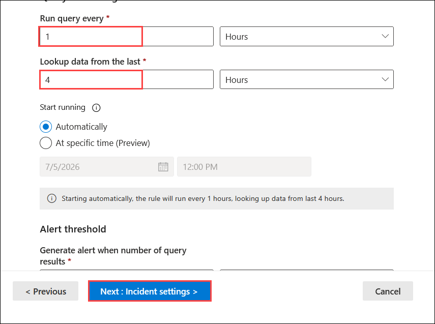

1. Once validation passes, select **Save** to deploy the rule.

    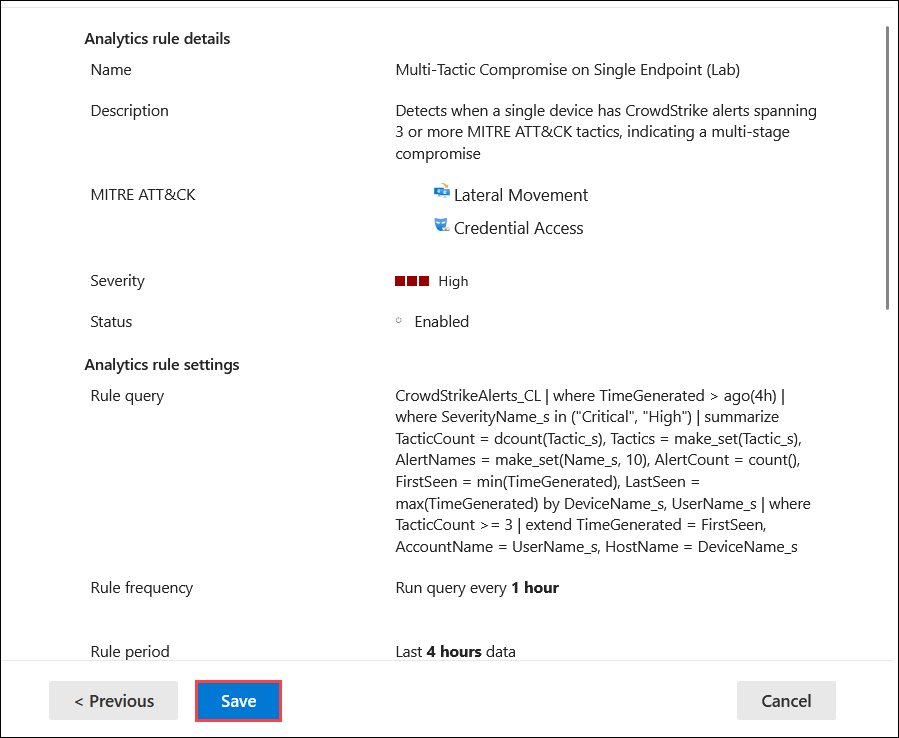

1. To verify, return to **Analytics**, confirm the rule appears with **Status: Enabled**, and optionally select it and choose to run it. Any resulting incident will map `FINANCE-WKS-07` and `bob.smith` as entities - the same compromised assets you identified through hunting.

    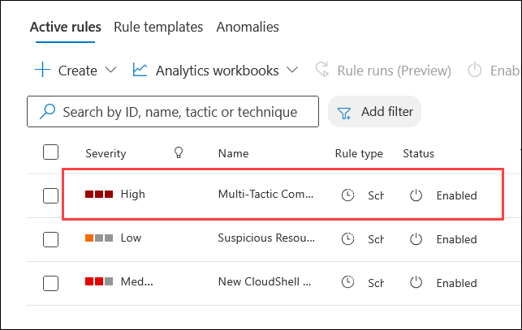

## Summary

In this lab, you performed multi-cloud threat hunting across four distinct security sources in Microsoft Sentinel's unified Advanced hunting experience. You discovered which tables held data, then explored **CrowdStrike** endpoint alerts, **Palo Alto** firewall traffic, **Okta** identity events, and **AWS** cloud activity - spotting a compromised endpoint, an internal port scan, an account takeover with MFA manipulation, and cloud reconnaissance. You then correlated all four sources into a single chronological timeline using `union`, using shared entities (a username, a device IP, an external IP) as pivot points to reconstruct the full attack chain. Finally, you operationalized your hunting by turning the multi-tactic endpoint query into a scheduled custom detection rule. You now understand the core hunting workflow: discover the data, explore each source, correlate across sources, and turn findings into automated detections.

## You have successfully completed the lab!

### Now, click on **Next >>** from the lower right corner to move on to the next page.

   
