# Lab 07: Cross-Platform Response - Device Isolation (Requires MDE)

## Estimated Duration: 30 Minutes

## Overview

In this lab, you will implement a real **device isolation** response using Microsoft Defender for Endpoint (MDE). You will first onboard a Windows device to MDE so it appears in the Defender portal's device inventory, then use that live device to perform a hands-on isolation - both manually from the device page and automatically through a custom detection rule. You will also learn the cross-platform pattern SOCs use in multi-vendor environments, where a detection from a third-party EDR (such as CrowdStrike) is resolved to an MDE `DeviceId` so the isolation action can execute. Because device isolation is a high-impact action, you will finish by learning how to stage it safely and reverse it from the Action center.

> **Important - MDE required:** This lab performs a **real device isolation**, which requires a device onboarded to **Microsoft Defender for Endpoint (Plan 2)** and a role with device remediation permissions (Security Administrator, or a Defender for Endpoint role with **Active remediation actions / Manage security settings**). You will onboard a lab VM in Task 1. If your environment has no VM available to onboard, Tasks 3-4 can be read through instead, but the intended experience is fully hands-on.

## Lab Objectives

In this lab, you will perform the following:

- Task 1: Onboard a Windows device to Microsoft Defender for Endpoint
- Task 2: Confirm the device in the Defender portal inventory
- Task 3: Isolate the device manually from the device page
- Task 4: Automate isolation with a custom detection rule (cross-platform pattern)
- Task 5: Review and reverse the isolation in the Action center

### Task 1: Onboard a Windows Device to Microsoft Defender for Endpoint

In this task, you will download the MDE onboarding package and run it on a lab Windows VM so the device begins reporting to Defender for Endpoint.

> **Note:** This lab uses a Windows VM such as the **cvm** provided in earlier exercises. If you do not have a VM, provision or start one now. The device must have outbound internet access to reach the Defender for Endpoint service.

1. In the **Azure portal**, navigate to **Compute infrastructure > Virtual machines**.

2. From the list of available virtual machines, Select the **cvm-<inject key="DeploymentID" enableCopy="false"/>** to open.

    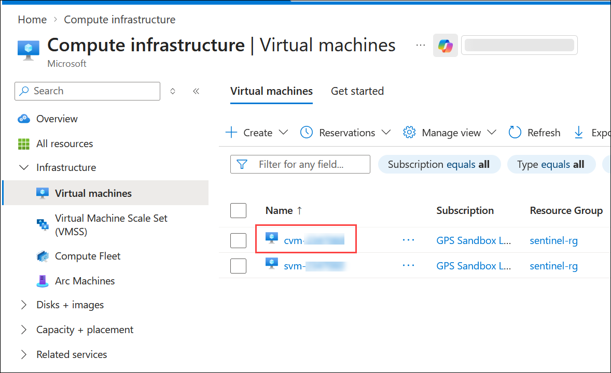

1. Select **Start** to start the virtual machine. Once the VM is Started then copy the **Prmary IP**.

    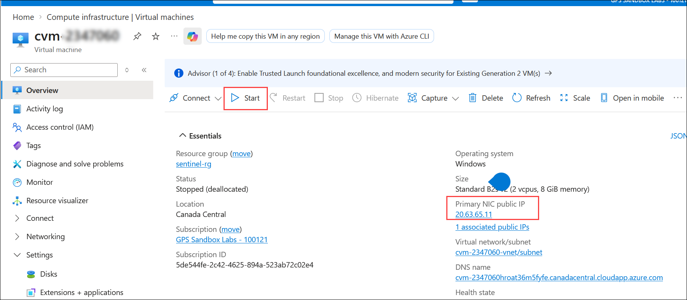

1. Click the **Windows Search** box on the taskbar and type **rdp**. From the search results, select **Remote Desktop Connection** to launch the Remote Desktop client.

    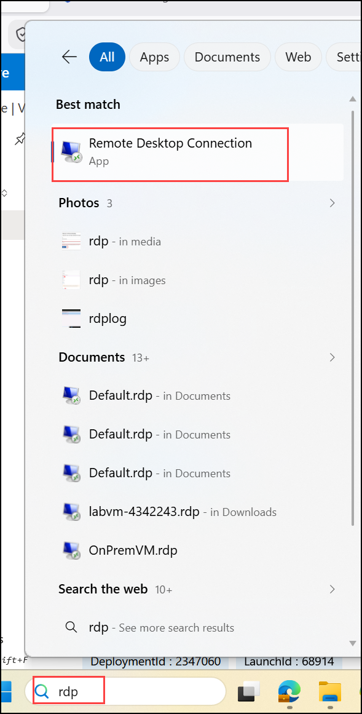

1. In the **Environment** tab, copy the **LabVM Admin Username** and **LabVM Admin Password**, enter them in the Windows Security prompt, and select **OK** to connect to the VM.

    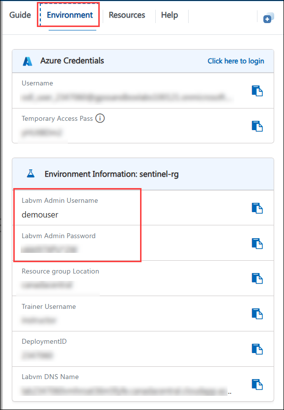

    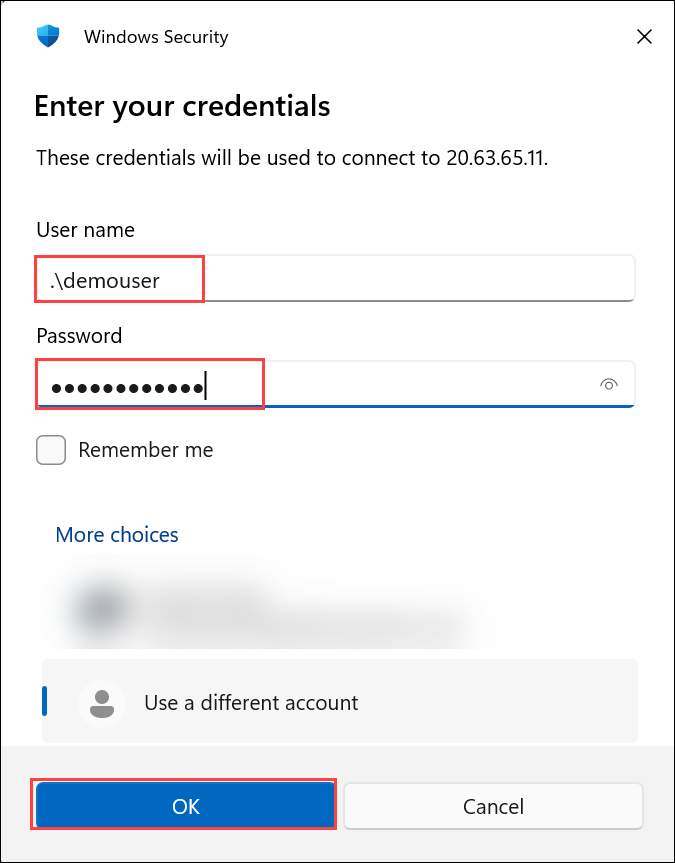

1. Select **Yes** to continue connecting to the remote computer despite the certificate warning.

    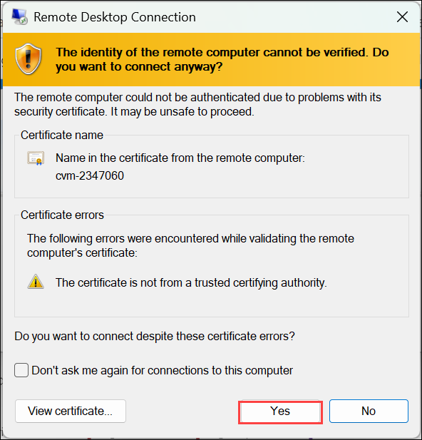

1. Open the browser and navigate to the **Microsoft Defender Portal**.

    ```
    https://security.microsoft.com/
    ```

1. In the left navigation pane, select **System (1)** > **Settings (2)** > **Endpoints (3)**.

    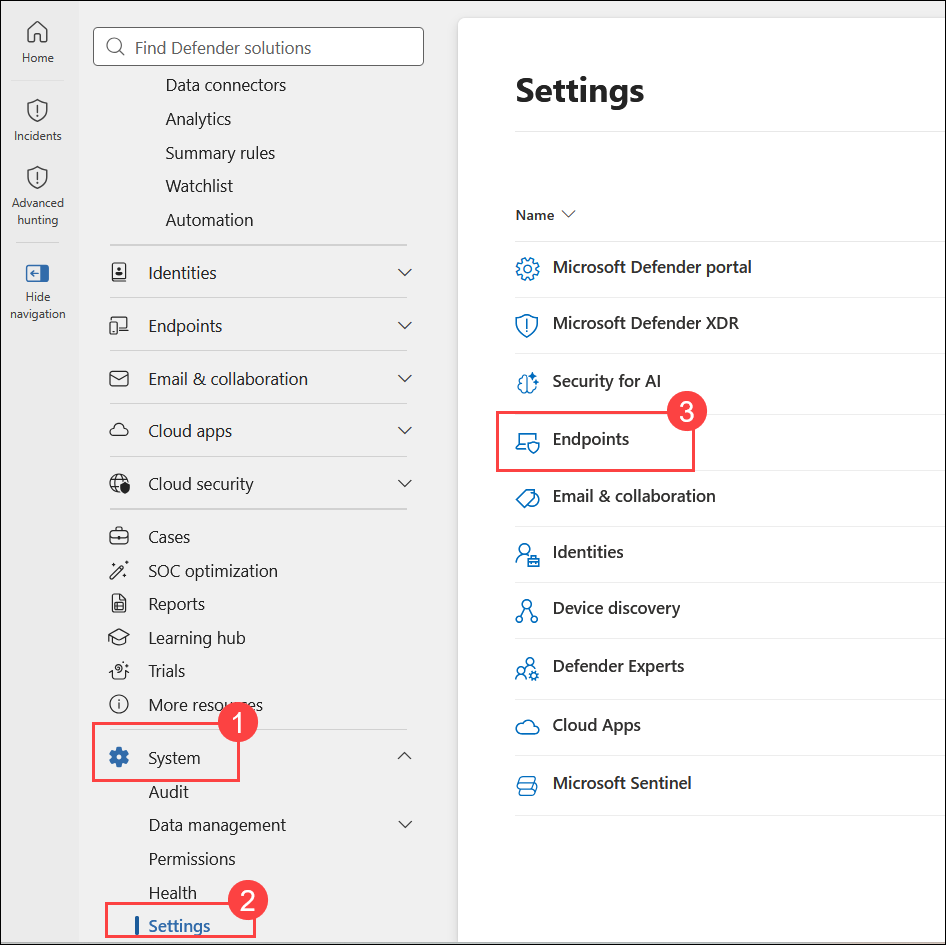

1. Under the **Device management** section, select **Onboarding**.

1. On the **Onboarding** page, configure the following:

    - **Select operating system to start onboarding process:** **Windows 10 and 11 (1)**
    - **Connectivity type:** **Streamlined (2)** (simplifies firewall/proxy connectivity)
    - **Deployment method:** **Local script (for up to 10 devices) (3)**

    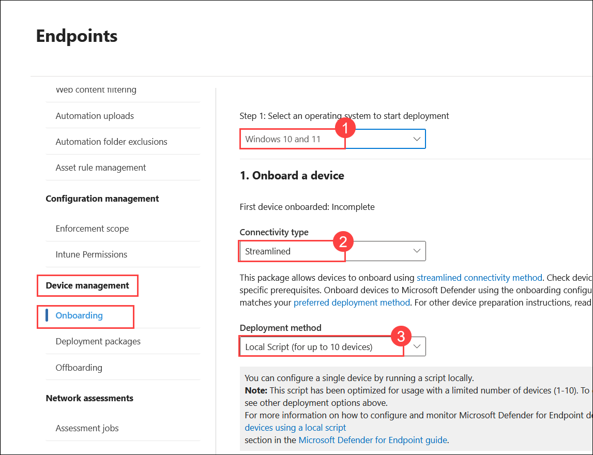

1. Select **Download onboarding package (1)**. This downloads a file named `GatewayWindowsDefenderATPOnboardingPackage.zip`.

    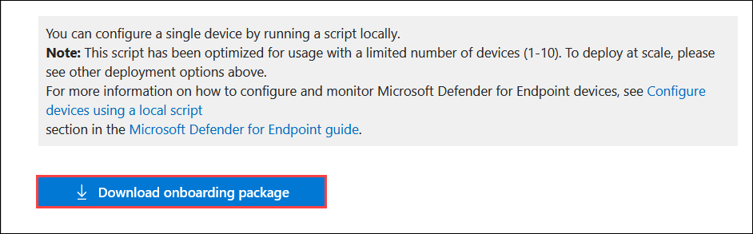

1. Copy the downloaded `.zip` file to the Windows VM you are onboarding, and **extract** it to an easy-to-find location such as the **Desktop**. After extraction you should have a file named **`WindowsDefenderATPLocalOnboardingScript.cmd`**.

    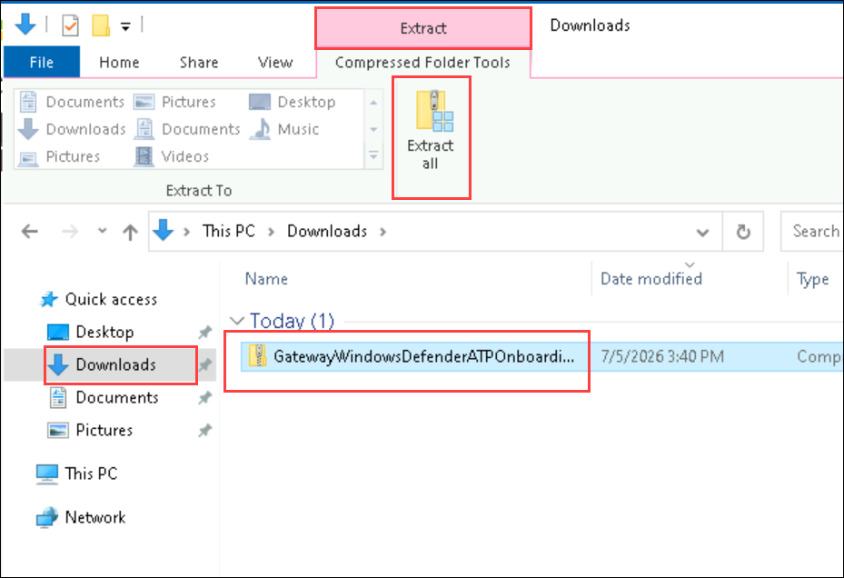

    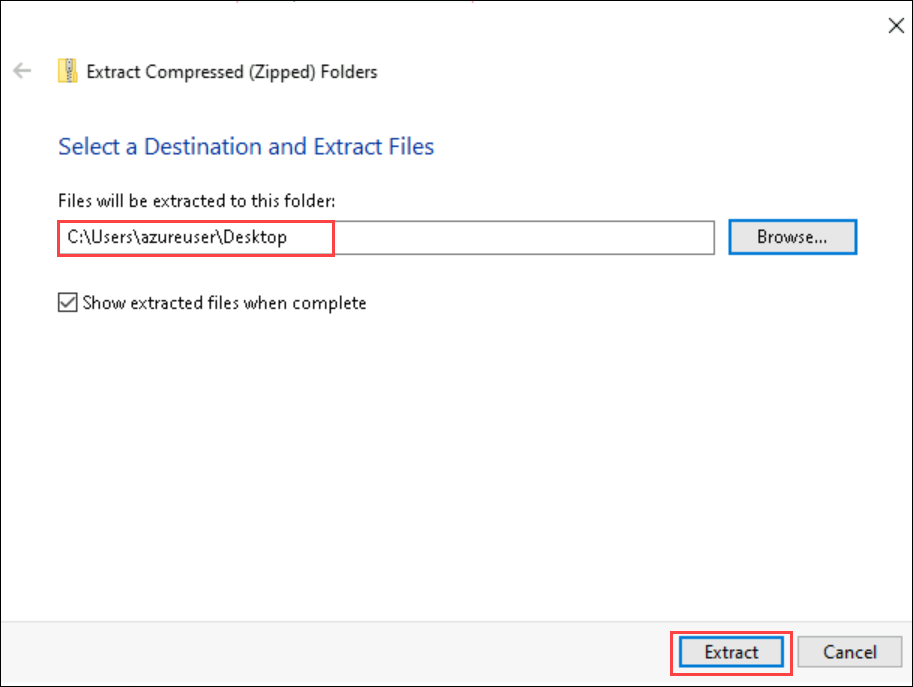

1. On the VM, open an **elevated Command Prompt** (search **cmd**, right-click **Command Prompt**, select **Run as administrator**).

    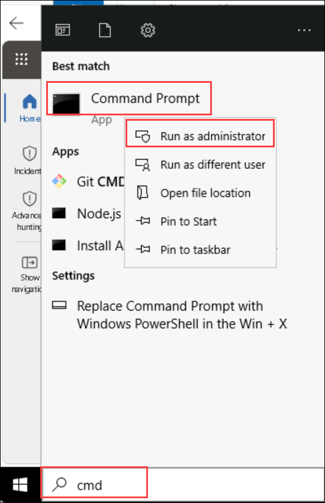

1. Navigate to the folder containing the script and run it. For example, if it is on the Desktop:

    ```cmd
    cd %userprofile%\Desktop
    WindowsDefenderATPLocalOnboardingScript.cmd
    ```

1. When prompted, type **Y** to confirm and run the onboarding. Wait for the message confirming the script completed successfully.

    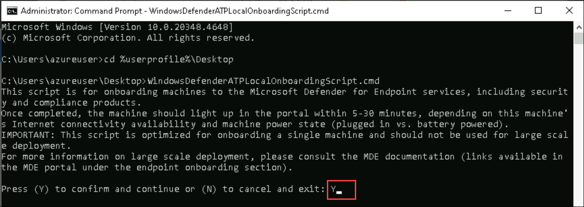

    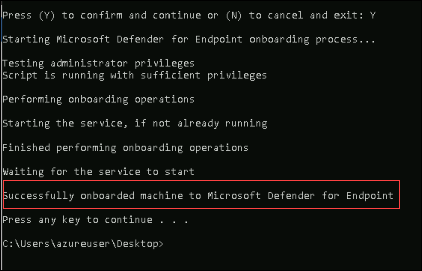

    > **Note:** The onboarding script configures the device to report to Defender for Endpoint. It does not require a reboot, but sensor data can take time to first appear in the portal (see Task 2).

1. *(Optional)* Run the MDE detection test to confirm the sensor is active. In the same elevated Command Prompt, run:

    ```cmd
    powershell.exe -NoExit -ExecutionPolicy Bypass -WindowStyle Hidden $ErrorActionPreference = 'silentlycontinue';(New-Object System.Net.WebClient).DownloadFile('http://127.0.0.1/1.exe', 'C:\\test-MDATP-test\\invoice.exe');Start-Process 'C:\\test-MDATP-test\\invoice.exe'
    ```

    > **Note:** This is Microsoft's official, harmless detection test command. It generates a test alert to confirm the device is properly onboarded and reporting.

### Task 2: Confirm the Device in the Defender Portal Inventory

In this task, you will verify the onboarded device appears in the Defender portal and is reporting.

1. In the Defender portal, in the left navigation pane, select **Assets (1)** > **Devices (2)**.

1. Locate your onboarded device (for example, **cvm-<inject key="DeploymentID" enableCopy="false"/>**) in the device inventory list. Confirm it appears and shows a health/onboarding status.

    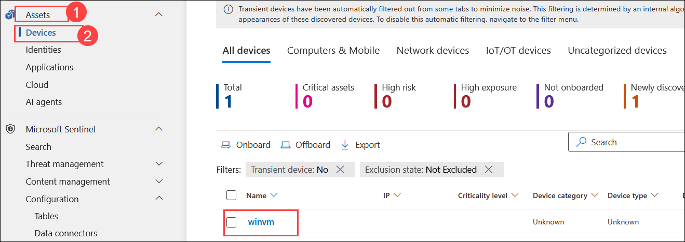

    > **Important:** It can take **15-60 minutes** (occasionally longer on first provisioning) for a newly onboarded device to appear and show full telemetry. If it is not visible yet, wait and refresh. You can continue reading ahead while you wait.

1. Confirm the device is also visible in the `DeviceInfo` table, which is what response actions and cross-platform queries rely on. Go to **Advanced hunting** and run:

    ```KQL
    DeviceInfo
    | where Timestamp > ago(1d)
    | summarize arg_max(Timestamp, *) by DeviceName
    | project DeviceName, DeviceId, OSPlatform, OnboardingStatus
    ```

    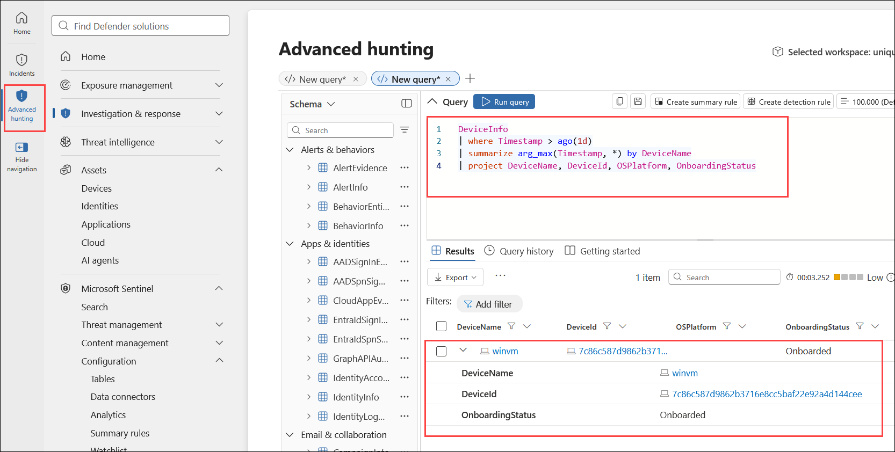

    > **Note:** Confirm your device shows **OnboardingStatus = Onboarded** and has a populated **DeviceId** (a GUID). This DeviceId is the identifier that every device-scoped response action - including isolation - requires.

### Task 3: Isolate the Device Manually from the Device Page

In this task, you will perform a real device isolation directly from the device's page, then confirm the effect.

1. Go to **Assets** > **Devices**, and select your onboarded device to open its **device page**.

1. On the device page, select the **actions menu** (the **...** or the response actions bar at the top right), then select **Isolate device (1)**.

    >**Note:** It will take upto 2 hrs, to visible the Isolate device option.

    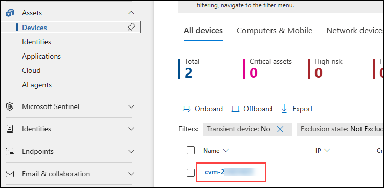

    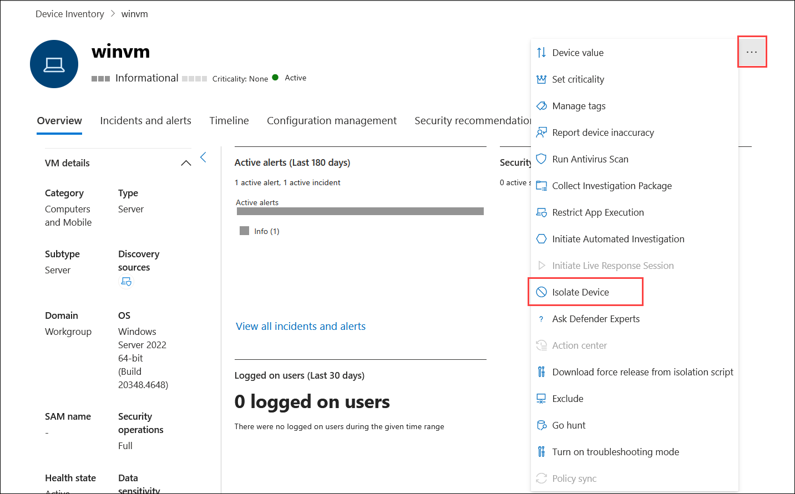

1. Enter a **comment/reason** for the action (for example, `Lab exercise - testing device isolation`) (1), then select **Confirm (2)**.

    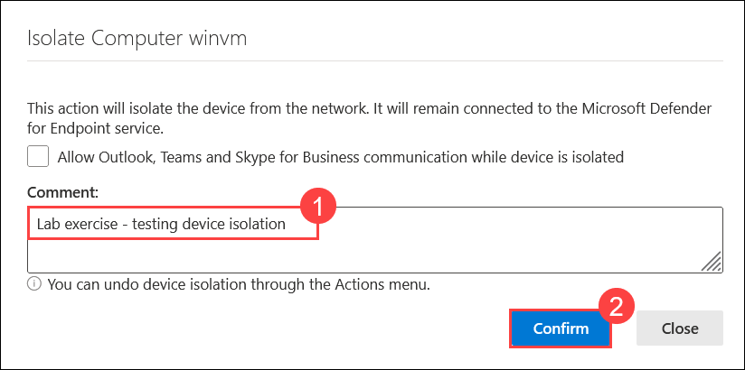

    > **Important:** In production, full isolation stops a user's device from reaching the network entirely. Only isolate when you are confident containment is warranted - but note it is fully reversible (Task 5).

1. Observe the isolation status. The device page shows the device is being isolated, and a notification confirms the action was submitted.

    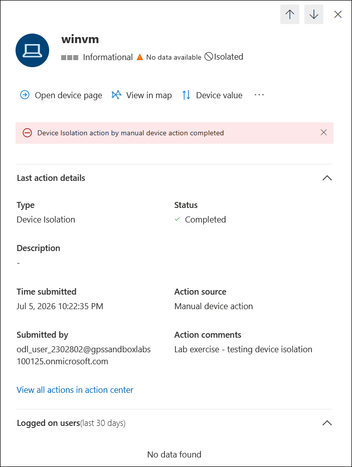

1. *(Optional)* On the VM itself, confirm connectivity is cut - for example, a browser can no longer reach external sites - demonstrating the isolation took effect.

    > **Note:** Isolation can take a minute or two to apply. The device retains its connection to Defender so the SOC can continue to investigate and later release it.

### Task 4: Automate Isolation with a Custom Detection Rule (Cross-Platform Pattern)

In this task, you will build the cross-platform pattern SOCs use in multi-vendor environments: resolve a third-party EDR (CrowdStrike) detection to the MDE `DeviceId`, then attach an automated isolation action.

> **Note:** In a real multi-vendor SOC, a CrowdStrike alert identifies a device by **hostname**, but MDE isolation requires the **DeviceId**. The bridge is a join to the `DeviceInfo` table on hostname. For this join to return a match, the CrowdStrike hostname must equal your onboarded device's name - so if you want a live match, ensure your CrowdStrike sample data (or a test alert) uses the same hostname as your onboarded VM.

1. In **Advanced hunting**, build and run the resolution query. It takes high-severity CrowdStrike alerts and looks up the matching MDE `DeviceId`:

    ```KQL
    CrowdStrikeAlerts_CL
    | where TimeGenerated > ago(7d)
    | where SeverityName_s in ("Critical", "High")
    | extend CSHostname = DeviceName_s
    | join kind=inner (
        DeviceInfo
        | where Timestamp > ago(14d)
        | summarize arg_max(Timestamp, DeviceId) by DeviceName
        | project DeviceName, DeviceId
    ) on $left.CSHostname == $right.DeviceName
    | project Timestamp = TimeGenerated, DeviceId, CSHostname, AlertName = Name_s, Severity = SeverityName_s
    ```

    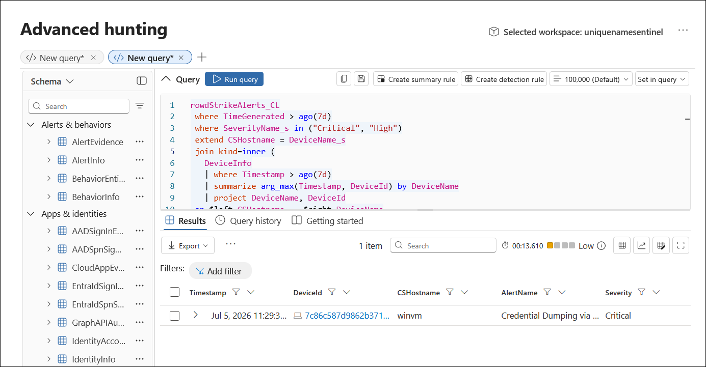

    > **Note:** The query widens the CrowdStrike lookback to 7 days so sample data injected earlier still falls in range. Native Defender tables such as `DeviceInfo` use the column **`Timestamp`** (not `TimeGenerated`), and `arg_max()` returns the latest `DeviceId` per hostname. The `kind=inner` join ensures you only alert on devices MDE can actually act on.

    > **Tip:** If the join returns no rows, the CrowdStrike hostname does not match an onboarded device name. Either rename the test alert's hostname to match your VM, or replace the CrowdStrike side with a direct `DeviceInfo` filter on your device name to complete the task hands-on.

1. With the query in the editor and returning a `DeviceId` and `Timestamp` column, select **Create detection rule** from the query toolbar.

    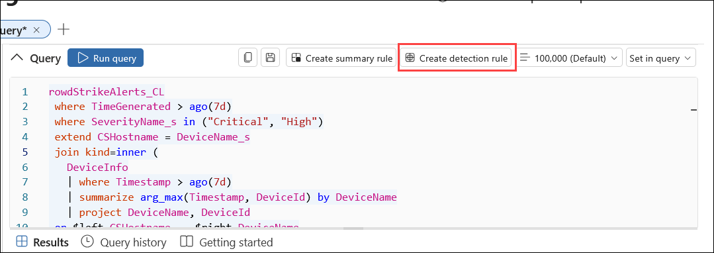

1. On the **Detection details** page, enter:

    - **Detection name:** `CrowdStrike Critical Alert - Isolate Device (Lab) (1)`
    - **Frequency:** **Every hour (2)**
    - **Severity:** **High (3)**
    - **MITRE ATT&CK techniques:** map to a relevant technique such as **T1204.002 (User Execution: Malicious File) (4)**

    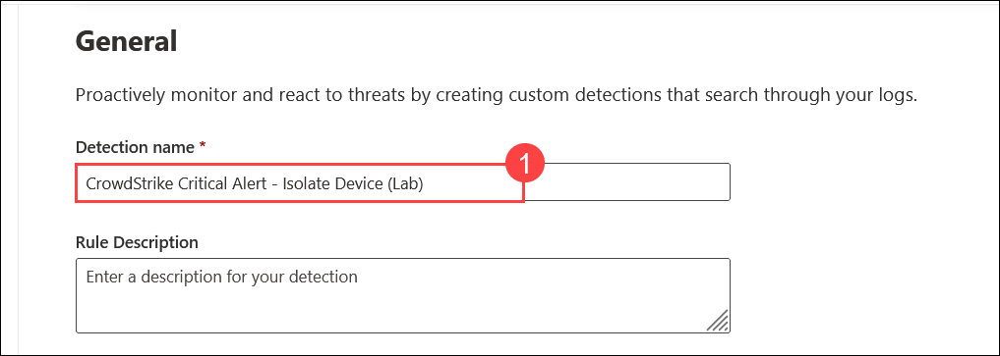

    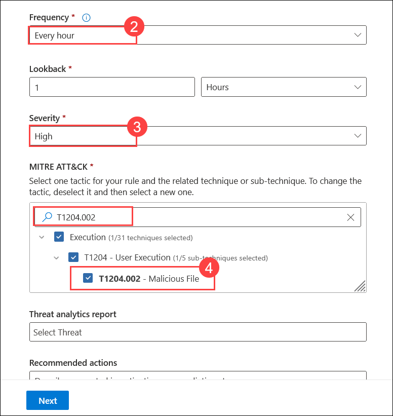

1. Select **Next**. On the **Alerts settings** page, map the device entity:

    - **Device** → Identifier **DeviceId** → Column **DeviceId (1)**

    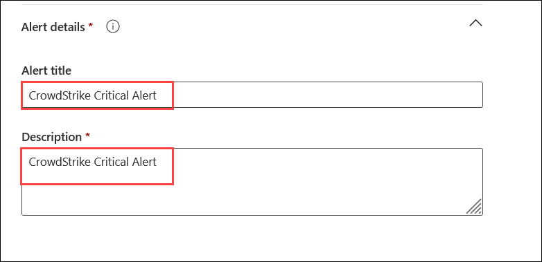

    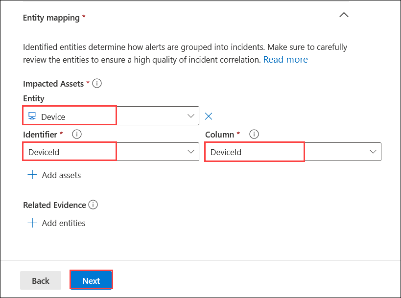

    > **Note:** Because your query returns a `DeviceId` column, the portal makes device-scoped actions available on the next page. The available actions are context-aware based on the identifiers your query projects.

1. Select **Next** to reach the **Automated Actions** page. Under **Devices**, select **Isolate device (1)** and set **Isolation type** to **Full (2)**.

    

1. Select **Next**, review the rule on the **Review and create** page, and select **Submit**.

    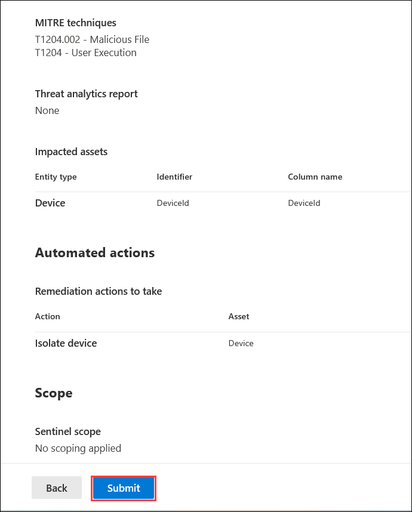

1. Verify the rule. Go to **Investigation & response (1)** > **Hunting (2)** > **Custom detection rules (3)**, confirm `CrowdStrike Critical Alert - Isolate Device (Lab)` is listed, then select it and review the **Triggered alerts** and **Triggered actions** tabs.

    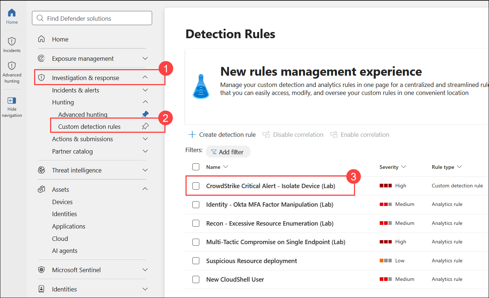

    > **Important - Staging best practice:** Auto-isolation is one of the highest-impact actions available. In production, never enable it on an unproven rule. Progress in stages: (1) **alert-only** to measure false positives, (2) add **Collect investigation package** for automatic forensics, and only then (3) add **Isolate device (Full)** once you trust the detection.

### Task 5: Review and Reverse the Isolation in the Action Center

In this task, you will review the isolation actions taken and release the device from isolation - restoring its network access.

1. In the left navigation pane, go to the **Action center**.

    ```
    https://security.microsoft.com/action-center
    ```

1. Select the **History** tab. Locate the **Isolate device** action(s) you performed in Task 3 (and any triggered by the rule in Task 4). Confirm each action is logged individually with its status.

    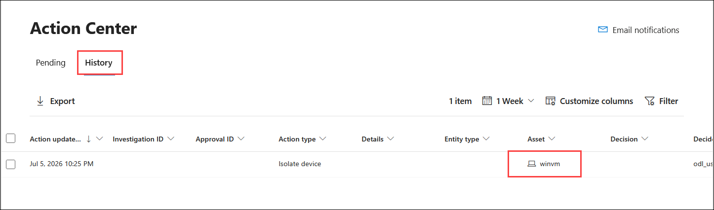

1. To reverse the isolation, return to the device page (**Assets** > **Devices** > your device), select the actions menu, and select **Release from isolation (1)**. Enter a comment and select **Confirm (2)**.

    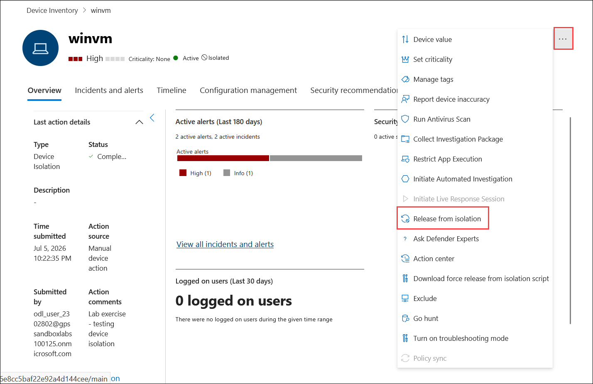

    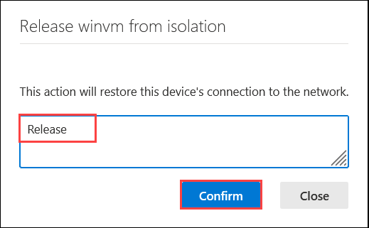

    > **Note:** Releasing the device from isolation restores its normal network connectivity. This reversibility is what makes isolation a safe containment step - you can contain a threat instantly and undo it just as quickly if it turns out to be a false positive.

1. Confirm in the **Action center** that the release action is recorded and the device's status returns to normal.

    > **Tip:** The Action center is your single audit trail for every response action across the tenant - manual and automated. It shows who did what, when, and lets you undo reversible actions like isolation and file blocks.

## Summary

In this lab, you implemented a complete, real device-isolation response in Microsoft Defender for Endpoint. You onboarded a Windows device using the local-script package, confirmed it in the Defender portal's device inventory and the `DeviceInfo` table, and then isolated it manually from the device page. You also built the cross-platform response pattern that multi-vendor SOCs rely on - resolving a CrowdStrike detection's hostname to the MDE `DeviceId` and attaching an automated **Isolate device** action to a custom detection rule. Finally, you reviewed the actions in the Action center and released the device from isolation, demonstrating that this high-impact containment action is fully reversible. You now have hands-on experience with one of the most important response capabilities in a modern SOC, plus the best-practice discipline of staging high-impact automation carefully.

## You have successfully completed the lab!

In this hands-on lab **Threat Protection and Incident Response with Microsoft Sentinel within Unified Platform - Day 2**, you have strengthened your expertise in Microsoft Sentinel’s threat detection, investigation, and automation capabilities. You worked with analytics rules, automation playbooks, hunting queries, watchlists, and Jupyter notebook-based hunting, then extended those skills into multi-cloud correlation across CrowdStrike, Palo Alto, Okta, and AWS, and cross-platform automated response with real device isolation in Microsoft Defender for Endpoint. These skills will help you detect threats earlier, investigate incidents effectively, and contain them across a multi-vendor security stack.
