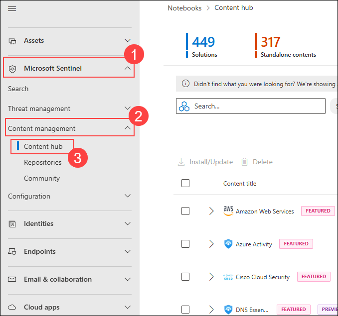

# Lab 10: Threat Hunting with Jupyter Notebooks

## Estimated Duration: 60 Minutes

## Overview

In this exercise, you will leverage **Jupyter notebooks** and the **MSTICPy Python library** to conduct advanced threat hunting in **Microsoft Sentinel**. Jupyter notebooks provide a flexible, interactive environment for security analysis, allowing you to combine KQL queries, Python data processing, and rich visualizations. You will start by setting up a Jupyter notebook environment, connect to your Sentinel workspace, and perform sophisticated threat analysis using MSTICPy's capabilities for investigating alerts, creating timelines, and visualizing attack patterns. By completing this exercise, you will develop powerful, reproducible threat hunting workflows that your team can leverage for ongoing security investigations.

## Lab Objectives

In this lab, you will perform the following:

- Task 1: Access and Configure Jupyter Notebooks in Sentinel
- Task 2: Connect to Sentinel Workspace and Query Data
- Task 3: Perform Advanced Data Analysis with MSTICPy
- Task 4: Create Visualizations and Hunt Workflows

### Task 1: Access and Configure Jupyter Notebooks in Sentinel

In this task, you will access Jupyter notebooks in Microsoft Sentinel and configure the environment.

1. Navigate to **Microsoft Defender Portal**

    ```
    https://security.microsoft.com/
    ```

1. On the left side menu, select **Microsoft Sentinel (1)** > **Content management (2)** and select **Content hub (3)** under Configuration.

    

1. Search for **Jupyter Notebook (1)** in the Content Hub and select **Jupyter Notebook (2)** from the results.

    

1. Click **Install (1)** to install the Jupyter Notebook solution.

    

1. Once installed, navigate to **Notebooks (1)** in the **Threat management (2)** section under the left menu.

    

1. Click **+ Create new notebook (1)** to create a new notebook for threat hunting.

    

1. On the **Create new notebook** dialog, enter the following details:

    - **Notebook name:** Enter **Threat Hunting Analysis (1)**
    - **Description:** Enter **Advanced threat hunting using Python and MSTICPy (2)**
    - **Kernel:** Select **Python 3.8 (3)**
    - Click **Create (4)**

    

1. Wait for the notebook to be created and provisioned. This may take a few minutes.

    

1. Once the notebook loads, click **Launch notebook (1)** to open it in the Jupyter environment.

    

### Task 2: Connect to Sentinel Workspace and Query Data

In this task, you will connect to your Sentinel workspace and perform KQL queries from within the notebook.

1. In the Jupyter notebook, click **+ Code (1)** to add a new code cell.

    

1. Enter Python code to import required libraries and connect to Azure Sentinel:

    - Import pandas, numpy, datetime, matplotlib, and MSTICPy components
    - Authenticate to Azure using MSTICPy's authentication methods
    - Initialize QueryProvider for AzureSentinel
    - Connect to your workspace

1. Click **Run** to execute the cell and establish connection to Sentinel.

    

1. Add a code cell to **query security alerts** from your Sentinel workspace. Write a query to retrieve high-severity security alerts from the last 7 days.

1. Click **Run** to execute the query and retrieve alert data.

    

1. Add a code cell to **query authentication logs for suspicious patterns**. Write a query to identify failed login attempts exceeding a threshold.

1. Click **Run** to execute the authentication query and retrieve suspicious login data.

    

### Task 3: Perform Advanced Data Analysis with MSTICPy

In this task, you will use MSTICPy's advanced analysis capabilities for timeline creation, anomaly detection, and data enrichment.

1. Add a code cell to **create an event timeline** for process events:

    - Query process events from the last 24 hours
    - Filter for suspicious processes
    - Use MSTICPy's plot_timeline function to visualize event sequences

1. Click **Run** to create a timeline visualization of process events.

    

1. Add a code cell for **anomaly detection** on authentication patterns:

    - Use TimeSeriesAnomalyDetector from MSTICPy
    - Prepare authentication data for time series analysis
    - Detect anomalies in login patterns
    - Visualize normal and anomalous login attempts

1. Click **Run** to perform anomaly detection and visualize results.

    

1. Add a code cell to **correlate data across multiple sources**:

    - Correlate failed logins with security alerts
    - Join authentication logs with security alert data
    - Identify users with both failed logins and security alerts

1. Click **Run** to correlate authentication and alert data.

    

### Task 4: Create Visualizations and Hunt Workflows

In this task, you will create comprehensive visualizations and establish reusable threat hunting workflows.

1. Add a code cell to **create alert distribution visualization** by severity:

    - Query alert counts grouped by severity level
    - Create bar chart with color-coded severity levels
    - Visualize alert distribution over time period

1. Click **Run** to create alert distribution visualization.

    

1. Add a code cell to **create a geographic distribution visualization** of suspicious activities:

    - Query failed login attempts by geographic location
    - Create horizontal bar chart showing threat distribution by location
    - Identify geographic patterns in attack attempts

1. Click **Run** to visualize geographic threat distribution.

    

1. Add a code cell to **create a reusable threat hunting function**:

    - Define function to hunt for suspicious process execution
    - Parameterize with process keywords
    - Execute function to detect suspicious patterns
    - Return formatted results for analysis

1. Click **Run** to execute the threat hunting function.

    

1. Add a code cell to **generate a threat hunting summary report**:

    - Compile key findings from all analyses
    - Calculate statistics on alerts, suspicious users, and processes
    - Generate recommendations for incident response
    - Format as structured report

1. Click **Run** to generate the threat hunting summary report.

    

1. Click **Save notebook (1)** to save all your work and analysis.

    

1. You can **share the notebook (1)** with team members by clicking the **Share (2)** button for collaborative threat hunting.

    

## Summary

In this exercise, you successfully accessed and configured Jupyter notebooks within Microsoft Sentinel, connected to your workspace to query security data, performed advanced analysis using MSTICPy for anomaly detection and timeline creation, and created reusable threat hunting workflows with comprehensive visualizations. You have established a powerful, flexible platform for ongoing threat hunting and security investigation that your team can leverage and extend for continuous security monitoring and incident investigation.

## You have successfully completed the exercise!

### Now, click on **Next >>** from the lower right corner to move on to the next page.

   