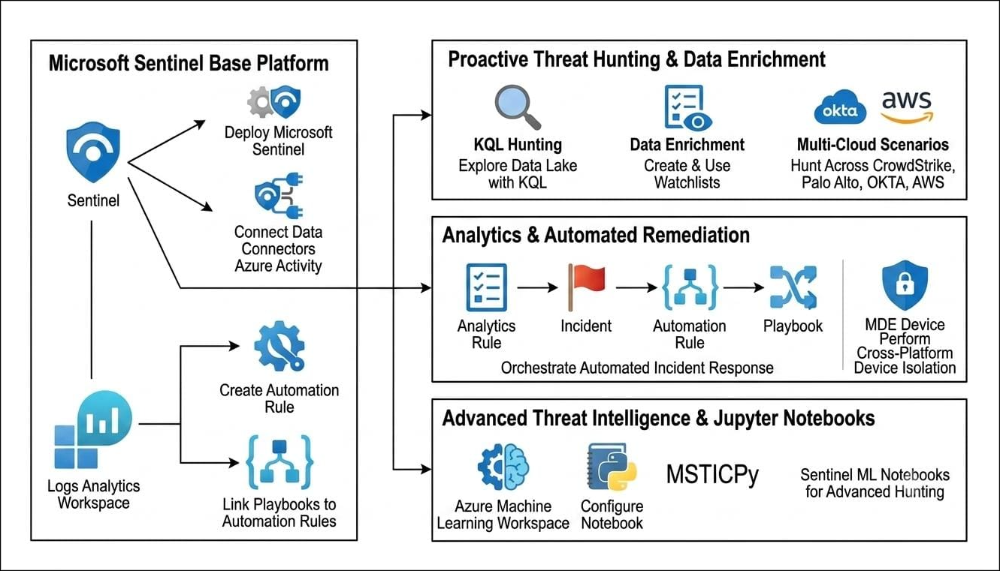
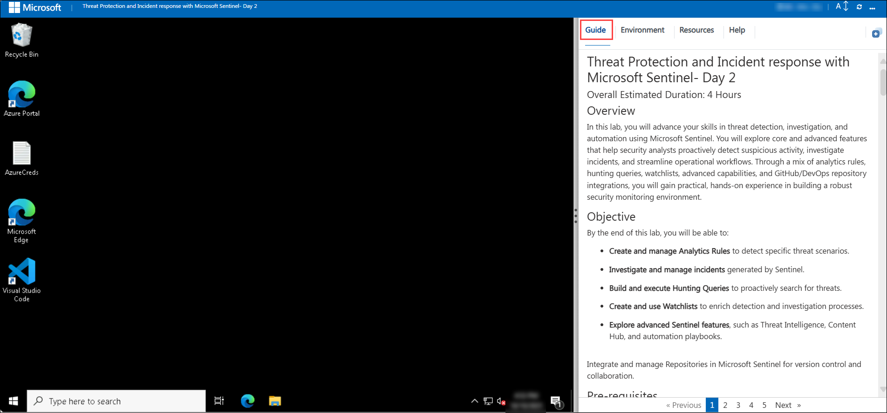
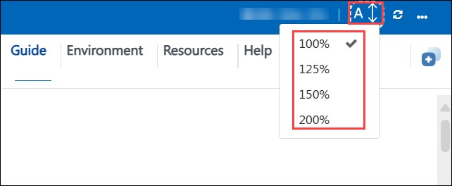
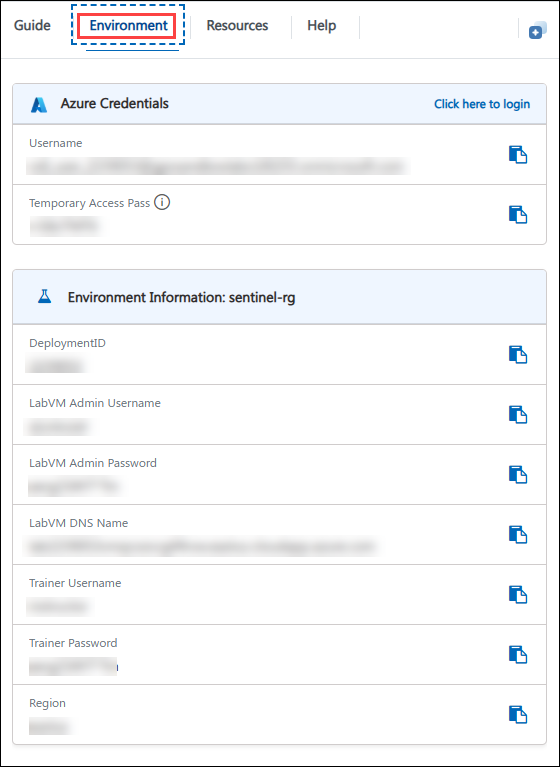
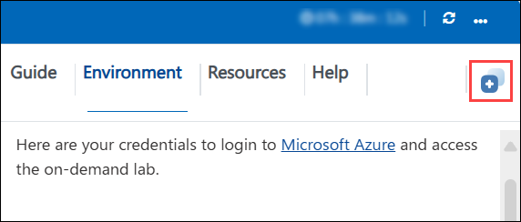
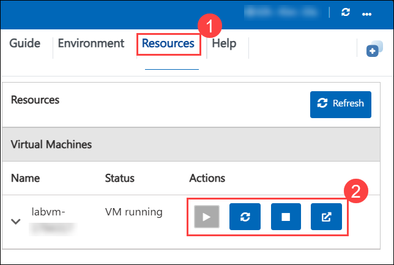
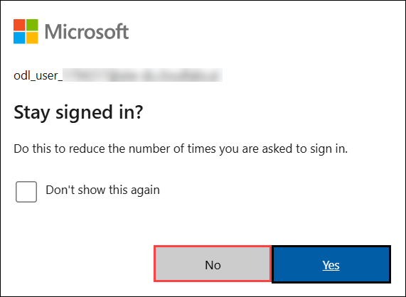

# Threat Protection and Incident response with Microsoft Sentinel within Unified Platform - Day 2

### Overall Estimated Duration: 4 Hours

## Overview

In this lab, you will advance your skills in threat detection, investigation, and automation using Microsoft Sentinel. You will explore core and advanced features that help security analysts proactively detect suspicious activity, investigate incidents, and streamline operational workflows. Through a mix of analytics rules, hunting queries, watchlists, advanced capabilities, and GitHub/DevOps repository integrations, you will gain practical, hands-on experience in building a robust security monitoring environment. 

## Objective

By the end of this lab, you will be able to:

  - **Responding to Threats Using Automation** to trigger playbooks and orchestrate incident response actions.

  - **Hunt Threats Using KQL Across the Data Lake** to identify suspicious patterns and advanced attack behaviours.

  - **Create and manage Analytics Rules** to detect specific threat scenarios.

  - **Investigate and manage incidents** generated by Sentinel.

  - **Build and execute Hunting Queries** to proactively search for threats.
  
  - **Create and use Watchlists** to enrich detection and investigation processes.

  - **Perform advanced threat hunting with Jupyter notebooks and MSTICPy** to build reusable, code-driven investigation workflows.

  - **Correlate multi-cloud telemetry** from CrowdStrike, Palo Alto, Okta, and AWS into a single attack timeline.

  - **Automate cross-platform incident response**, including real device isolation with Microsoft Defender for Endpoint.

## Pre-requisites

Participants should have:

   - Basic understanding of Microsoft Sentinel and Azure security concepts.

   - Experience with navigating the Azure portal.

   - Familiarity with Kusto Query Language (KQL) for querying log data.

   - Awareness of security operations workflows such as incident investigation and threat hunting.

## Architecture
 
In this lab, you will use Microsoft Sentinel to detect, investigate, and respond to security threats across your environment. Data from connected sources such as Azure Active Directory, Microsoft 365 Defender, and security appliances will be ingested into Sentinel, where Analytics Rules automatically identify suspicious activities and generate incidents that Automation Rules and playbooks can respond to. You will perform proactive threat hunting using Kusto Query Language (KQL) across the Sentinel data lake and enrich queries with Watchlists containing sensitive asset details or known threat indicators. You will then move to advanced, code-driven investigation using Jupyter notebooks and MSTICPy, correlate multi-cloud telemetry from CrowdStrike, Palo Alto, Okta, and AWS into a single attack timeline, and finally automate cross-platform incident response, including real device isolation with Microsoft Defender for Endpoint (MDE), fostering a proactive, automated, and collaborative approach to enterprise threat protection and incident response.

## Architecture Diagram

## Explanation of Components

The architecture for this lab involves the following key components:

 1. **Automation Rules & Playbooks:** Automation Rules orchestrate incident-handling logic in Sentinel and can trigger Logic Apps-based playbooks to take remediation actions automatically.
    - Centralize and prioritize automation logic across analytics rules.
    - Playbooks can enrich, notify, or remediate without analyst intervention.

 1. **Analytics Rules:** Analytics Rules are detection logic in Sentinel that automatically generate incidents when specific patterns of suspicious activity are detected in ingested logs. They can be created from built-in templates or customized using KQL.
    - Real-time or scheduled execution.
    - Mapping to MITRE ATT&CK tactics and techniques.
    - Automation trigger capabilities.

1. **Incident Management:** Incidents are collections of alerts and related entities that Sentinel groups for investigation. You will learn to investigate incidents, link related events, and trigger automation for remediation.
   - Incident timeline and evidence view.
   - Entity enrichment for IPs, users, and devices.
   - Assignment, tagging, and closing workflows. 

1. **Hunting Queries:** Hunting queries are analyst-driven searches for threats that may have bypassed automated detections. They allow proactive exploration of data using KQL across the Sentinel data lake.

   - Can be saved for reuse and scheduled.
   - Linked with bookmarks for potential incidents.
   - Integration with MITRE ATT&CK mapping. 

1. **Watchlists**: Watchlists are custom data tables you can upload (CSV/JSON) to enhance analytics rules, hunting queries, and incident investigations.
   - Store IP ranges, user lists, or sensitive assets.
   - Join or filter data within KQL queries.
   - Dynamic update without modifying query logic.  

1. **Jupyter Notebooks & MSTICPy:** Code-driven investigation using an Azure Machine Learning workspace and the MSTICPy library extends hunting beyond native KQL.
   - Builds reusable, shareable investigation workflows.
   - Combines KQL, Python, and visualization in a single notebook.

1. **Multi-Cloud Data Sources:** Sentinel ingests and correlates telemetry from third-party platforms such as CrowdStrike, Palo Alto, Okta, and AWS alongside Microsoft data.
   - Enables a single, cross-platform attack timeline.
   - Hunting queries can join across disparate log schemas.

1. **Microsoft Defender for Endpoint (MDE) Integration:** Sentinel automation can reach into MDE to take real response actions on endpoints.
   - Manual or automated device isolation from detection rules.
   - Actions are reversible and tracked in the Action Center.

## Getting Started with Lab
Once you're ready to dive in, your virtual machine and **Guide** will be right at your fingertips within your web browser.

## Lab Guide Zoom In/Zoom Out

To adjust the zoom level for the environment page, click the **A↕ : 100%** icon located next to the timer in the lab environment.

## Virtual Machine & Lab Guide
Your virtual machine is your workhorse throughout the workshop. The guide is your roadmap to success.

## Exploring Your Lab Resources
To get a better understanding of your lab resources and credentials, navigate to the **Environment** tab.

## Utilizing the Split Window Feature
For convenience, you can open the lab guide in a separate window by selecting the **Split Window** button from the top right corner.

## Managing Your Virtual Machine
Feel free to **start, restart, or stop (2)** your virtual machine as needed from the **Resources (1)** tab. Your experience is in your hands!

## Let's Get Started with Azure Portal
 
1. On your virtual machine, click on the **Azure Portal** icon.

   

1. On the **Sign in to Microsoft Azure** tab you will see the login screen, in that enter the following email/username, and click on **Next (2)**. 

   * **Email/Username**: <inject key="AzureAdUserEmail"></inject> **(1)**
   
      
     
1. Now enter the following Temporary Access Pass and click on **Sign in (2)**.
   
   * **Temporary Access Pass**: <inject key="AzureAdUserPassword"></inject> **(1)**

       
     
1. If you see the pop-up **Stay Signed in?**, select **No**.

   

1. If a **Welcome to Microsoft Azure** popup window appears, select **Maybe Later** to skip the tour.

## Support Contact

The CloudLabs support team is available 24/7, 365 days a year, via email and live chat to ensure seamless assistance at any time. We offer dedicated support channels tailored specifically for both learners and instructors, ensuring that all your needs are promptly and efficiently addressed.

Learner Support Contacts:

- Email Support: cloudlabs-support@spektrasystems.com
- Live Chat Support: https://cloudlabs.ai/labs-support

Click **Next >>** from the bottom right corner to embark on your Lab journey!

### Happy Learning!!

